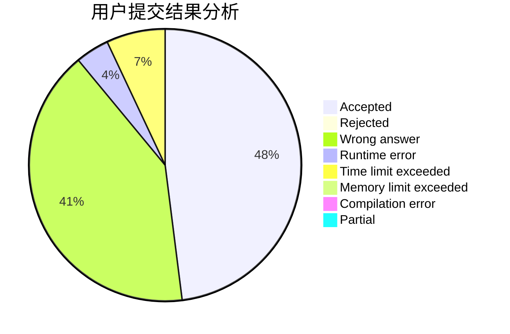
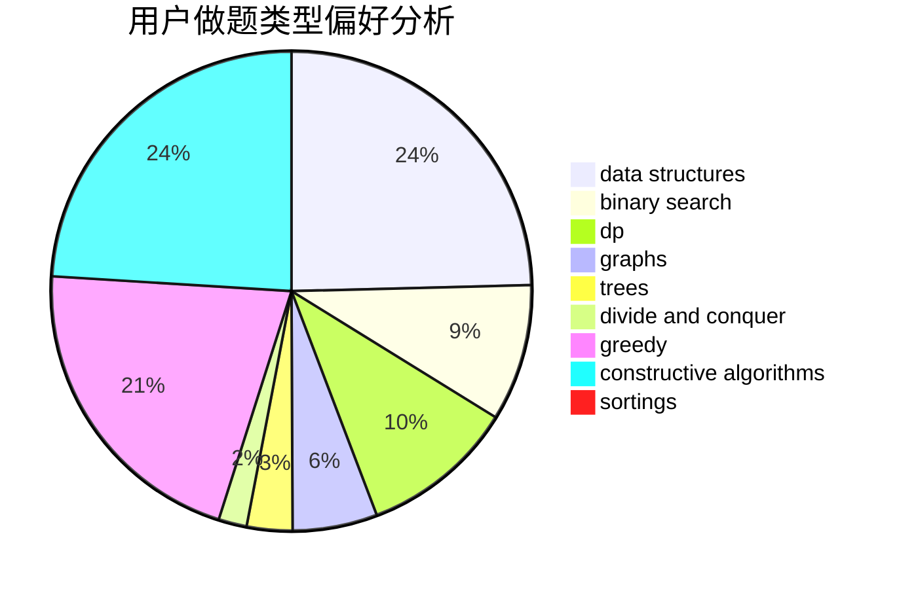
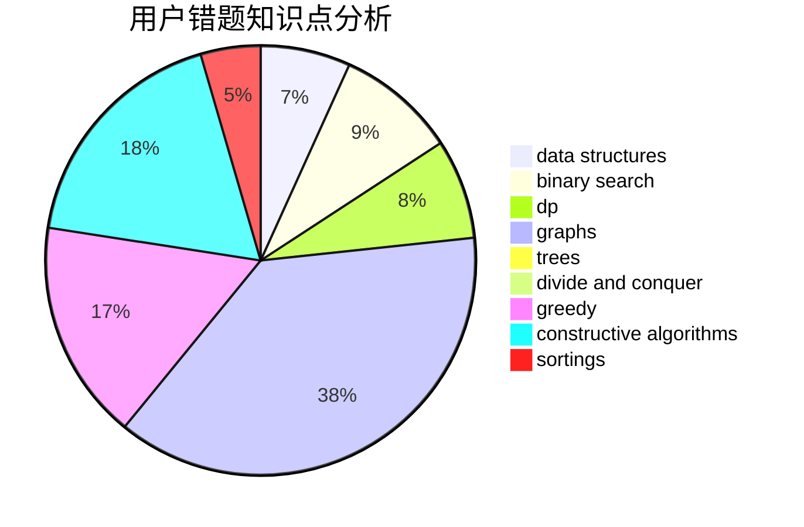

# Irene
<!-- tabs:start -->
#### **用户提交结果分析**

#### **用户做题类型偏好分析**

#### **用户错题知识点分析**

<!-- tabs:end -->
# 推荐题目
[1506B](http://codeforces.com/problemset/problem/1506/B)		greedy,
                        implementation		  
[1430F](http://codeforces.com/problemset/problem/1430/F)		dp,
                        greedy		  
[109A](http://codeforces.com/problemset/problem/109/A)		brute force,
                        implementation		  
[445B](http://codeforces.com/problemset/problem/445/B)		dfs and similar,
                        dsu,
                        greedy		  
[114D](https://codeforces.com/contest/114/problem/D)		brute force,
                        data structures,
                        hashing,
                        strings		  
[664A](http://codeforces.com/problemset/problem/664/A)		math,
                        number theory		  
[490E](http://codeforces.com/problemset/problem/490/E)		binary search,
                        brute force,
                        greedy,
                        implementation		  
[878B](http://codeforces.com/problemset/problem/878/B)		data structures,
                        implementation		  
[181B](http://codeforces.com/problemset/problem/181/B)		binary search,
                        brute force		  
[768C](http://codeforces.com/problemset/problem/768/C)		brute force,
                        dp,
                        implementation,
                        sortings		  
<!-- tabs:start -->
#### **data structures**
[114D](https://codeforces.com/contest/114/problem/D)		brute force,
                        data structures,
                        hashing,
                        strings		  
[878B](http://codeforces.com/problemset/problem/878/B)		data structures,
                        implementation		  
[1335E2](http://codeforces.com/problemset/problem/1335/E2)		brute force,
                        data structures,
                        dp,
                        two pointers		  
[372C](http://codeforces.com/problemset/problem/372/C)		data structures,
                        dp,
                        math		  
[865D](http://codeforces.com/problemset/problem/865/D)		constructive algorithms,
                        data structures,
                        greedy		  
[150E](http://codeforces.com/problemset/problem/150/E)		binary search,
                        data structures,
                        divide and conquer,
                        trees		  
[1481E](http://codeforces.com/problemset/problem/1481/E)		data structures,
                        dp,
                        greedy		  
[1474D](http://codeforces.com/problemset/problem/1474/D)		data structures,
                        dp,
                        greedy,
                        math		  
[1492C](http://codeforces.com/problemset/problem/1492/C)		binary search,
                        data structures,
                        dp,
                        greedy,
                        two pointers		  
[1490G](http://codeforces.com/problemset/problem/1490/G)		binary search,
                        data structures,
                        math		  
#### **binary search**
[490E](http://codeforces.com/problemset/problem/490/E)		binary search,
                        brute force,
                        greedy,
                        implementation		  
[181B](http://codeforces.com/problemset/problem/181/B)		binary search,
                        brute force		  
[701D](https://codeforces.com/contest/701/problem/D)		binary search,
                        math		  
[150E](http://codeforces.com/problemset/problem/150/E)		binary search,
                        data structures,
                        divide and conquer,
                        trees		  
[1492C](http://codeforces.com/problemset/problem/1492/C)		binary search,
                        data structures,
                        dp,
                        greedy,
                        two pointers		  
[1463D](http://codeforces.com/problemset/problem/1463/D)		binary search,
                        constructive algorithms,
                        greedy,
                        two pointers		  
[1490G](http://codeforces.com/problemset/problem/1490/G)		binary search,
                        data structures,
                        math		  
[1479D](http://codeforces.com/problemset/problem/1479/D)		binary search,
                        bitmasks,
                        brute force,
                        data structures,
                        probabilities,
                        trees		  
[1436E](http://codeforces.com/problemset/problem/1436/E)		binary search,
                        data structures,
                        two pointers		  
[1461D](http://codeforces.com/problemset/problem/1461/D)		binary search,
                        brute force,
                        data structures,
                        divide and conquer,
                        implementation,
                        sortings		  
#### **dp**
[1430F](http://codeforces.com/problemset/problem/1430/F)		dp,
                        greedy		  
[768C](http://codeforces.com/problemset/problem/768/C)		brute force,
                        dp,
                        implementation,
                        sortings		  
[1156F](http://codeforces.com/problemset/problem/1156/F)		dp,
                        math,
                        probabilities		  
[1335E2](http://codeforces.com/problemset/problem/1335/E2)		brute force,
                        data structures,
                        dp,
                        two pointers		  
[1310E](http://codeforces.com/problemset/problem/1310/E)		dp		  
[696C](http://codeforces.com/problemset/problem/696/C)		combinatorics,
                        dp,
                        implementation,
                        math,
                        matrices		  
[372C](http://codeforces.com/problemset/problem/372/C)		data structures,
                        dp,
                        math		  
[1393E1](http://codeforces.com/problemset/problem/1393/E1)		dp,
                        hashing,
                        implementation,
                        string suffix structures,
                        strings		  
[1481E](http://codeforces.com/problemset/problem/1481/E)		data structures,
                        dp,
                        greedy		  
[1158F](http://codeforces.com/problemset/problem/1158/F)		dp,
                        math		  
#### **graph**
[1316D](http://codeforces.com/problemset/problem/1316/D)		constructive algorithms,
                        dfs and similar,
                        graphs,
                        implementation		  
[1487C](http://codeforces.com/problemset/problem/1487/C)		brute force,
                        constructive algorithms,
                        dfs and similar,
                        graphs,
                        greedy,
                        implementation,
                        math		  
[1437C](http://codeforces.com/problemset/problem/1437/C)		dp,
                        flows,
                        graph matchings,
                        greedy,
                        math,
                        sortings		  
[1470D](http://codeforces.com/problemset/problem/1470/D)		constructive algorithms,
                        dfs and similar,
                        graph matchings,
                        graphs,
                        greedy		  
[1476C](http://codeforces.com/problemset/problem/1476/C)		dp,
                        graphs,
                        greedy		  
[1304D](http://codeforces.com/problemset/problem/1304/D)		constructive algorithms,
                        graphs,
                        greedy,
                        two pointers		  
[1475C](http://codeforces.com/problemset/problem/1475/C)		combinatorics,
                        graphs,
                        math		  
[553E](http://codeforces.com/problemset/problem/553/E)		dp,
                        fft,
                        graphs,
                        math,
                        probabilities		  
[1495C](http://codeforces.com/problemset/problem/1495/C)		constructive algorithms,
                        graphs		  
[1510K](http://codeforces.com/problemset/problem/1510/K)		brute force,
                        graphs,
                        implementation		  
#### **trees**
[150E](http://codeforces.com/problemset/problem/150/E)		binary search,
                        data structures,
                        divide and conquer,
                        trees		  
[1479D](http://codeforces.com/problemset/problem/1479/D)		binary search,
                        bitmasks,
                        brute force,
                        data structures,
                        probabilities,
                        trees		  
[1511C](http://codeforces.com/problemset/problem/1511/C)		brute force,
                        data structures,
                        implementation,
                        trees		  
[1499F](http://codeforces.com/problemset/problem/1499/F)		combinatorics,
                        dfs and similar,
                        dp,
                        trees		  
[1491E](http://codeforces.com/problemset/problem/1491/E)		brute force,
                        dfs and similar,
                        divide and conquer,
                        number theory,
                        trees		  
[1466D](http://codeforces.com/problemset/problem/1466/D)		data structures,
                        greedy,
                        sortings,
                        trees		  
[1495D](http://codeforces.com/problemset/problem/1495/D)		combinatorics,
                        dfs and similar,
                        graphs,
                        math,
                        shortest paths,
                        trees		  
[1303G](http://codeforces.com/problemset/problem/1303/G)		data structures,
                        divide and conquer,
                        geometry,
                        trees		  
[1454E](http://codeforces.com/problemset/problem/1454/E)		combinatorics,
                        dfs and similar,
                        graphs,
                        trees		  
[1494D](http://codeforces.com/problemset/problem/1494/D)		constructive algorithms,
                        data structures,
                        dfs and similar,
                        divide and conquer,
                        dsu,
                        greedy,
                        sortings,
                        trees		  
#### **divide and conquer**
[150E](http://codeforces.com/problemset/problem/150/E)		binary search,
                        data structures,
                        divide and conquer,
                        trees		  
[1461D](http://codeforces.com/problemset/problem/1461/D)		binary search,
                        brute force,
                        data structures,
                        divide and conquer,
                        implementation,
                        sortings		  
[1466G](http://codeforces.com/problemset/problem/1466/G)		combinatorics,
                        divide and conquer,
                        hashing,
                        math,
                        string suffix structures,
                        strings		  
[1490D](http://codeforces.com/problemset/problem/1490/D)		dfs and similar,
                        divide and conquer,
                        implementation		  
[1483C](https://codeforces.com/contest/1483/problem/C)		data structures,
                        divide and conquer,
                        dp		  
[1491E](http://codeforces.com/problemset/problem/1491/E)		brute force,
                        dfs and similar,
                        divide and conquer,
                        number theory,
                        trees		  
[1303G](http://codeforces.com/problemset/problem/1303/G)		data structures,
                        divide and conquer,
                        geometry,
                        trees		  
[1494D](http://codeforces.com/problemset/problem/1494/D)		constructive algorithms,
                        data structures,
                        dfs and similar,
                        divide and conquer,
                        dsu,
                        greedy,
                        sortings,
                        trees		  
[1482E](http://codeforces.com/problemset/problem/1482/E)		data structures,
                        divide and conquer,
                        dp		  
[566C](http://codeforces.com/problemset/problem/566/C)		dfs and similar,
                        divide and conquer,
                        trees		  
#### **greedy**
[1506B](http://codeforces.com/problemset/problem/1506/B)		greedy,
                        implementation		  
[1430F](http://codeforces.com/problemset/problem/1430/F)		dp,
                        greedy		  
[445B](http://codeforces.com/problemset/problem/445/B)		dfs and similar,
                        dsu,
                        greedy		  
[490E](http://codeforces.com/problemset/problem/490/E)		binary search,
                        brute force,
                        greedy,
                        implementation		  
[1411D](http://codeforces.com/problemset/problem/1411/D)		brute force,
                        greedy,
                        implementation,
                        strings		  
[1019A](http://codeforces.com/problemset/problem/1019/A)		brute force,
                        greedy		  
[1350D](https://codeforces.com/contest/1350/problem/D)		constructive algorithms,
                        greedy,
                        math		  
[865D](http://codeforces.com/problemset/problem/865/D)		constructive algorithms,
                        data structures,
                        greedy		  
[1393A](http://codeforces.com/problemset/problem/1393/A)		greedy,
                        math		  
[1481E](http://codeforces.com/problemset/problem/1481/E)		data structures,
                        dp,
                        greedy		  
#### **constructive algorithms**
[1316D](http://codeforces.com/problemset/problem/1316/D)		constructive algorithms,
                        dfs and similar,
                        graphs,
                        implementation		  
[1350D](https://codeforces.com/contest/1350/problem/D)		constructive algorithms,
                        greedy,
                        math		  
[865D](http://codeforces.com/problemset/problem/865/D)		constructive algorithms,
                        data structures,
                        greedy		  
[1435A](https://codeforces.com/contest/1435/problem/A)		constructive algorithms,
                        math		  
[878A](http://codeforces.com/problemset/problem/878/A)		bitmasks,
                        constructive algorithms		  
[1493A](http://codeforces.com/problemset/problem/1493/A)		constructive algorithms,
                        greedy		  
[1463D](http://codeforces.com/problemset/problem/1463/D)		binary search,
                        constructive algorithms,
                        greedy,
                        two pointers		  
[1456B](https://codeforces.com/contest/1456/problem/B)		bitmasks,
                        brute force,
                        constructive algorithms		  
[1492D](http://codeforces.com/problemset/problem/1492/D)		bitmasks,
                        constructive algorithms,
                        greedy,
                        math		  
[1504D](https://codeforces.com/contest/1504/problem/D)		constructive algorithms,
                        games,
                        interactive		  
#### **sortings**
[768C](http://codeforces.com/problemset/problem/768/C)		brute force,
                        dp,
                        implementation,
                        sortings		  
[632C](http://codeforces.com/problemset/problem/632/C)		sortings,
                        strings		  
[1394A](http://codeforces.com/problemset/problem/1394/A)		dp,
                        greedy,
                        sortings,
                        two pointers		  
[1496C](https://codeforces.com/contest/1496/problem/C)		geometry,
                        greedy,
                        math,
                        sortings		  
[1495A](http://codeforces.com/problemset/problem/1495/A)		geometry,
                        greedy,
                        math,
                        sortings		  
[1497A](http://codeforces.com/problemset/problem/1497/A)		brute force,
                        data structures,
                        greedy,
                        sortings		  
[1427A](http://codeforces.com/problemset/problem/1427/A)		math,
                        sortings		  
[1461D](http://codeforces.com/problemset/problem/1461/D)		binary search,
                        brute force,
                        data structures,
                        divide and conquer,
                        implementation,
                        sortings		  
[1437C](http://codeforces.com/problemset/problem/1437/C)		dp,
                        flows,
                        graph matchings,
                        greedy,
                        math,
                        sortings		  
[1473A](http://codeforces.com/problemset/problem/1473/A)		greedy,
                        implementation,
                        math,
                        sortings		  
<!-- tabs:end -->
