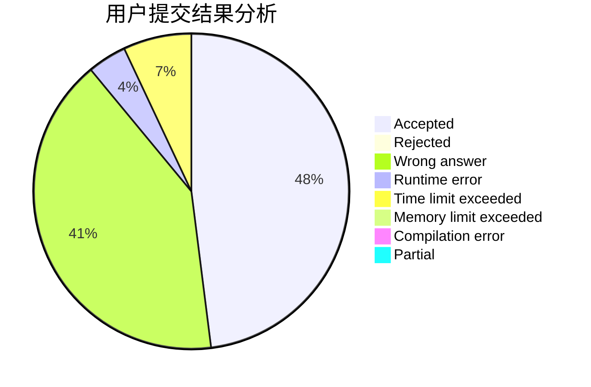
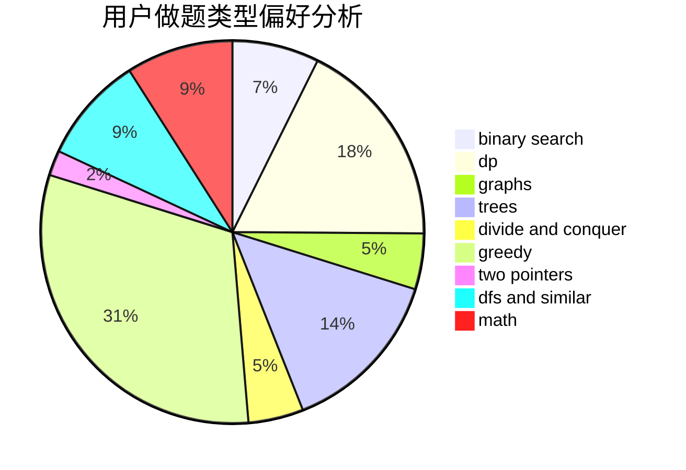

# Irene

<!-- tabs:start -->

#### **用户提交结果分析**

#### **用户做题类型偏好分析**

<!-- tabs:end -->
# 推荐题目
[1439D](https://codeforces.com/contest/1439/problem/D)
[788B](https://codeforces.com/contest/788/problem/B)
[11521](https://codeforces.com/contest/1152/problem/1)
[13577](https://codeforces.com/contest/1357/problem/7)
[10C](https://codeforces.com/contest/10/problem/C)
[465D](https://codeforces.com/contest/465/problem/D)
[683B](https://codeforces.com/contest/683/problem/B)
[386C](https://codeforces.com/contest/386/problem/C)
[886A](https://codeforces.com/contest/886/problem/A)
[713A](https://codeforces.com/contest/713/problem/A)
