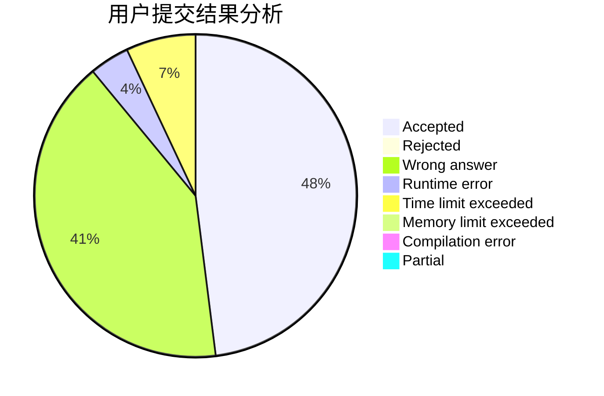
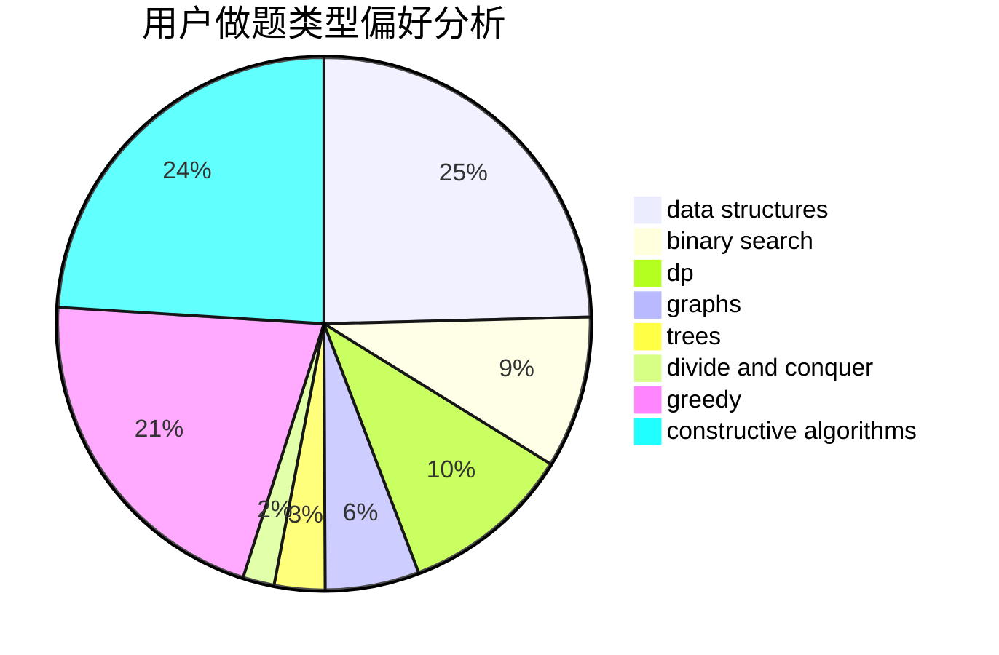
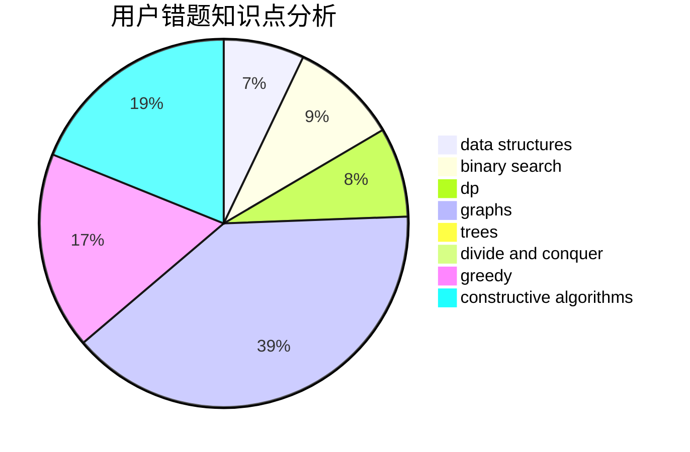

# Irene
<!-- tabs:start -->
#### **用户提交结果分析**

#### **用户做题类型偏好分析**

#### **用户错题知识点分析**

<!-- tabs:end -->
# 推荐题目
[Partial Replacement](http://codeforces.com/problemset/problem/1506/B)		greedy,
                        implementation		  
[Realistic Gameplay](http://codeforces.com/problemset/problem/1430/F)		dp,
                        greedy		  
[Lucky Sum of Digits](http://codeforces.com/problemset/problem/109/A)		brute force,
                        implementation		  
[DZY Loves Chemistry](http://codeforces.com/problemset/problem/445/B)		dfs and similar,
                        dsu,
                        greedy		  
[Petr#](https://codeforces.com/contest/114/problem/D)		brute force,
                        data structures,
                        hashing,
                        strings		  
[Complicated GCD](http://codeforces.com/problemset/problem/664/A)		math,
                        number theory		  
[Restoring Increasing Sequence](http://codeforces.com/problemset/problem/490/E)		binary search,
                        brute force,
                        greedy,
                        implementation		  
[Teams Formation](http://codeforces.com/problemset/problem/878/B)		data structures,
                        implementation		  
[Number of Triplets](http://codeforces.com/problemset/problem/181/B)		binary search,
                        brute force		  
[Jon Snow and his Favourite Number](http://codeforces.com/problemset/problem/768/C)		brute force,
                        dp,
                        implementation,
                        sortings		  
<!-- tabs:start -->
#### **data structures**
[Partial Replacement](https://codeforces.com/contest/114/problem/D)		brute force,
                        data structures,
                        hashing,
                        strings		  
[Realistic Gameplay](http://codeforces.com/problemset/problem/878/B)		data structures,
                        implementation		  
[Lucky Sum of Digits](http://codeforces.com/problemset/problem/1335/E2)		brute force,
                        data structures,
                        dp,
                        two pointers		  
[DZY Loves Chemistry](http://codeforces.com/problemset/problem/372/C)		data structures,
                        dp,
                        math		  
[Petr#](http://codeforces.com/problemset/problem/865/D)		constructive algorithms,
                        data structures,
                        greedy		  
[Complicated GCD](http://codeforces.com/problemset/problem/150/E)		binary search,
                        data structures,
                        divide and conquer,
                        trees		  
[Restoring Increasing Sequence](http://codeforces.com/problemset/problem/1481/E)		data structures,
                        dp,
                        greedy		  
[Teams Formation](http://codeforces.com/problemset/problem/1474/D)		data structures,
                        dp,
                        greedy,
                        math		  
[Number of Triplets](http://codeforces.com/problemset/problem/1492/C)		binary search,
                        data structures,
                        dp,
                        greedy,
                        two pointers		  
[Jon Snow and his Favourite Number](http://codeforces.com/problemset/problem/1490/G)		binary search,
                        data structures,
                        math		  
#### **binary search**
[Partial Replacement](http://codeforces.com/problemset/problem/490/E)		binary search,
                        brute force,
                        greedy,
                        implementation		  
[Realistic Gameplay](http://codeforces.com/problemset/problem/181/B)		binary search,
                        brute force		  
[Lucky Sum of Digits](https://codeforces.com/contest/701/problem/D)		binary search,
                        math		  
[DZY Loves Chemistry](http://codeforces.com/problemset/problem/150/E)		binary search,
                        data structures,
                        divide and conquer,
                        trees		  
[Petr#](http://codeforces.com/problemset/problem/1492/C)		binary search,
                        data structures,
                        dp,
                        greedy,
                        two pointers		  
[Complicated GCD](http://codeforces.com/problemset/problem/1463/D)		binary search,
                        constructive algorithms,
                        greedy,
                        two pointers		  
[Restoring Increasing Sequence](http://codeforces.com/problemset/problem/1490/G)		binary search,
                        data structures,
                        math		  
[Teams Formation](http://codeforces.com/problemset/problem/1479/D)		binary search,
                        bitmasks,
                        brute force,
                        data structures,
                        probabilities,
                        trees		  
[Number of Triplets](http://codeforces.com/problemset/problem/1436/E)		binary search,
                        data structures,
                        two pointers		  
[Jon Snow and his Favourite Number](http://codeforces.com/problemset/problem/1461/D)		binary search,
                        brute force,
                        data structures,
                        divide and conquer,
                        implementation,
                        sortings		  
#### **dp**
[Partial Replacement](http://codeforces.com/problemset/problem/1430/F)		dp,
                        greedy		  
[Realistic Gameplay](http://codeforces.com/problemset/problem/768/C)		brute force,
                        dp,
                        implementation,
                        sortings		  
[Lucky Sum of Digits](http://codeforces.com/problemset/problem/1156/F)		dp,
                        math,
                        probabilities		  
[DZY Loves Chemistry](http://codeforces.com/problemset/problem/1335/E2)		brute force,
                        data structures,
                        dp,
                        two pointers		  
[Petr#](http://codeforces.com/problemset/problem/1310/E)		dp		  
[Complicated GCD](http://codeforces.com/problemset/problem/696/C)		combinatorics,
                        dp,
                        implementation,
                        math,
                        matrices		  
[Restoring Increasing Sequence](http://codeforces.com/problemset/problem/372/C)		data structures,
                        dp,
                        math		  
[Teams Formation](http://codeforces.com/problemset/problem/1393/E1)		dp,
                        hashing,
                        implementation,
                        string suffix structures,
                        strings		  
[Number of Triplets](http://codeforces.com/problemset/problem/1481/E)		data structures,
                        dp,
                        greedy		  
[Jon Snow and his Favourite Number](http://codeforces.com/problemset/problem/1158/F)		dp,
                        math		  
#### **graph**
[Partial Replacement](http://codeforces.com/problemset/problem/1316/D)		constructive algorithms,
                        dfs and similar,
                        graphs,
                        implementation		  
[Realistic Gameplay](http://codeforces.com/problemset/problem/1487/C)		brute force,
                        constructive algorithms,
                        dfs and similar,
                        graphs,
                        greedy,
                        implementation,
                        math		  
[Lucky Sum of Digits](http://codeforces.com/problemset/problem/1437/C)		dp,
                        flows,
                        graph matchings,
                        greedy,
                        math,
                        sortings		  
[DZY Loves Chemistry](http://codeforces.com/problemset/problem/1470/D)		constructive algorithms,
                        dfs and similar,
                        graph matchings,
                        graphs,
                        greedy		  
[Petr#](http://codeforces.com/problemset/problem/1476/C)		dp,
                        graphs,
                        greedy		  
[Complicated GCD](http://codeforces.com/problemset/problem/1304/D)		constructive algorithms,
                        graphs,
                        greedy,
                        two pointers		  
[Restoring Increasing Sequence](http://codeforces.com/problemset/problem/1475/C)		combinatorics,
                        graphs,
                        math		  
[Teams Formation](http://codeforces.com/problemset/problem/553/E)		dp,
                        fft,
                        graphs,
                        math,
                        probabilities		  
[Number of Triplets](http://codeforces.com/problemset/problem/1495/C)		constructive algorithms,
                        graphs		  
[Jon Snow and his Favourite Number](http://codeforces.com/problemset/problem/1510/K)		brute force,
                        graphs,
                        implementation		  
#### **trees**
[Partial Replacement](http://codeforces.com/problemset/problem/150/E)		binary search,
                        data structures,
                        divide and conquer,
                        trees		  
[Realistic Gameplay](http://codeforces.com/problemset/problem/1479/D)		binary search,
                        bitmasks,
                        brute force,
                        data structures,
                        probabilities,
                        trees		  
[Lucky Sum of Digits](http://codeforces.com/problemset/problem/1511/C)		brute force,
                        data structures,
                        implementation,
                        trees		  
[DZY Loves Chemistry](http://codeforces.com/problemset/problem/1499/F)		combinatorics,
                        dfs and similar,
                        dp,
                        trees		  
[Petr#](http://codeforces.com/problemset/problem/1491/E)		brute force,
                        dfs and similar,
                        divide and conquer,
                        number theory,
                        trees		  
[Complicated GCD](http://codeforces.com/problemset/problem/1466/D)		data structures,
                        greedy,
                        sortings,
                        trees		  
[Restoring Increasing Sequence](http://codeforces.com/problemset/problem/1495/D)		combinatorics,
                        dfs and similar,
                        graphs,
                        math,
                        shortest paths,
                        trees		  
[Teams Formation](http://codeforces.com/problemset/problem/1303/G)		data structures,
                        divide and conquer,
                        geometry,
                        trees		  
[Number of Triplets](http://codeforces.com/problemset/problem/1454/E)		combinatorics,
                        dfs and similar,
                        graphs,
                        trees		  
[Jon Snow and his Favourite Number](http://codeforces.com/problemset/problem/1494/D)		constructive algorithms,
                        data structures,
                        dfs and similar,
                        divide and conquer,
                        dsu,
                        greedy,
                        sortings,
                        trees		  
#### **divide and conquer**
[Partial Replacement](http://codeforces.com/problemset/problem/150/E)		binary search,
                        data structures,
                        divide and conquer,
                        trees		  
[Realistic Gameplay](http://codeforces.com/problemset/problem/1461/D)		binary search,
                        brute force,
                        data structures,
                        divide and conquer,
                        implementation,
                        sortings		  
[Lucky Sum of Digits](http://codeforces.com/problemset/problem/1466/G)		combinatorics,
                        divide and conquer,
                        hashing,
                        math,
                        string suffix structures,
                        strings		  
[DZY Loves Chemistry](http://codeforces.com/problemset/problem/1490/D)		dfs and similar,
                        divide and conquer,
                        implementation		  
[Petr#](https://codeforces.com/contest/1483/problem/C)		data structures,
                        divide and conquer,
                        dp		  
[Complicated GCD](http://codeforces.com/problemset/problem/1491/E)		brute force,
                        dfs and similar,
                        divide and conquer,
                        number theory,
                        trees		  
[Restoring Increasing Sequence](http://codeforces.com/problemset/problem/1303/G)		data structures,
                        divide and conquer,
                        geometry,
                        trees		  
[Teams Formation](http://codeforces.com/problemset/problem/1494/D)		constructive algorithms,
                        data structures,
                        dfs and similar,
                        divide and conquer,
                        dsu,
                        greedy,
                        sortings,
                        trees		  
[Number of Triplets](http://codeforces.com/problemset/problem/1482/E)		data structures,
                        divide and conquer,
                        dp		  
[Jon Snow and his Favourite Number](http://codeforces.com/problemset/problem/566/C)		dfs and similar,
                        divide and conquer,
                        trees		  
#### **greedy**
[Partial Replacement](http://codeforces.com/problemset/problem/1506/B)		greedy,
                        implementation		  
[Realistic Gameplay](http://codeforces.com/problemset/problem/1430/F)		dp,
                        greedy		  
[Lucky Sum of Digits](http://codeforces.com/problemset/problem/445/B)		dfs and similar,
                        dsu,
                        greedy		  
[DZY Loves Chemistry](http://codeforces.com/problemset/problem/490/E)		binary search,
                        brute force,
                        greedy,
                        implementation		  
[Petr#](http://codeforces.com/problemset/problem/1411/D)		brute force,
                        greedy,
                        implementation,
                        strings		  
[Complicated GCD](http://codeforces.com/problemset/problem/1019/A)		brute force,
                        greedy		  
[Restoring Increasing Sequence](https://codeforces.com/contest/1350/problem/D)		constructive algorithms,
                        greedy,
                        math		  
[Teams Formation](http://codeforces.com/problemset/problem/865/D)		constructive algorithms,
                        data structures,
                        greedy		  
[Number of Triplets](http://codeforces.com/problemset/problem/1393/A)		greedy,
                        math		  
[Jon Snow and his Favourite Number](http://codeforces.com/problemset/problem/1481/E)		data structures,
                        dp,
                        greedy		  
#### **constructive algorithms**
[Partial Replacement](http://codeforces.com/problemset/problem/1316/D)		constructive algorithms,
                        dfs and similar,
                        graphs,
                        implementation		  
[Realistic Gameplay](https://codeforces.com/contest/1350/problem/D)		constructive algorithms,
                        greedy,
                        math		  
[Lucky Sum of Digits](http://codeforces.com/problemset/problem/865/D)		constructive algorithms,
                        data structures,
                        greedy		  
[DZY Loves Chemistry](https://codeforces.com/contest/1435/problem/A)		constructive algorithms,
                        math		  
[Petr#](http://codeforces.com/problemset/problem/878/A)		bitmasks,
                        constructive algorithms		  
[Complicated GCD](http://codeforces.com/problemset/problem/1493/A)		constructive algorithms,
                        greedy		  
[Restoring Increasing Sequence](http://codeforces.com/problemset/problem/1463/D)		binary search,
                        constructive algorithms,
                        greedy,
                        two pointers		  
[Teams Formation](https://codeforces.com/contest/1456/problem/B)		bitmasks,
                        brute force,
                        constructive algorithms		  
[Number of Triplets](http://codeforces.com/problemset/problem/1492/D)		bitmasks,
                        constructive algorithms,
                        greedy,
                        math		  
[Jon Snow and his Favourite Number](https://codeforces.com/contest/1504/problem/D)		constructive algorithms,
                        games,
                        interactive		  
#### **sortings**
[Partial Replacement](http://codeforces.com/problemset/problem/768/C)		brute force,
                        dp,
                        implementation,
                        sortings		  
[Realistic Gameplay](http://codeforces.com/problemset/problem/632/C)		sortings,
                        strings		  
[Lucky Sum of Digits](http://codeforces.com/problemset/problem/1394/A)		dp,
                        greedy,
                        sortings,
                        two pointers		  
[DZY Loves Chemistry](https://codeforces.com/contest/1496/problem/C)		geometry,
                        greedy,
                        math,
                        sortings		  
[Petr#](http://codeforces.com/problemset/problem/1495/A)		geometry,
                        greedy,
                        math,
                        sortings		  
[Complicated GCD](http://codeforces.com/problemset/problem/1497/A)		brute force,
                        data structures,
                        greedy,
                        sortings		  
[Restoring Increasing Sequence](http://codeforces.com/problemset/problem/1427/A)		math,
                        sortings		  
[Teams Formation](http://codeforces.com/problemset/problem/1461/D)		binary search,
                        brute force,
                        data structures,
                        divide and conquer,
                        implementation,
                        sortings		  
[Number of Triplets](http://codeforces.com/problemset/problem/1437/C)		dp,
                        flows,
                        graph matchings,
                        greedy,
                        math,
                        sortings		  
[Jon Snow and his Favourite Number](http://codeforces.com/problemset/problem/1473/A)		greedy,
                        implementation,
                        math,
                        sortings		  
<!-- tabs:end -->
