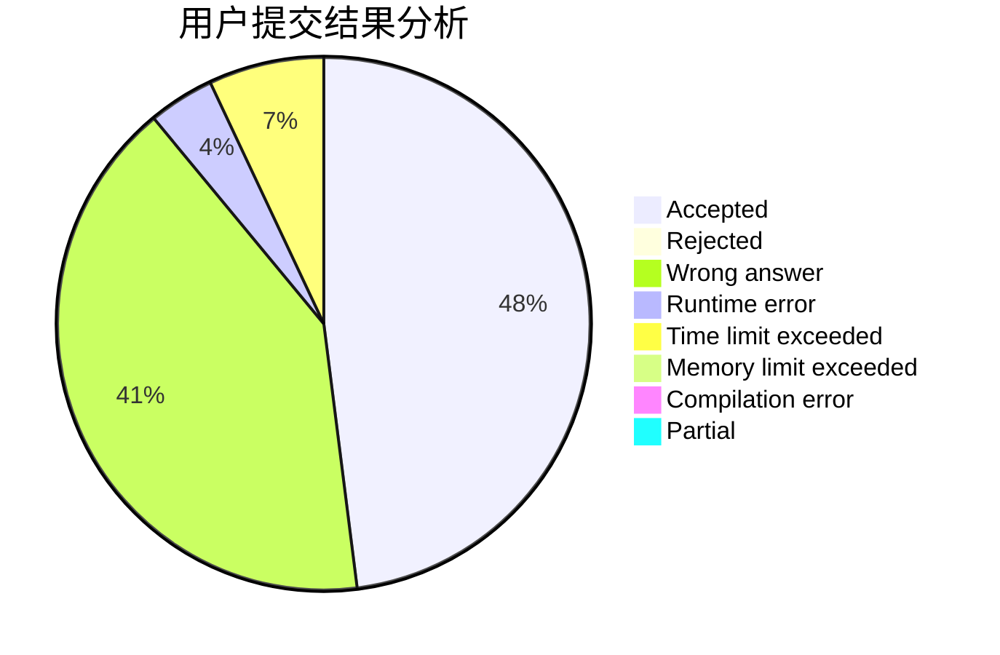
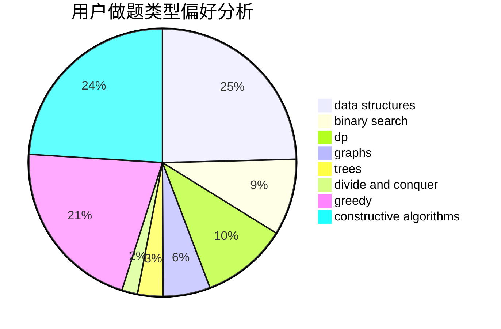
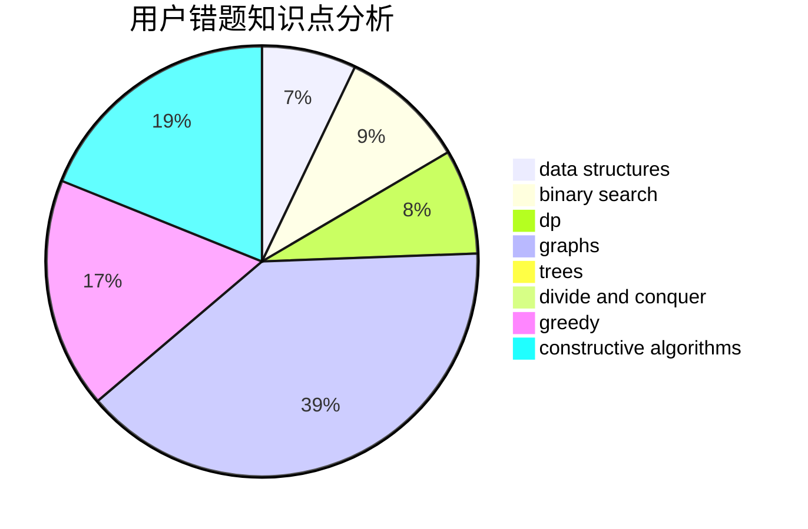

# Irene

<!-- tabs:start -->

#### **用户提交结果分析**

#### **用户做题类型偏好分析**

#### **用户错题知识点分析**

<!-- tabs:end -->
# 推荐题目
[1430F](https://codeforces.com/contest/1430/problem/F)		dp,
                        greedy		  
[768C](https://codeforces.com/contest/768/problem/C)		brute force,
                        dp,
                        implementation,
                        sortings		  
[114D](https://codeforces.com/contest/114/problem/D)		dsu,graphs,sortings,trees		  
[1350D](https://codeforces.com/contest/1350/problem/D)		dsu,graphs,sortings,trees		  
[109A](https://codeforces.com/contest/109/problem/A)		brute force,
                        implementation		  
[445B](https://codeforces.com/contest/445/problem/B)		dfs and similar,
                        dsu,
                        greedy		  
[664A](https://codeforces.com/contest/664/problem/A)		math,
                        number theory		  
[359C](https://codeforces.com/contest/359/problem/C)		math,
                        number theory		  
[865D](https://codeforces.com/contest/865/problem/D)		constructive algorithms,
                        data structures,
                        greedy		  
[696C](https://codeforces.com/contest/696/problem/C)		combinatorics,
                        dp,
                        implementation,
                        math,
                        matrices		  
