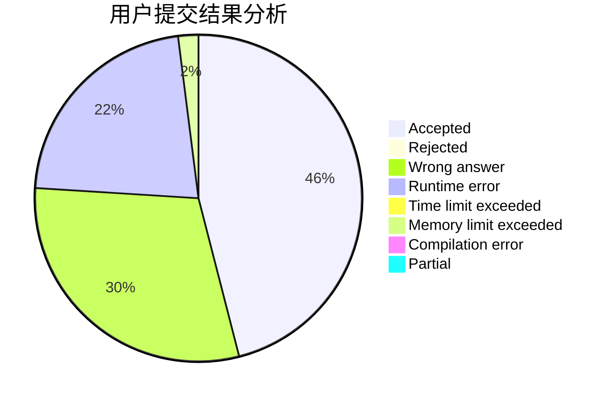
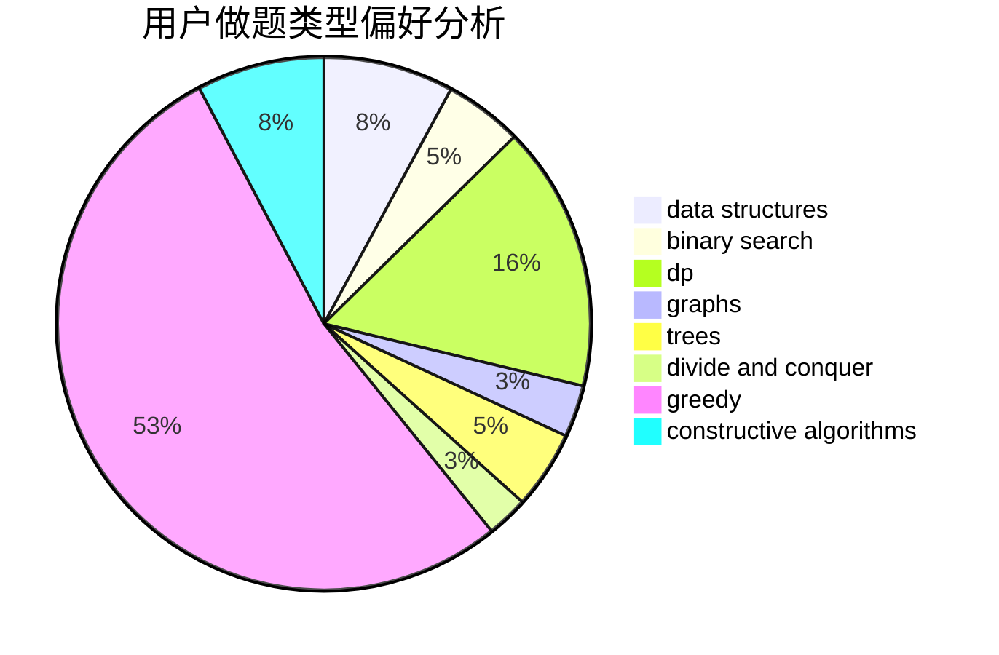
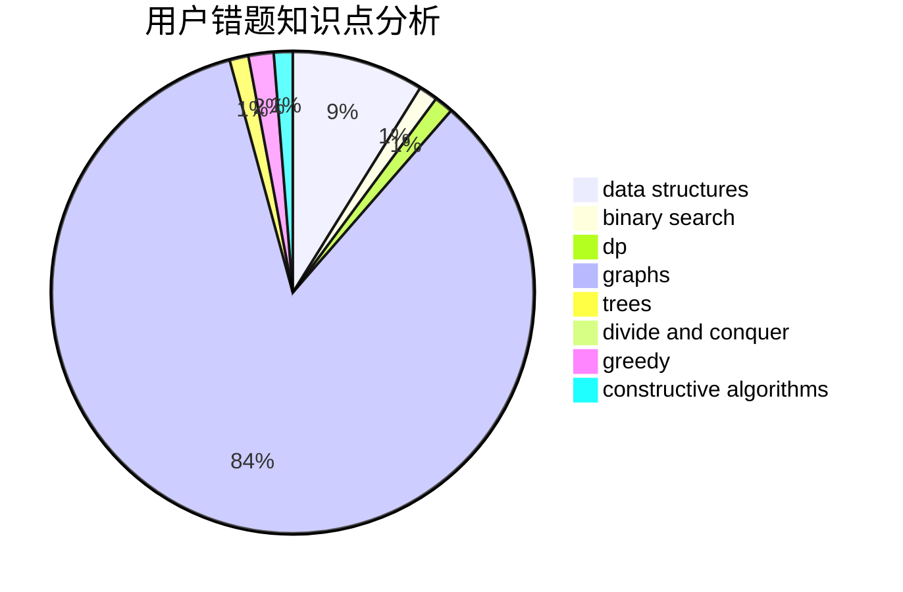

# Iridescent2020

<!-- tabs:start -->

#### **用户提交结果分析**

#### **用户做题类型偏好分析**

#### **用户错题知识点分析**

<!-- tabs:end -->
# 推荐题目
[876B](https://codeforces.com/contest/876/problem/B)		implementation,
                        math,
                        number theory		  
[1073C](https://codeforces.com/contest/1073/problem/C)		binary search,
                        two pointers		  
[721C](https://codeforces.com/contest/721/problem/C)		dp,
                        graphs		  
[1488F](https://codeforces.com/contest/1488/problem/F)		*special problem,
                        *special problem,
                        binary search,
                        data structures		  
[547D](https://codeforces.com/contest/547/problem/D)		constructive algorithms,
                        dfs and similar,
                        graphs		  
[231E](https://codeforces.com/contest/231/problem/E)		data structures,
                        dfs and similar,
                        dp,
                        graphs,
                        trees		  
[1194F](https://codeforces.com/contest/1194/problem/F)		combinatorics,
                        dp,
                        number theory,
                        probabilities,
                        two pointers		  
[699A](https://codeforces.com/contest/699/problem/A)		implementation		  
[1342F](https://codeforces.com/contest/1342/problem/F)		bitmasks,
                        brute force,
                        dp		  
[421B](https://codeforces.com/contest/421/problem/B)		dsu,graphs,sortings,trees		  
