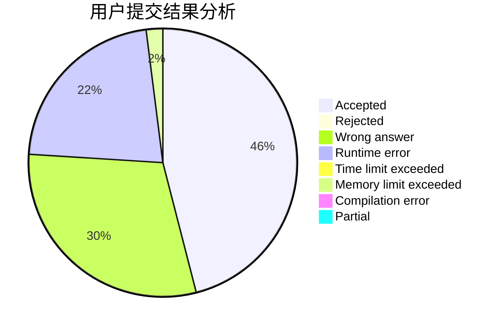
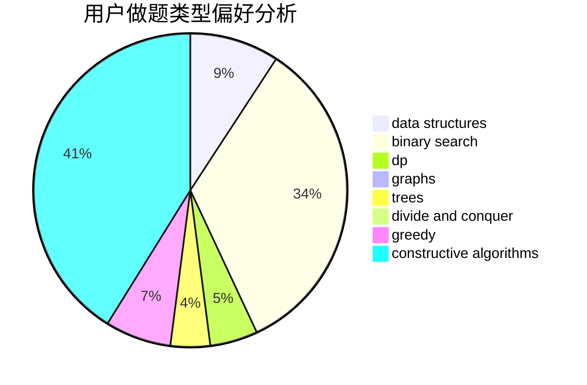

# Iridescent2020

<!-- tabs:start -->

#### **用户提交结果分析**

#### **用户做题类型偏好分析**

#### **用户错题知识点分析**

<!-- tabs:end -->
# 推荐题目
[858C](https://codeforces.com/contest/858/problem/C)		dp,
                        greedy,
                        implementation		  
[1072D](https://codeforces.com/contest/1072/problem/D)		dsu,graphs,sortings,trees		  
[702E](https://codeforces.com/contest/702/problem/E)		data structures,
                        graphs		  
[1480B](https://codeforces.com/contest/1480/problem/B)		greedy,
                        implementation,
                        sortings		  
[521E](https://codeforces.com/contest/521/problem/E)		dfs and similar,
                        graphs		  
[20C](https://codeforces.com/contest/20/problem/C)		graphs,
                        shortest paths		  
[1189D1](https://codeforces.com/contest/1189D/problem/1)		dsu,graphs,sortings,trees		  
[673B](https://codeforces.com/contest/673/problem/B)		greedy,
                        implementation		  
[1335E2](https://codeforces.com/contest/1335E/problem/2)		brute force,
                        data structures,
                        dp,
                        two pointers		  
[393C](https://codeforces.com/contest/393/problem/C)		dsu,graphs,sortings,trees		  
