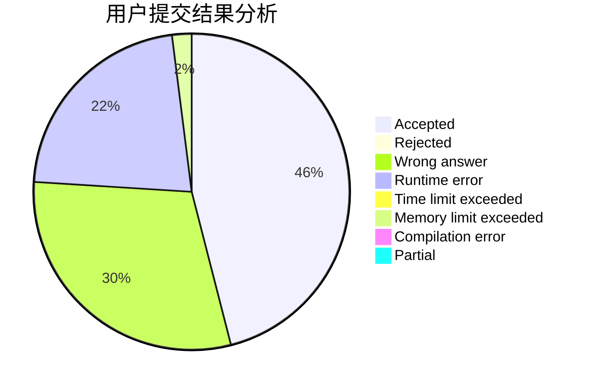
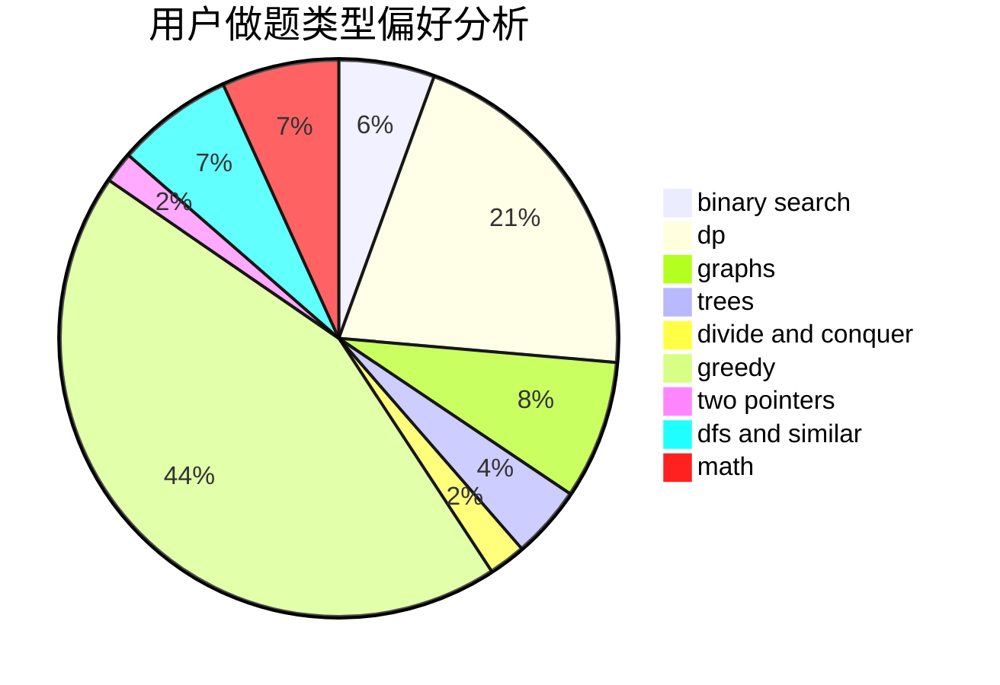

# Iridescent2020

<!-- tabs:start -->

#### **用户提交结果分析**

#### **用户做题类型偏好分析**

<!-- tabs:end -->
# 推荐题目
[876B](https://codeforces.com/contest/876/problem/B)
[1073C](https://codeforces.com/contest/1073/problem/C)
[721C](https://codeforces.com/contest/721/problem/C)
[1488F](https://codeforces.com/contest/1488/problem/F)
[547D](https://codeforces.com/contest/547/problem/D)
[231E](https://codeforces.com/contest/231/problem/E)
[1194F](https://codeforces.com/contest/1194/problem/F)
[699A](https://codeforces.com/contest/699/problem/A)
[1342F](https://codeforces.com/contest/1342/problem/F)
[421B](https://codeforces.com/contest/421/problem/B)
