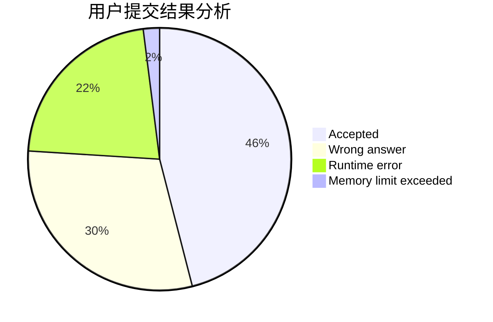
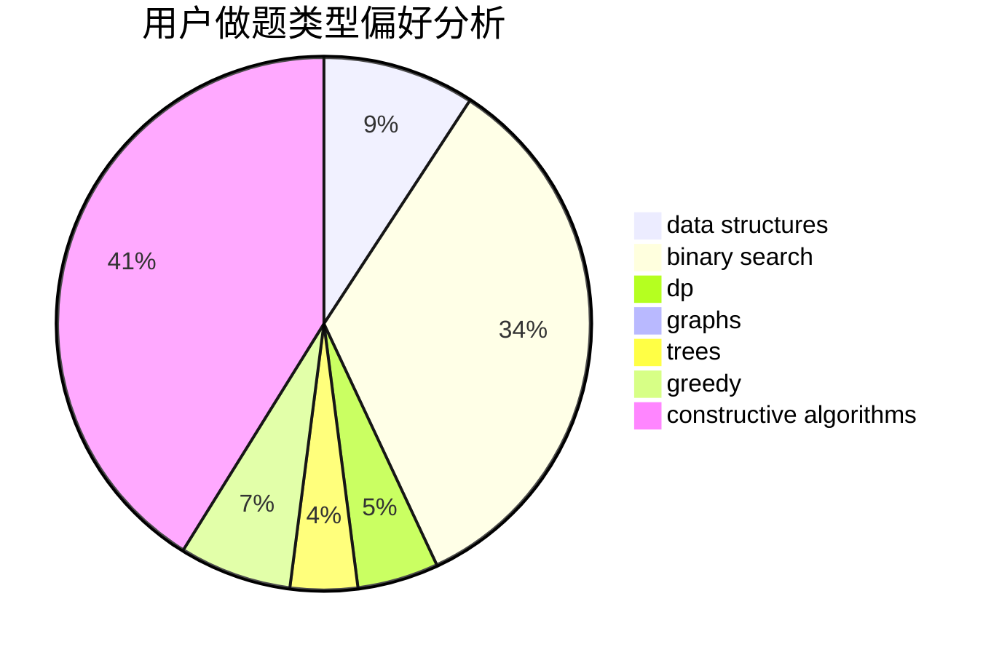

# Iridescent2020
<!-- tabs:start -->
#### **用户提交结果分析**

#### **用户做题类型偏好分析**

#### **用户错题知识点分析**

<!-- tabs:end -->
# 推荐题目
[The Great Hero](http://codeforces.com/problemset/problem/1480/B)		greedy,
                        implementation,
                        sortings		  
[Dijkstra?](http://codeforces.com/problemset/problem/20/C)		graphs,
                        shortest paths		  
[Frequency Problem (Easy Version)](http://codeforces.com/problemset/problem/1446/D1)		data structures,
                        greedy		  
[Problems for Round](http://codeforces.com/problemset/problem/673/B)		greedy,
                        implementation		  
[Analysis of Pathes in Functional Graph](http://codeforces.com/problemset/problem/702/E)		data structures,
                        graphs		  
[Blocked Points](https://codeforces.com/contest/393/problem/C)		math		  
[Bath Queue](http://codeforces.com/problemset/problem/28/C)		combinatorics,
                        dp,
                        probabilities		  
[String and Operations](http://codeforces.com/problemset/problem/1455/F)		dp,
                        greedy		  
[Add on a Tree](https://codeforces.com/contest/1189/problem/D1)		trees		  
[Cycling City](http://codeforces.com/problemset/problem/521/E)		dfs and similar,
                        graphs		  
<!-- tabs:start -->
#### **data structures**
[Frequency Problem (Easy Version)](http://codeforces.com/problemset/problem/1446/D1)		data structures,
                        greedy		  
[Analysis of Pathes in Functional Graph](http://codeforces.com/problemset/problem/702/E)		data structures,
                        graphs		  
[Greg and Array](http://codeforces.com/problemset/problem/295/A)		data structures,
                        implementation		  
[Table Tennis](http://codeforces.com/problemset/problem/879/B)		data structures,
                        implementation		  
[Ratings and Reality Shows](http://codeforces.com/problemset/problem/887/D)		data structures,
                        two pointers		  
[Preparing for the Contest](http://codeforces.com/problemset/problem/377/B)		binary search,
                        data structures,
                        greedy,
                        sortings		  
[Three Blocks Palindrome (hard version)](http://codeforces.com/problemset/problem/1335/E2)		brute force,
                        data structures,
                        dp,
                        two pointers		  
[Into Blocks (hard version)](http://codeforces.com/problemset/problem/1209/G2)		data structures		  
[Strip](http://codeforces.com/problemset/problem/487/B)		binary search,
                        data structures,
                        dp,
                        two pointers		  
[BRT Contract](http://codeforces.com/problemset/problem/187/D)		data structures		  
#### **binary search**
[Preparing for the Contest](http://codeforces.com/problemset/problem/377/B)		binary search,
                        data structures,
                        greedy,
                        sortings		  
[Perfect Number](http://codeforces.com/problemset/problem/919/B)		binary search,
                        brute force,
                        dp,
                        implementation,
                        number theory		  
[Strip](http://codeforces.com/problemset/problem/487/B)		binary search,
                        data structures,
                        dp,
                        two pointers		  
[Maximum width](http://codeforces.com/problemset/problem/1492/C)		binary search,
                        data structures,
                        dp,
                        greedy,
                        two pointers		  
[Pairs](http://codeforces.com/problemset/problem/1463/D)		binary search,
                        constructive algorithms,
                        greedy,
                        two pointers		  
[Old Floppy Drive](http://codeforces.com/problemset/problem/1490/G)		binary search,
                        data structures,
                        math		  
[Odd Mineral Resource](http://codeforces.com/problemset/problem/1479/D)		binary search,
                        bitmasks,
                        brute force,
                        data structures,
                        probabilities,
                        trees		  
[Complicated Computations](http://codeforces.com/problemset/problem/1436/E)		binary search,
                        data structures,
                        two pointers		  
[Divide and Summarize](http://codeforces.com/problemset/problem/1461/D)		binary search,
                        brute force,
                        data structures,
                        divide and conquer,
                        implementation,
                        sortings		  
[K-beautiful Strings](http://codeforces.com/problemset/problem/1493/C)		binary search,
                        brute force,
                        constructive algorithms,
                        greedy,
                        strings		  
#### **dp**
[Bath Queue](http://codeforces.com/problemset/problem/28/C)		combinatorics,
                        dp,
                        probabilities		  
[String and Operations](http://codeforces.com/problemset/problem/1455/F)		dp,
                        greedy		  
[Did you mean...](http://codeforces.com/problemset/problem/858/C)		dp,
                        greedy,
                        implementation		  
[Antichain](http://codeforces.com/problemset/problem/353/E)		dp,
                        graph matchings,
                        greedy		  
[Three Blocks Palindrome (hard version)](http://codeforces.com/problemset/problem/1335/E2)		brute force,
                        data structures,
                        dp,
                        two pointers		  
[Field expansion](http://codeforces.com/problemset/problem/799/D)		brute force,
                        dp,
                        meet-in-the-middle		  
[Rectangles and Square](http://codeforces.com/problemset/problem/335/D)		brute force,
                        dp		  
[Odd sum](http://codeforces.com/problemset/problem/797/B)		dp,
                        greedy,
                        implementation		  
[Perfect Number](http://codeforces.com/problemset/problem/919/B)		binary search,
                        brute force,
                        dp,
                        implementation,
                        number theory		  
[Strip](http://codeforces.com/problemset/problem/487/B)		binary search,
                        data structures,
                        dp,
                        two pointers		  
#### **graph**
[Dijkstra?](http://codeforces.com/problemset/problem/20/C)		graphs,
                        shortest paths		  
[Analysis of Pathes in Functional Graph](http://codeforces.com/problemset/problem/702/E)		data structures,
                        graphs		  
[Cycling City](http://codeforces.com/problemset/problem/521/E)		dfs and similar,
                        graphs		  
[Antichain](http://codeforces.com/problemset/problem/353/E)		dp,
                        graph matchings,
                        greedy		  
[Tanya is 5!](http://codeforces.com/problemset/problem/737/E)		graph matchings,
                        graphs,
                        greedy,
                        schedules		  
[Valid BFS?](http://codeforces.com/problemset/problem/1037/D)		dfs and similar,
                        graphs,
                        shortest paths,
                        trees		  
[Planar Perimeter](http://codeforces.com/problemset/problem/1242/E)		constructive algorithms,
                        graphs		  
[Two Paths](http://codeforces.com/problemset/problem/14/D)		dfs and similar,
                        dp,
                        graphs,
                        shortest paths,
                        trees,
                        two pointers		  
[Cycle](http://codeforces.com/problemset/problem/117/C)		dfs and similar,
                        graphs		  
[Graph Game](http://codeforces.com/problemset/problem/235/D)		graphs		  
#### **trees**
[Add on a Tree](https://codeforces.com/contest/1189/problem/D1)		trees		  
[Valid BFS?](http://codeforces.com/problemset/problem/1037/D)		dfs and similar,
                        graphs,
                        shortest paths,
                        trees		  
[Two Paths](http://codeforces.com/problemset/problem/14/D)		dfs and similar,
                        dp,
                        graphs,
                        shortest paths,
                        trees,
                        two pointers		  
[Odd Mineral Resource](http://codeforces.com/problemset/problem/1479/D)		binary search,
                        bitmasks,
                        brute force,
                        data structures,
                        probabilities,
                        trees		  
[Yet Another Card Deck](http://codeforces.com/problemset/problem/1511/C)		brute force,
                        data structures,
                        implementation,
                        trees		  
[Diameter Cuts](http://codeforces.com/problemset/problem/1499/F)		combinatorics,
                        dfs and similar,
                        dp,
                        trees		  
[Fib-tree](http://codeforces.com/problemset/problem/1491/E)		brute force,
                        dfs and similar,
                        divide and conquer,
                        number theory,
                        trees		  
[13th Labour of Heracles](http://codeforces.com/problemset/problem/1466/D)		data structures,
                        greedy,
                        sortings,
                        trees		  
[BFS Trees](http://codeforces.com/problemset/problem/1495/D)		combinatorics,
                        dfs and similar,
                        graphs,
                        math,
                        shortest paths,
                        trees		  
[Sum of Prefix Sums](http://codeforces.com/problemset/problem/1303/G)		data structures,
                        divide and conquer,
                        geometry,
                        trees		  
#### **divide and conquer**
[Divide and Summarize](http://codeforces.com/problemset/problem/1461/D)		binary search,
                        brute force,
                        data structures,
                        divide and conquer,
                        implementation,
                        sortings		  
[Song of the Sirens](http://codeforces.com/problemset/problem/1466/G)		combinatorics,
                        divide and conquer,
                        hashing,
                        math,
                        string suffix structures,
                        strings		  
[Permutation Transformation](http://codeforces.com/problemset/problem/1490/D)		dfs and similar,
                        divide and conquer,
                        implementation		  
[Skyline Photo](https://codeforces.com/contest/1483/problem/C)		data structures,
                        divide and conquer,
                        dp		  
[Fib-tree](http://codeforces.com/problemset/problem/1491/E)		brute force,
                        dfs and similar,
                        divide and conquer,
                        number theory,
                        trees		  
[Sum of Prefix Sums](http://codeforces.com/problemset/problem/1303/G)		data structures,
                        divide and conquer,
                        geometry,
                        trees		  
[Dogeforces](http://codeforces.com/problemset/problem/1494/D)		constructive algorithms,
                        data structures,
                        dfs and similar,
                        divide and conquer,
                        dsu,
                        greedy,
                        sortings,
                        trees		  
[Logistical Questions](http://codeforces.com/problemset/problem/566/C)		dfs and similar,
                        divide and conquer,
                        trees		  
[Fruit Sequences](http://codeforces.com/problemset/problem/1428/F)		binary search,
                        data structures,
                        divide and conquer,
                        dp,
                        two pointers		  
[Dr. Evil Underscores](http://codeforces.com/problemset/problem/1285/D)		bitmasks,
                        brute force,
                        dfs and similar,
                        divide and conquer,
                        dp,
                        greedy,
                        strings,
                        trees		  
#### **greedy**
[The Great Hero](http://codeforces.com/problemset/problem/1480/B)		greedy,
                        implementation,
                        sortings		  
[Frequency Problem (Easy Version)](http://codeforces.com/problemset/problem/1446/D1)		data structures,
                        greedy		  
[Problems for Round](http://codeforces.com/problemset/problem/673/B)		greedy,
                        implementation		  
[String and Operations](http://codeforces.com/problemset/problem/1455/F)		dp,
                        greedy		  
[Did you mean...](http://codeforces.com/problemset/problem/858/C)		dp,
                        greedy,
                        implementation		  
[Minimum path](https://codeforces.com/contest/1072/problem/D)		greedy		  
[Nauuo and Cards](http://codeforces.com/problemset/problem/1172/A)		greedy,
                        implementation		  
[Antichain](http://codeforces.com/problemset/problem/353/E)		dp,
                        graph matchings,
                        greedy		  
[Tanya is 5!](http://codeforces.com/problemset/problem/737/E)		graph matchings,
                        graphs,
                        greedy,
                        schedules		  
[Send Boxes to Alice (Easy Version)](http://codeforces.com/problemset/problem/1254/B1)		constructive algorithms,
                        greedy,
                        math,
                        number theory,
                        ternary search,
                        two pointers		  
#### **constructive algorithms**
[Send Boxes to Alice (Easy Version)](http://codeforces.com/problemset/problem/1254/B1)		constructive algorithms,
                        greedy,
                        math,
                        number theory,
                        ternary search,
                        two pointers		  
[Planar Perimeter](http://codeforces.com/problemset/problem/1242/E)		constructive algorithms,
                        graphs		  
[Fence Painting](http://codeforces.com/problemset/problem/1481/C)		brute force,
                        constructive algorithms,
                        greedy		  
[Labs](http://codeforces.com/problemset/problem/1236/C)		constructive algorithms,
                        greedy,
                        implementation		  
[Game of Pairs](http://codeforces.com/problemset/problem/1404/D)		constructive algorithms,
                        dfs and similar,
                        interactive,
                        math,
                        number theory		  
[Anti-knapsack](http://codeforces.com/problemset/problem/1493/A)		constructive algorithms,
                        greedy		  
[Pairs](http://codeforces.com/problemset/problem/1463/D)		binary search,
                        constructive algorithms,
                        greedy,
                        two pointers		  
[XOR-gun](https://codeforces.com/contest/1456/problem/B)		bitmasks,
                        brute force,
                        constructive algorithms		  
[Genius's Gambit](http://codeforces.com/problemset/problem/1492/D)		bitmasks,
                        constructive algorithms,
                        greedy,
                        math		  
[3-Coloring](https://codeforces.com/contest/1504/problem/D)		constructive algorithms,
                        games,
                        interactive		  
#### **sortings**
[The Great Hero](http://codeforces.com/problemset/problem/1480/B)		greedy,
                        implementation,
                        sortings		  
[Preparing for the Contest](http://codeforces.com/problemset/problem/377/B)		binary search,
                        data structures,
                        greedy,
                        sortings		  
[Diamond Miner](https://codeforces.com/contest/1496/problem/C)		geometry,
                        greedy,
                        math,
                        sortings		  
[Meximization](http://codeforces.com/problemset/problem/1497/A)		brute force,
                        data structures,
                        greedy,
                        sortings		  
[Avoiding Zero](http://codeforces.com/problemset/problem/1427/A)		math,
                        sortings		  
[Divide and Summarize](http://codeforces.com/problemset/problem/1461/D)		binary search,
                        brute force,
                        data structures,
                        divide and conquer,
                        implementation,
                        sortings		  
[Chef Monocarp](http://codeforces.com/problemset/problem/1437/C)		dp,
                        flows,
                        graph matchings,
                        greedy,
                        math,
                        sortings		  
[Replacing Elements](http://codeforces.com/problemset/problem/1473/A)		greedy,
                        implementation,
                        math,
                        sortings		  
[Eastern Exhibition](http://codeforces.com/problemset/problem/1486/B)		binary search,
                        geometry,
                        shortest paths,
                        sortings		  
[Rescue Nibel!](http://codeforces.com/problemset/problem/1420/D)		combinatorics,
                        data structures,
                        sortings		  
<!-- tabs:end -->
