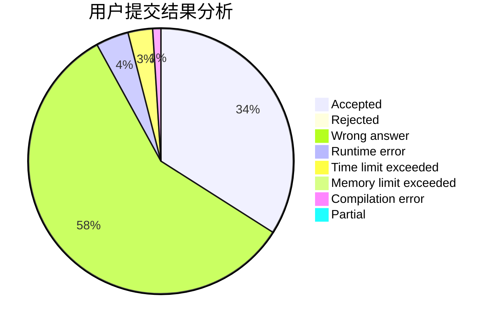
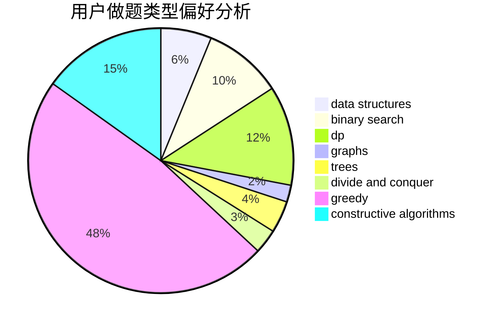
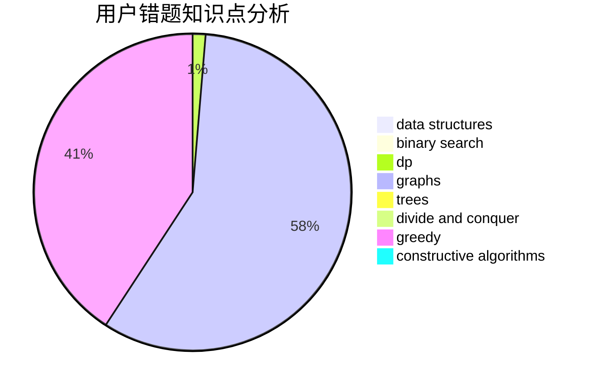

# Iscream2001
<!-- tabs:start -->
#### **用户提交结果分析**

#### **用户做题类型偏好分析**

#### **用户错题知识点分析**

<!-- tabs:end -->
# 推荐题目
[XOR-gun](https://codeforces.com/contest/1457/problem/D)		bitmasks,
                        brute force,
                        constructive algorithms		  
[Birthday](http://codeforces.com/problemset/problem/623/D)		greedy,
                        math,
                        probabilities		  
[Almost Identity Permutations](http://codeforces.com/problemset/problem/888/D)		combinatorics,
                        dp,
                        math		  
[Playing with Permutations](http://codeforces.com/problemset/problem/251/B)		implementation,
                        math		  
[Rectangles](http://codeforces.com/problemset/problem/1028/C)		geometry,
                        implementation,
                        sortings		  
[Substring](http://codeforces.com/problemset/problem/919/D)		dfs and similar,
                        dp,
                        graphs		  
[Two Permutations](http://codeforces.com/problemset/problem/213/E)		data structures,
                        hashing,
                        strings		  
[Developing Game](http://codeforces.com/problemset/problem/377/D)		data structures		  
[Physical Education](http://codeforces.com/problemset/problem/53/D)		sortings		  
[Barcelonian Distance](http://codeforces.com/problemset/problem/1032/D)		geometry,
                        implementation		  
<!-- tabs:start -->
#### **data structures**
[XOR-gun](http://codeforces.com/problemset/problem/213/E)		data structures,
                        hashing,
                        strings		  
[Birthday](http://codeforces.com/problemset/problem/377/D)		data structures		  
[Almost Identity Permutations](http://codeforces.com/problemset/problem/1469/F)		binary search,
                        data structures,
                        greedy		  
[Playing with Permutations](http://codeforces.com/problemset/problem/733/E)		constructive algorithms,
                        data structures,
                        math,
                        two pointers		  
[Rectangles](http://codeforces.com/problemset/problem/487/B)		binary search,
                        data structures,
                        dp,
                        two pointers		  
[Substring](https://codeforces.com/contest/1262/problem/D1)		data structures,
                        greedy		  
[Two Permutations](http://codeforces.com/problemset/problem/1322/B)		binary search,
                        bitmasks,
                        constructive algorithms,
                        data structures,
                        math,
                        sortings		  
[Developing Game](https://codeforces.com/contest/1287/problem/D)		constructive algorithms,
                        data structures,
                        dfs and similar,
                        graphs,
                        greedy,
                        trees		  
[Physical Education](http://codeforces.com/problemset/problem/896/C)		data structures,
                        probabilities		  
[Barcelonian Distance](http://codeforces.com/problemset/problem/1492/C)		binary search,
                        data structures,
                        dp,
                        greedy,
                        two pointers		  
#### **binary search**
[XOR-gun](http://codeforces.com/problemset/problem/551/C)		binary search,
                        greedy		  
[Birthday](http://codeforces.com/problemset/problem/1201/D)		binary search,
                        dp,
                        greedy,
                        implementation		  
[Almost Identity Permutations](http://codeforces.com/problemset/problem/1469/F)		binary search,
                        data structures,
                        greedy		  
[Playing with Permutations](http://codeforces.com/problemset/problem/487/B)		binary search,
                        data structures,
                        dp,
                        two pointers		  
[Rectangles](https://codeforces.com/contest/1240/problem/E)		binary search,
                        math,
                        number theory		  
[Substring](http://codeforces.com/problemset/problem/1329/E)		binary search,
                        greedy		  
[Two Permutations](http://codeforces.com/problemset/problem/1010/B)		binary search,
                        interactive		  
[Developing Game](http://codeforces.com/problemset/problem/1322/B)		binary search,
                        bitmasks,
                        constructive algorithms,
                        data structures,
                        math,
                        sortings		  
[Physical Education](http://codeforces.com/problemset/problem/1100/C)		binary search,
                        geometry,
                        math		  
[Barcelonian Distance](http://codeforces.com/problemset/problem/1492/C)		binary search,
                        data structures,
                        dp,
                        greedy,
                        two pointers		  
#### **dp**
[XOR-gun](http://codeforces.com/problemset/problem/888/D)		combinatorics,
                        dp,
                        math		  
[Birthday](http://codeforces.com/problemset/problem/919/D)		dfs and similar,
                        dp,
                        graphs		  
[Almost Identity Permutations](http://codeforces.com/problemset/problem/1201/D)		binary search,
                        dp,
                        greedy,
                        implementation		  
[Playing with Permutations](http://codeforces.com/problemset/problem/698/C)		bitmasks,
                        dp,
                        math,
                        probabilities		  
[Rectangles](http://codeforces.com/problemset/problem/487/B)		binary search,
                        data structures,
                        dp,
                        two pointers		  
[Substring](http://codeforces.com/problemset/problem/1092/F)		dfs and similar,
                        dp,
                        trees		  
[Two Permutations](http://codeforces.com/problemset/problem/1492/C)		binary search,
                        data structures,
                        dp,
                        greedy,
                        two pointers		  
[Developing Game](https://codeforces.com/contest/1457/problem/C)		brute force,
                        dp,
                        implementation		  
[Physical Education](http://codeforces.com/problemset/problem/1491/C)		brute force,
                        data structures,
                        dp,
                        greedy,
                        implementation		  
[Barcelonian Distance](http://codeforces.com/problemset/problem/1437/C)		dp,
                        flows,
                        graph matchings,
                        greedy,
                        math,
                        sortings		  
#### **graph**
[XOR-gun](http://codeforces.com/problemset/problem/919/D)		dfs and similar,
                        dp,
                        graphs		  
[Birthday](http://codeforces.com/problemset/problem/1250/N)		dfs and similar,
                        graphs,
                        greedy		  
[Almost Identity Permutations](http://codeforces.com/problemset/problem/901/D)		constructive algorithms,
                        dfs and similar,
                        graphs		  
[Playing with Permutations](https://codeforces.com/contest/1287/problem/D)		constructive algorithms,
                        data structures,
                        dfs and similar,
                        graphs,
                        greedy,
                        trees		  
[Rectangles](http://codeforces.com/problemset/problem/1487/C)		brute force,
                        constructive algorithms,
                        dfs and similar,
                        graphs,
                        greedy,
                        implementation,
                        math		  
[Substring](http://codeforces.com/problemset/problem/1437/C)		dp,
                        flows,
                        graph matchings,
                        greedy,
                        math,
                        sortings		  
[Two Permutations](http://codeforces.com/problemset/problem/1470/D)		constructive algorithms,
                        dfs and similar,
                        graph matchings,
                        graphs,
                        greedy		  
[Developing Game](http://codeforces.com/problemset/problem/1476/C)		dp,
                        graphs,
                        greedy		  
[Physical Education](http://codeforces.com/problemset/problem/1304/D)		constructive algorithms,
                        graphs,
                        greedy,
                        two pointers		  
[Barcelonian Distance](http://codeforces.com/problemset/problem/1475/C)		combinatorics,
                        graphs,
                        math		  
#### **trees**
[XOR-gun](http://codeforces.com/problemset/problem/1092/F)		dfs and similar,
                        dp,
                        trees		  
[Birthday](https://codeforces.com/contest/1287/problem/D)		constructive algorithms,
                        data structures,
                        dfs and similar,
                        graphs,
                        greedy,
                        trees		  
[Almost Identity Permutations](http://codeforces.com/problemset/problem/1479/D)		binary search,
                        bitmasks,
                        brute force,
                        data structures,
                        probabilities,
                        trees		  
[Playing with Permutations](http://codeforces.com/problemset/problem/1511/C)		brute force,
                        data structures,
                        implementation,
                        trees		  
[Rectangles](http://codeforces.com/problemset/problem/1499/F)		combinatorics,
                        dfs and similar,
                        dp,
                        trees		  
[Substring](http://codeforces.com/problemset/problem/1491/E)		brute force,
                        dfs and similar,
                        divide and conquer,
                        number theory,
                        trees		  
[Two Permutations](http://codeforces.com/problemset/problem/1466/D)		data structures,
                        greedy,
                        sortings,
                        trees		  
[Developing Game](http://codeforces.com/problemset/problem/1495/D)		combinatorics,
                        dfs and similar,
                        graphs,
                        math,
                        shortest paths,
                        trees		  
[Physical Education](http://codeforces.com/problemset/problem/1303/G)		data structures,
                        divide and conquer,
                        geometry,
                        trees		  
[Barcelonian Distance](http://codeforces.com/problemset/problem/1454/E)		combinatorics,
                        dfs and similar,
                        graphs,
                        trees		  
#### **divide and conquer**
[XOR-gun](http://codeforces.com/problemset/problem/1461/D)		binary search,
                        brute force,
                        data structures,
                        divide and conquer,
                        implementation,
                        sortings		  
[Birthday](http://codeforces.com/problemset/problem/1466/G)		combinatorics,
                        divide and conquer,
                        hashing,
                        math,
                        string suffix structures,
                        strings		  
[Almost Identity Permutations](http://codeforces.com/problemset/problem/1490/D)		dfs and similar,
                        divide and conquer,
                        implementation		  
[Playing with Permutations](https://codeforces.com/contest/1483/problem/C)		data structures,
                        divide and conquer,
                        dp		  
[Rectangles](http://codeforces.com/problemset/problem/1491/E)		brute force,
                        dfs and similar,
                        divide and conquer,
                        number theory,
                        trees		  
[Substring](http://codeforces.com/problemset/problem/1303/G)		data structures,
                        divide and conquer,
                        geometry,
                        trees		  
[Two Permutations](http://codeforces.com/problemset/problem/1494/D)		constructive algorithms,
                        data structures,
                        dfs and similar,
                        divide and conquer,
                        dsu,
                        greedy,
                        sortings,
                        trees		  
[Developing Game](http://codeforces.com/problemset/problem/1482/E)		data structures,
                        divide and conquer,
                        dp		  
[Physical Education](http://codeforces.com/problemset/problem/566/C)		dfs and similar,
                        divide and conquer,
                        trees		  
[Barcelonian Distance](http://codeforces.com/problemset/problem/1428/F)		binary search,
                        data structures,
                        divide and conquer,
                        dp,
                        two pointers		  
#### **greedy**
[XOR-gun](http://codeforces.com/problemset/problem/623/D)		greedy,
                        math,
                        probabilities		  
[Birthday](http://codeforces.com/problemset/problem/1250/N)		dfs and similar,
                        graphs,
                        greedy		  
[Almost Identity Permutations](http://codeforces.com/problemset/problem/551/C)		binary search,
                        greedy		  
[Playing with Permutations](http://codeforces.com/problemset/problem/1201/D)		binary search,
                        dp,
                        greedy,
                        implementation		  
[Rectangles](https://codeforces.com/contest/820/problem/C)		games,
                        greedy		  
[Substring](http://codeforces.com/problemset/problem/1469/F)		binary search,
                        data structures,
                        greedy		  
[Two Permutations](https://codeforces.com/contest/1262/problem/D1)		data structures,
                        greedy		  
[Developing Game](http://codeforces.com/problemset/problem/1329/E)		binary search,
                        greedy		  
[Physical Education](https://codeforces.com/contest/1287/problem/D)		constructive algorithms,
                        data structures,
                        dfs and similar,
                        graphs,
                        greedy,
                        trees		  
[Barcelonian Distance](http://codeforces.com/problemset/problem/1359/A)		brute force,
                        greedy,
                        math		  
#### **constructive algorithms**
[XOR-gun](https://codeforces.com/contest/1457/problem/D)		bitmasks,
                        brute force,
                        constructive algorithms		  
[Birthday](http://codeforces.com/problemset/problem/901/D)		constructive algorithms,
                        dfs and similar,
                        graphs		  
[Almost Identity Permutations](https://codeforces.com/contest/879/problem/C)		bitmasks,
                        constructive algorithms		  
[Playing with Permutations](http://codeforces.com/problemset/problem/733/E)		constructive algorithms,
                        data structures,
                        math,
                        two pointers		  
[Rectangles](http://codeforces.com/problemset/problem/1322/B)		binary search,
                        bitmasks,
                        constructive algorithms,
                        data structures,
                        math,
                        sortings		  
[Substring](https://codeforces.com/contest/1287/problem/D)		constructive algorithms,
                        data structures,
                        dfs and similar,
                        graphs,
                        greedy,
                        trees		  
[Two Permutations](http://codeforces.com/problemset/problem/1400/C)		2-sat,
                        brute force,
                        constructive algorithms,
                        greedy		  
[Developing Game](http://codeforces.com/problemset/problem/1493/A)		constructive algorithms,
                        greedy		  
[Physical Education](http://codeforces.com/problemset/problem/1463/D)		binary search,
                        constructive algorithms,
                        greedy,
                        two pointers		  
[Barcelonian Distance](https://codeforces.com/contest/1456/problem/B)		bitmasks,
                        brute force,
                        constructive algorithms		  
#### **sortings**
[XOR-gun](http://codeforces.com/problemset/problem/1028/C)		geometry,
                        implementation,
                        sortings		  
[Birthday](http://codeforces.com/problemset/problem/53/D)		sortings		  
[Almost Identity Permutations](http://codeforces.com/problemset/problem/1322/B)		binary search,
                        bitmasks,
                        constructive algorithms,
                        data structures,
                        math,
                        sortings		  
[Playing with Permutations](https://codeforces.com/contest/1496/problem/C)		geometry,
                        greedy,
                        math,
                        sortings		  
[Rectangles](http://codeforces.com/problemset/problem/1495/A)		geometry,
                        greedy,
                        math,
                        sortings		  
[Substring](http://codeforces.com/problemset/problem/1497/A)		brute force,
                        data structures,
                        greedy,
                        sortings		  
[Two Permutations](http://codeforces.com/problemset/problem/1427/A)		math,
                        sortings		  
[Developing Game](http://codeforces.com/problemset/problem/1461/D)		binary search,
                        brute force,
                        data structures,
                        divide and conquer,
                        implementation,
                        sortings		  
[Physical Education](http://codeforces.com/problemset/problem/1437/C)		dp,
                        flows,
                        graph matchings,
                        greedy,
                        math,
                        sortings		  
[Barcelonian Distance](http://codeforces.com/problemset/problem/1473/A)		greedy,
                        implementation,
                        math,
                        sortings		  
<!-- tabs:end -->
