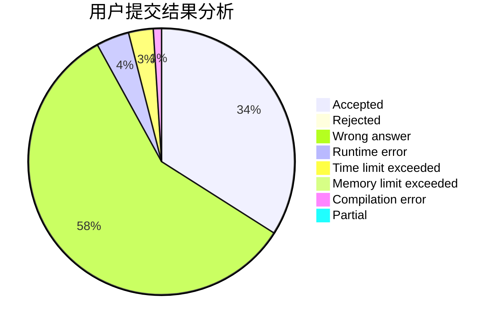
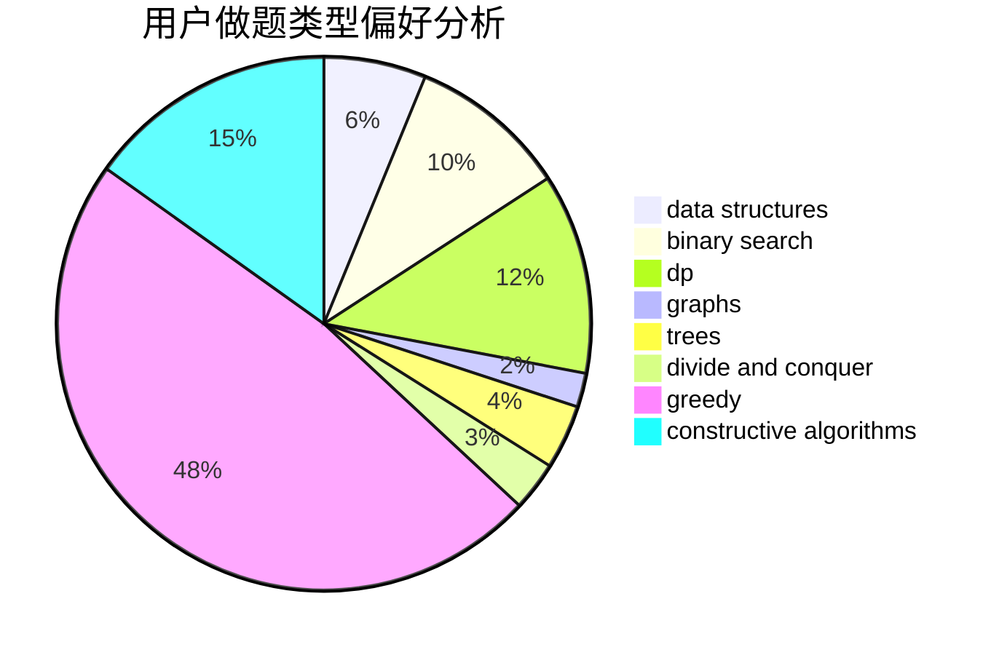
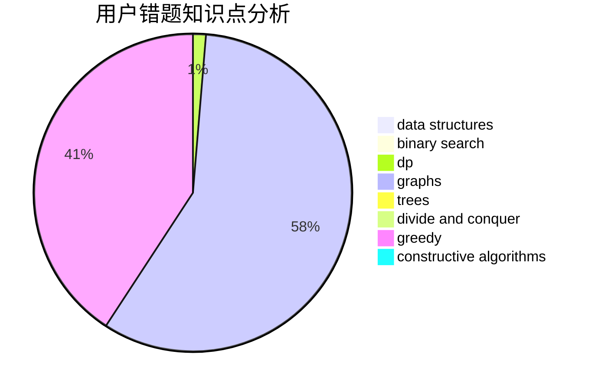

# Iscream2001

<!-- tabs:start -->

#### **用户提交结果分析**

#### **用户做题类型偏好分析**

#### **用户错题知识点分析**

<!-- tabs:end -->
# 推荐题目
[1457D](https://codeforces.com/contest/1457/problem/D)		dsu,graphs,sortings,trees		  
[888D](https://codeforces.com/contest/888/problem/D)		combinatorics,
                        dp,
                        math		  
[251B](https://codeforces.com/contest/251/problem/B)		implementation,
                        math		  
[1028C](https://codeforces.com/contest/1028/problem/C)		geometry,
                        implementation,
                        sortings		  
[698C](https://codeforces.com/contest/698/problem/C)		bitmasks,
                        dp,
                        math,
                        probabilities		  
[919D](https://codeforces.com/contest/919/problem/D)		dfs and similar,
                        dp,
                        graphs		  
[623D](https://codeforces.com/contest/623/problem/D)		greedy,
                        math,
                        probabilities		  
[213E](https://codeforces.com/contest/213/problem/E)		data structures,
                        hashing,
                        strings		  
[53D](https://codeforces.com/contest/53/problem/D)		sortings		  
[1329E](https://codeforces.com/contest/1329/problem/E)		binary search,
                        greedy		  
