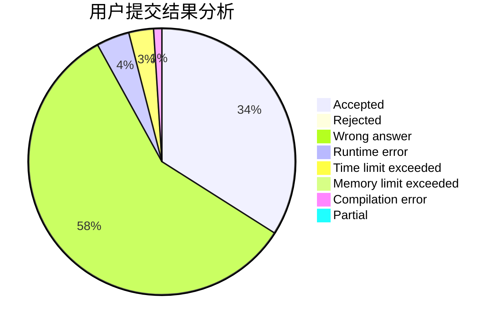
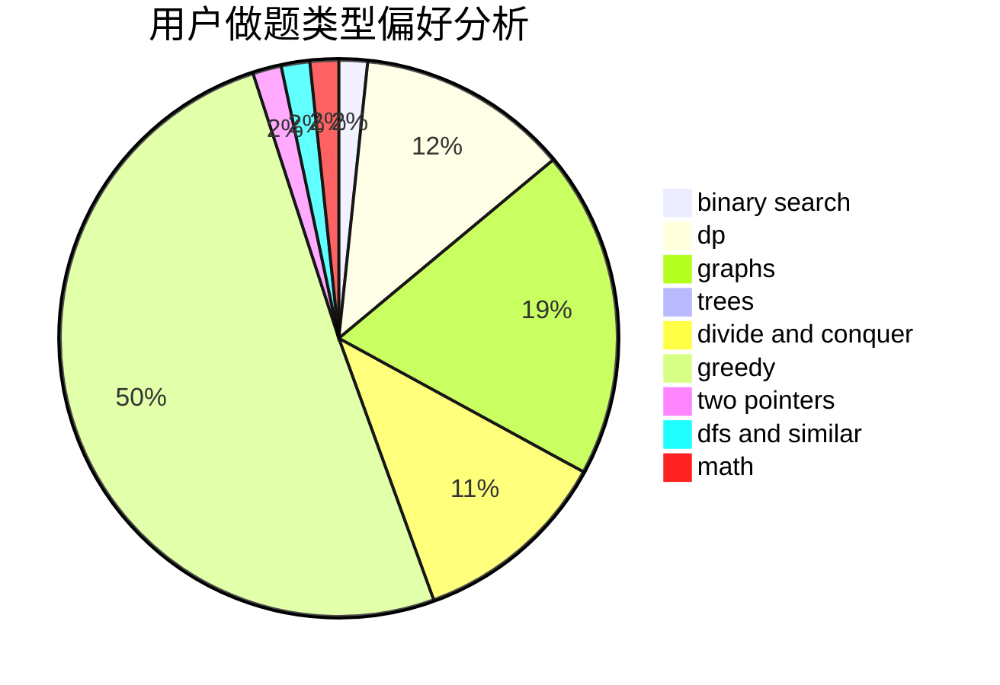

# Iscream2001

<!-- tabs:start -->

#### **用户提交结果分析**

#### **用户做题类型偏好分析**

<!-- tabs:end -->
# 推荐题目
[1466G](https://codeforces.com/contest/1466/problem/G)
[908B](https://codeforces.com/contest/908/problem/B)
[269D](https://codeforces.com/contest/269/problem/D)
[1028G](https://codeforces.com/contest/1028/problem/G)
[715A](https://codeforces.com/contest/715/problem/A)
[939E](https://codeforces.com/contest/939/problem/E)
[651D](https://codeforces.com/contest/651/problem/D)
[233A](https://codeforces.com/contest/233/problem/A)
[560A](https://codeforces.com/contest/560/problem/A)
[1335F](https://codeforces.com/contest/1335/problem/F)
