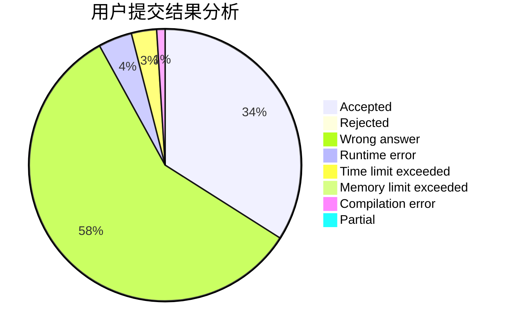
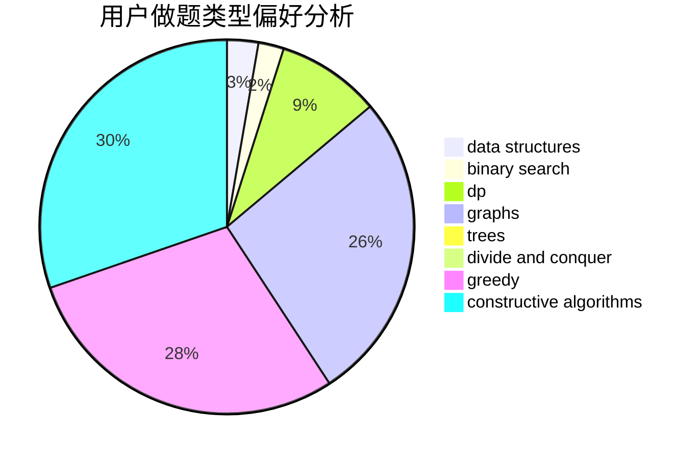
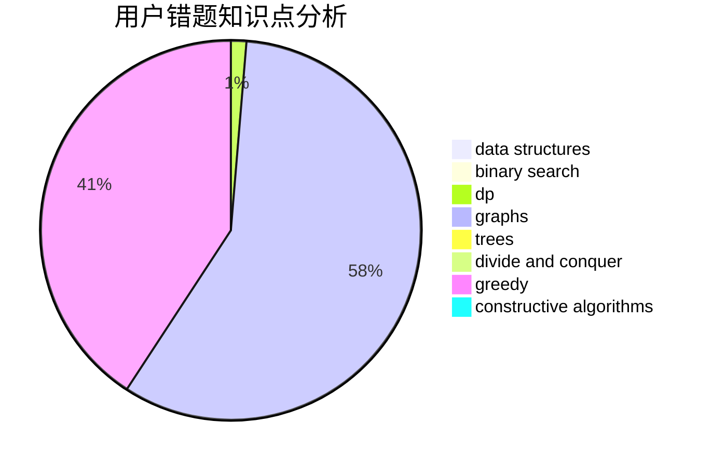

# Iscream2001

<!-- tabs:start -->

#### **用户提交结果分析**

#### **用户做题类型偏好分析**

#### **用户错题知识点分析**

<!-- tabs:end -->
# 推荐题目
[1466G](https://codeforces.com/contest/1466/problem/G)		combinatorics,
                        divide and conquer,
                        hashing,
                        math,
                        string suffix structures,
                        strings		  
[908B](https://codeforces.com/contest/908/problem/B)		brute force,
                        implementation		  
[269D](https://codeforces.com/contest/269/problem/D)		data structures,
                        dp,
                        graphs,
                        sortings		  
[1028G](https://codeforces.com/contest/1028/problem/G)		dp,
                        interactive		  
[715A](https://codeforces.com/contest/715/problem/A)		constructive algorithms,
                        math		  
[939E](https://codeforces.com/contest/939/problem/E)		binary search,
                        greedy,
                        ternary search,
                        two pointers		  
[651D](https://codeforces.com/contest/651/problem/D)		dsu,graphs,sortings,trees		  
[233A](https://codeforces.com/contest/233/problem/A)		implementation,
                        math		  
[560A](https://codeforces.com/contest/560/problem/A)		implementation,
                        sortings		  
[1335F](https://codeforces.com/contest/1335/problem/F)		data structures,
                        dfs and similar,
                        dsu,
                        graphs,
                        greedy,
                        matrices		  
