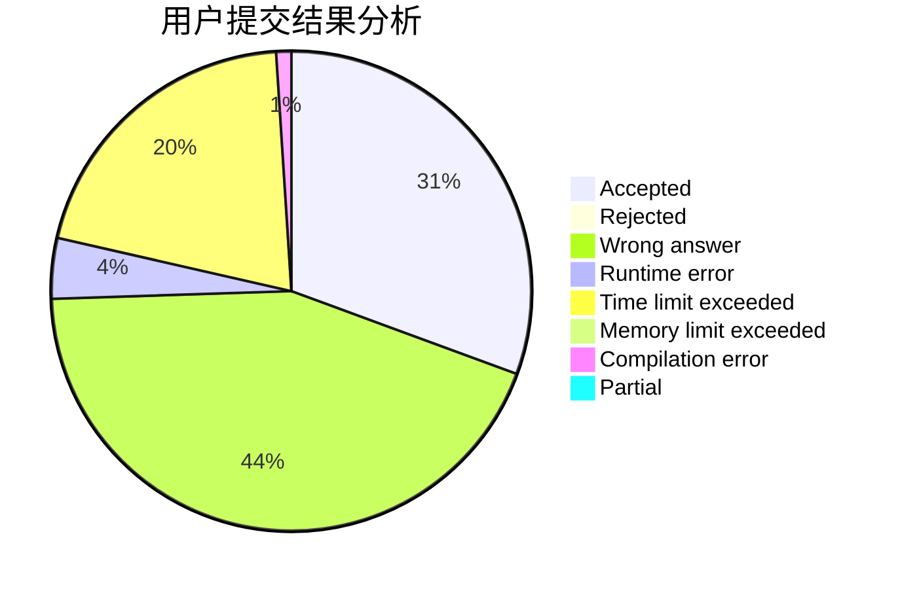
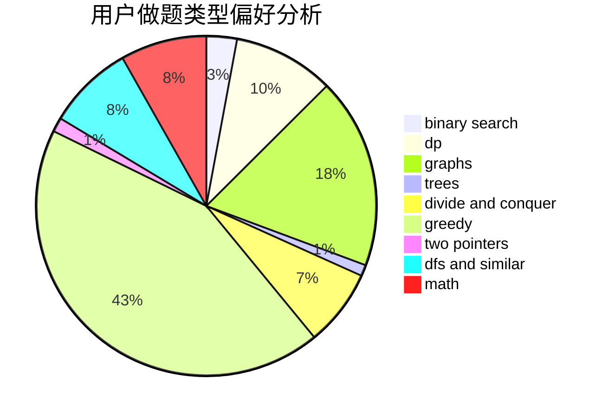

# Isoeasy

<!-- tabs:start -->

#### **用户提交结果分析**

#### **用户做题类型偏好分析**

<!-- tabs:end -->
# 推荐题目
[1513D](https://codeforces.com/contest/1513/problem/D)
[1481A](https://codeforces.com/contest/1481/problem/A)
[93A](https://codeforces.com/contest/93/problem/A)
[788D](https://codeforces.com/contest/788/problem/D)
[290C](https://codeforces.com/contest/290/problem/C)
[1133C](https://codeforces.com/contest/1133/problem/C)
[1040A](https://codeforces.com/contest/1040/problem/A)
[900B](https://codeforces.com/contest/900/problem/B)
[176B](https://codeforces.com/contest/176/problem/B)
[1017D](https://codeforces.com/contest/1017/problem/D)
