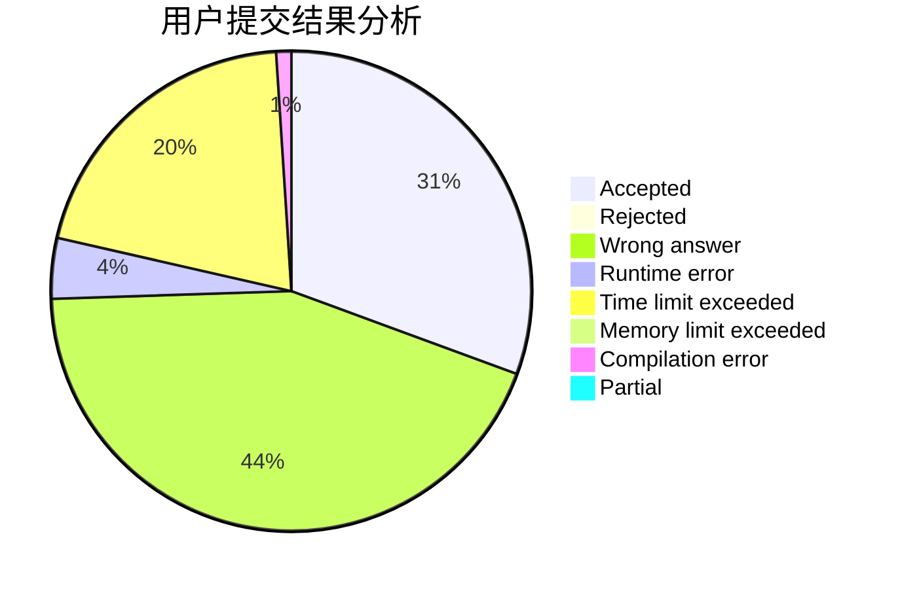
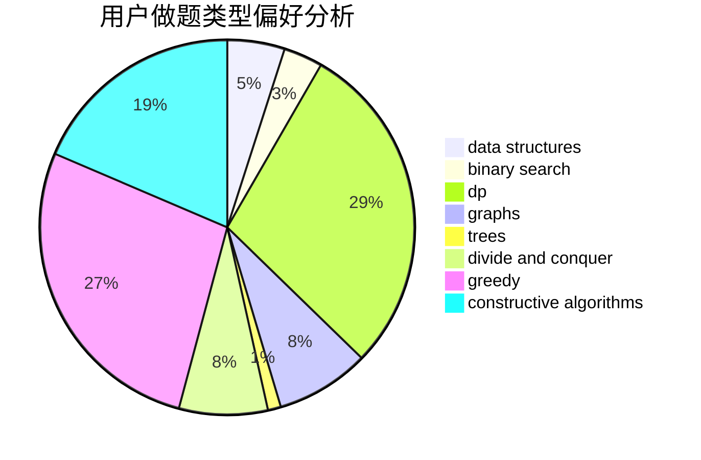
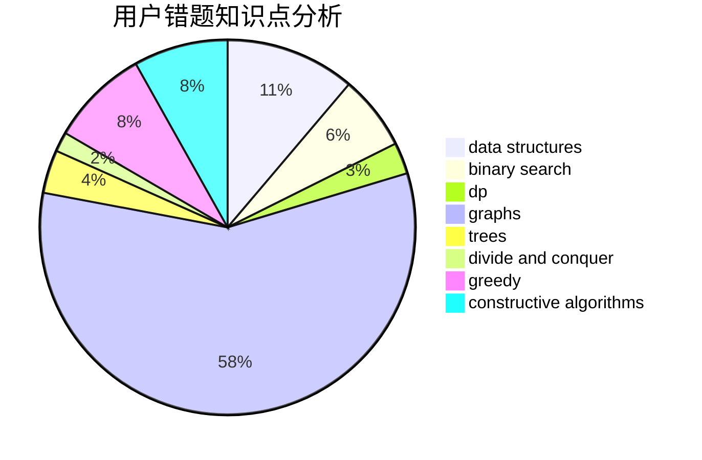

# Isoeasy
<!-- tabs:start -->
#### **用户提交结果分析**

#### **用户做题类型偏好分析**

#### **用户错题知识点分析**

<!-- tabs:end -->
# 推荐题目
[Travelling Salesman Problem](https://codeforces.com/contest/1504/problem/E)		binary search,
                        data structures,
                        dp,
                        greedy,
                        shortest paths,
                        sortings,
                        two pointers		  
[Correct Placement](http://codeforces.com/problemset/problem/1472/E)		binary search,
                        data structures,
                        dp,
                        sortings,
                        two pointers		  
[Russian Roulette](http://codeforces.com/problemset/problem/103/C)		constructive algorithms,
                        greedy		  
[The Rank](http://codeforces.com/problemset/problem/1017/A)		implementation		  
[Double Profiles](http://codeforces.com/problemset/problem/154/C)		graphs,
                        hashing,
                        sortings		  
[Congruence Equation](http://codeforces.com/problemset/problem/919/E)		chinese remainder theorem,
                        math,
                        number theory		  
[Little Elephant and Broken Sorting](http://codeforces.com/problemset/problem/258/D)		dp,
                        math,
                        probabilities		  
[Interesting Game](http://codeforces.com/problemset/problem/87/C)		dp,
                        games,
                        math		  
[A Game With Numbers](http://codeforces.com/problemset/problem/919/F)		games,
                        graphs,
                        shortest paths		  
[Orientation of Edges](http://codeforces.com/problemset/problem/883/G)		dfs and similar,
                        graphs		  
<!-- tabs:start -->
#### **data structures**
[Travelling Salesman Problem](https://codeforces.com/contest/1504/problem/E)		binary search,
                        data structures,
                        dp,
                        greedy,
                        shortest paths,
                        sortings,
                        two pointers		  
[Correct Placement](http://codeforces.com/problemset/problem/1472/E)		binary search,
                        data structures,
                        dp,
                        sortings,
                        two pointers		  
[Little Girl and Maximum Sum](http://codeforces.com/problemset/problem/276/C)		data structures,
                        greedy,
                        implementation,
                        sortings		  
[Spaceship Solitaire](http://codeforces.com/problemset/problem/1266/E)		data structures,
                        greedy,
                        implementation		  
[Bipartite Checking](http://codeforces.com/problemset/problem/813/F)		data structures,
                        dsu,
                        graphs		  
[Oleg and chess](http://codeforces.com/problemset/problem/793/G)		data structures,
                        divide and conquer,
                        flows,
                        graph matchings		  
[Tiles for Bathroom](http://codeforces.com/problemset/problem/1500/D)		data structures,
                        sortings,
                        two pointers		  
[Maximum width](http://codeforces.com/problemset/problem/1492/C)		binary search,
                        data structures,
                        dp,
                        greedy,
                        two pointers		  
[Old Floppy Drive](http://codeforces.com/problemset/problem/1490/G)		binary search,
                        data structures,
                        math		  
[Odd Mineral Resource](http://codeforces.com/problemset/problem/1479/D)		binary search,
                        bitmasks,
                        brute force,
                        data structures,
                        probabilities,
                        trees		  
#### **binary search**
[Travelling Salesman Problem](https://codeforces.com/contest/1504/problem/E)		binary search,
                        data structures,
                        dp,
                        greedy,
                        shortest paths,
                        sortings,
                        two pointers		  
[Correct Placement](http://codeforces.com/problemset/problem/1472/E)		binary search,
                        data structures,
                        dp,
                        sortings,
                        two pointers		  
[Downloading B++](http://codeforces.com/problemset/problem/883/C)		binary search,
                        implementation		  
[Summer Earnings](http://codeforces.com/problemset/problem/333/E)		binary search,
                        bitmasks,
                        brute force,
                        geometry,
                        sortings		  
[Maximum width](http://codeforces.com/problemset/problem/1492/C)		binary search,
                        data structures,
                        dp,
                        greedy,
                        two pointers		  
[Pairs](http://codeforces.com/problemset/problem/1463/D)		binary search,
                        constructive algorithms,
                        greedy,
                        two pointers		  
[Old Floppy Drive](http://codeforces.com/problemset/problem/1490/G)		binary search,
                        data structures,
                        math		  
[Odd Mineral Resource](http://codeforces.com/problemset/problem/1479/D)		binary search,
                        bitmasks,
                        brute force,
                        data structures,
                        probabilities,
                        trees		  
[Complicated Computations](http://codeforces.com/problemset/problem/1436/E)		binary search,
                        data structures,
                        two pointers		  
[Divide and Summarize](http://codeforces.com/problemset/problem/1461/D)		binary search,
                        brute force,
                        data structures,
                        divide and conquer,
                        implementation,
                        sortings		  
#### **dp**
[Travelling Salesman Problem](https://codeforces.com/contest/1504/problem/E)		binary search,
                        data structures,
                        dp,
                        greedy,
                        shortest paths,
                        sortings,
                        two pointers		  
[Correct Placement](http://codeforces.com/problemset/problem/1472/E)		binary search,
                        data structures,
                        dp,
                        sortings,
                        two pointers		  
[Little Elephant and Broken Sorting](http://codeforces.com/problemset/problem/258/D)		dp,
                        math,
                        probabilities		  
[Interesting Game](http://codeforces.com/problemset/problem/87/C)		dp,
                        games,
                        math		  
[Game of Stones](http://codeforces.com/problemset/problem/768/E)		bitmasks,
                        dp,
                        games		  
[Xenon's Attack on the Gangs](https://codeforces.com/contest/1293/problem/E)		combinatorics,
                        dfs and similar,
                        dp,
                        greedy,
                        trees		  
[As Simple as One and Two](https://codeforces.com/contest/1277/problem/C)		dp,
                        greedy		  
[Vitamins](http://codeforces.com/problemset/problem/1042/B)		bitmasks,
                        brute force,
                        dp,
                        implementation		  
[Red and Blue](http://codeforces.com/problemset/problem/1469/B)		dp,
                        greedy		  
[Roman and Numbers](http://codeforces.com/problemset/problem/401/D)		bitmasks,
                        brute force,
                        combinatorics,
                        dp,
                        number theory		  
#### **graph**
[Double Profiles](http://codeforces.com/problemset/problem/154/C)		graphs,
                        hashing,
                        sortings		  
[A Game With Numbers](http://codeforces.com/problemset/problem/919/F)		games,
                        graphs,
                        shortest paths		  
[Orientation of Edges](http://codeforces.com/problemset/problem/883/G)		dfs and similar,
                        graphs		  
[Nearest Opposite Parity](http://codeforces.com/problemset/problem/1272/E)		dfs and similar,
                        graphs,
                        shortest paths		  
[Useful Edges](http://codeforces.com/problemset/problem/1482/F)		graphs,
                        shortest paths		  
[Bits of merry old England](http://codeforces.com/problemset/problem/132/E)		flows,
                        graphs		  
[Bipartite Checking](http://codeforces.com/problemset/problem/813/F)		data structures,
                        dsu,
                        graphs		  
[Oleg and chess](http://codeforces.com/problemset/problem/793/G)		data structures,
                        divide and conquer,
                        flows,
                        graph matchings		  
[Minimum Ties](http://codeforces.com/problemset/problem/1487/C)		brute force,
                        constructive algorithms,
                        dfs and similar,
                        graphs,
                        greedy,
                        implementation,
                        math		  
[Chef Monocarp](http://codeforces.com/problemset/problem/1437/C)		dp,
                        flows,
                        graph matchings,
                        greedy,
                        math,
                        sortings		  
#### **trees**
[Xenon's Attack on the Gangs](https://codeforces.com/contest/1293/problem/E)		combinatorics,
                        dfs and similar,
                        dp,
                        greedy,
                        trees		  
[Vladislav and a Great Legend](http://codeforces.com/problemset/problem/1097/G)		combinatorics,
                        dp,
                        trees		  
[Odd Mineral Resource](http://codeforces.com/problemset/problem/1479/D)		binary search,
                        bitmasks,
                        brute force,
                        data structures,
                        probabilities,
                        trees		  
[Yet Another Card Deck](http://codeforces.com/problemset/problem/1511/C)		brute force,
                        data structures,
                        implementation,
                        trees		  
[Diameter Cuts](http://codeforces.com/problemset/problem/1499/F)		combinatorics,
                        dfs and similar,
                        dp,
                        trees		  
[Fib-tree](http://codeforces.com/problemset/problem/1491/E)		brute force,
                        dfs and similar,
                        divide and conquer,
                        number theory,
                        trees		  
[13th Labour of Heracles](http://codeforces.com/problemset/problem/1466/D)		data structures,
                        greedy,
                        sortings,
                        trees		  
[BFS Trees](http://codeforces.com/problemset/problem/1495/D)		combinatorics,
                        dfs and similar,
                        graphs,
                        math,
                        shortest paths,
                        trees		  
[Sum of Prefix Sums](http://codeforces.com/problemset/problem/1303/G)		data structures,
                        divide and conquer,
                        geometry,
                        trees		  
[Number of Simple Paths](http://codeforces.com/problemset/problem/1454/E)		combinatorics,
                        dfs and similar,
                        graphs,
                        trees		  
#### **divide and conquer**
[Oleg and chess](http://codeforces.com/problemset/problem/793/G)		data structures,
                        divide and conquer,
                        flows,
                        graph matchings		  
[Divide and Summarize](http://codeforces.com/problemset/problem/1461/D)		binary search,
                        brute force,
                        data structures,
                        divide and conquer,
                        implementation,
                        sortings		  
[Song of the Sirens](http://codeforces.com/problemset/problem/1466/G)		combinatorics,
                        divide and conquer,
                        hashing,
                        math,
                        string suffix structures,
                        strings		  
[Permutation Transformation](http://codeforces.com/problemset/problem/1490/D)		dfs and similar,
                        divide and conquer,
                        implementation		  
[Skyline Photo](https://codeforces.com/contest/1483/problem/C)		data structures,
                        divide and conquer,
                        dp		  
[Fib-tree](http://codeforces.com/problemset/problem/1491/E)		brute force,
                        dfs and similar,
                        divide and conquer,
                        number theory,
                        trees		  
[Sum of Prefix Sums](http://codeforces.com/problemset/problem/1303/G)		data structures,
                        divide and conquer,
                        geometry,
                        trees		  
[Dogeforces](http://codeforces.com/problemset/problem/1494/D)		constructive algorithms,
                        data structures,
                        dfs and similar,
                        divide and conquer,
                        dsu,
                        greedy,
                        sortings,
                        trees		  
[Logistical Questions](http://codeforces.com/problemset/problem/566/C)		dfs and similar,
                        divide and conquer,
                        trees		  
[Fruit Sequences](http://codeforces.com/problemset/problem/1428/F)		binary search,
                        data structures,
                        divide and conquer,
                        dp,
                        two pointers		  
#### **greedy**
[Travelling Salesman Problem](https://codeforces.com/contest/1504/problem/E)		binary search,
                        data structures,
                        dp,
                        greedy,
                        shortest paths,
                        sortings,
                        two pointers		  
[Russian Roulette](http://codeforces.com/problemset/problem/103/C)		constructive algorithms,
                        greedy		  
[Summarize to the Power of Two](http://codeforces.com/problemset/problem/1005/C)		brute force,
                        greedy,
                        implementation		  
[Little Girl and Maximum Sum](http://codeforces.com/problemset/problem/276/C)		data structures,
                        greedy,
                        implementation,
                        sortings		  
[Spaceship Solitaire](http://codeforces.com/problemset/problem/1266/E)		data structures,
                        greedy,
                        implementation		  
[Sorting Railway Cars](http://codeforces.com/problemset/problem/605/A)		constructive algorithms,
                        greedy		  
[Diverse Permutation](https://codeforces.com/contest/483/problem/C)		constructive algorithms,
                        greedy		  
[Xenon's Attack on the Gangs](https://codeforces.com/contest/1293/problem/E)		combinatorics,
                        dfs and similar,
                        dp,
                        greedy,
                        trees		  
[New Game Plus!](https://codeforces.com/contest/1457/problem/E)		constructive algorithms,
                        greedy,
                        math		  
[Cards for Friends](http://codeforces.com/problemset/problem/1472/A)		greedy,
                        math		  
#### **constructive algorithms**
[Russian Roulette](http://codeforces.com/problemset/problem/103/C)		constructive algorithms,
                        greedy		  
[Sorting Railway Cars](http://codeforces.com/problemset/problem/605/A)		constructive algorithms,
                        greedy		  
[Ants on a Circle](http://codeforces.com/problemset/problem/652/F)		constructive algorithms,
                        math		  
[Greedy Change](http://codeforces.com/problemset/problem/10/E)		constructive algorithms		  
[Diverse Permutation](https://codeforces.com/contest/483/problem/C)		constructive algorithms,
                        greedy		  
[Asya And Kittens](http://codeforces.com/problemset/problem/1131/F)		constructive algorithms,
                        dsu		  
[Ehab and another construction problem](http://codeforces.com/problemset/problem/1088/A)		brute force,
                        constructive algorithms		  
[New Game Plus!](https://codeforces.com/contest/1457/problem/E)		constructive algorithms,
                        greedy,
                        math		  
[Kuroni and the Gifts](http://codeforces.com/problemset/problem/1305/A)		brute force,
                        constructive algorithms,
                        greedy,
                        sortings		  
[Kuroni and the Score Distribution](http://codeforces.com/problemset/problem/1305/E)		constructive algorithms,
                        greedy,
                        implementation,
                        math		  
#### **sortings**
[Travelling Salesman Problem](https://codeforces.com/contest/1504/problem/E)		binary search,
                        data structures,
                        dp,
                        greedy,
                        shortest paths,
                        sortings,
                        two pointers		  
[Correct Placement](http://codeforces.com/problemset/problem/1472/E)		binary search,
                        data structures,
                        dp,
                        sortings,
                        two pointers		  
[Double Profiles](http://codeforces.com/problemset/problem/154/C)		graphs,
                        hashing,
                        sortings		  
[Lala Land and Apple Trees](http://codeforces.com/problemset/problem/558/A)		brute force,
                        implementation,
                        sortings		  
[Little Girl and Maximum Sum](http://codeforces.com/problemset/problem/276/C)		data structures,
                        greedy,
                        implementation,
                        sortings		  
[Fair Game](http://codeforces.com/problemset/problem/864/A)		implementation,
                        sortings		  
[Page Numbers](http://codeforces.com/problemset/problem/34/C)		expression parsing,
                        implementation,
                        sortings,
                        strings		  
[Summer Earnings](http://codeforces.com/problemset/problem/333/E)		binary search,
                        bitmasks,
                        brute force,
                        geometry,
                        sortings		  
[Kuroni and the Gifts](http://codeforces.com/problemset/problem/1305/A)		brute force,
                        constructive algorithms,
                        greedy,
                        sortings		  
[Advertising Agency](http://codeforces.com/problemset/problem/1475/E)		combinatorics,
                        math,
                        sortings		  
<!-- tabs:end -->
