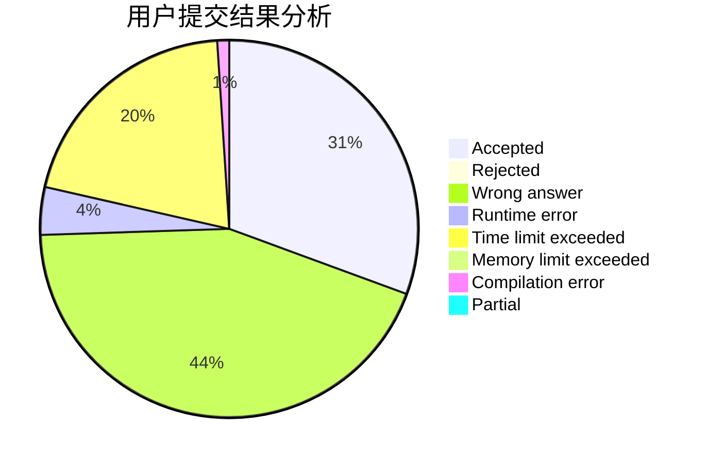
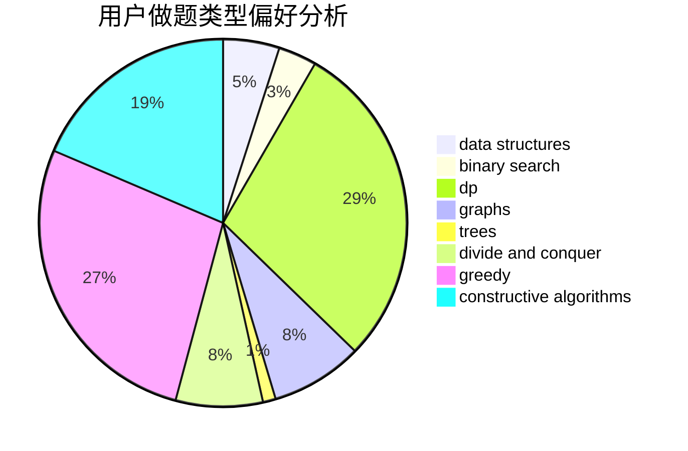
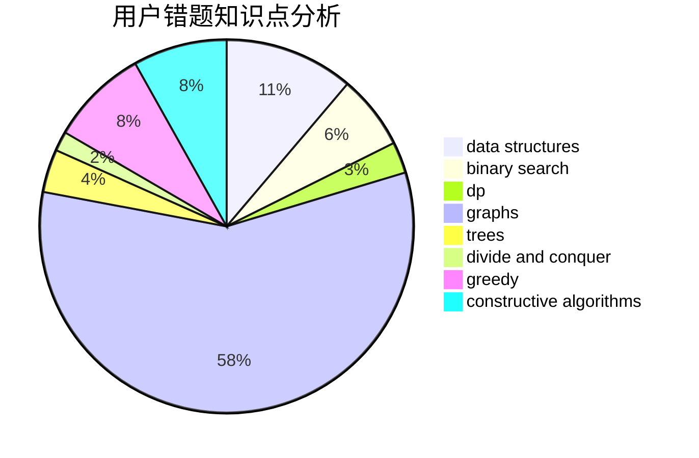

# Isoeasy

<!-- tabs:start -->

#### **用户提交结果分析**

#### **用户做题类型偏好分析**

#### **用户错题知识点分析**

<!-- tabs:end -->
# 推荐题目
[1504E](https://codeforces.com/contest/1504/problem/E)		dsu,graphs,sortings,trees		  
[1472E](https://codeforces.com/contest/1472/problem/E)		binary search,
                        data structures,
                        dp,
                        sortings,
                        two pointers		  
[919F](https://codeforces.com/contest/919/problem/F)		games,
                        graphs,
                        shortest paths		  
[768E](https://codeforces.com/contest/768/problem/E)		bitmasks,
                        dp,
                        games		  
[276C](https://codeforces.com/contest/276/problem/C)		data structures,
                        greedy,
                        implementation,
                        sortings		  
[1131F](https://codeforces.com/contest/1131/problem/F)		constructive algorithms,
                        dsu		  
[103C](https://codeforces.com/contest/103/problem/C)		constructive algorithms,
                        greedy		  
[883C](https://codeforces.com/contest/883/problem/C)		binary search,
                        implementation		  
[154C](https://codeforces.com/contest/154/problem/C)		graphs,
                        hashing,
                        sortings		  
[1017A](https://codeforces.com/contest/1017/problem/A)		implementation		  
