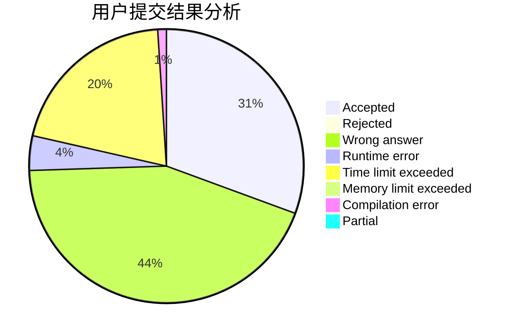
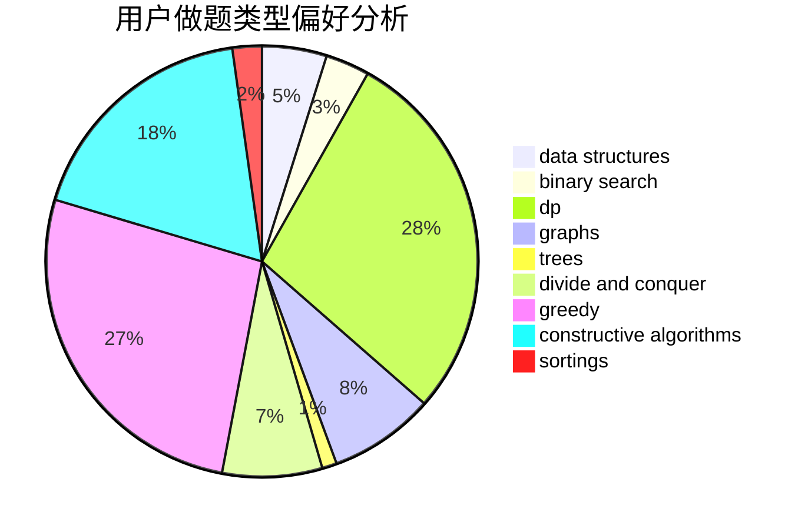
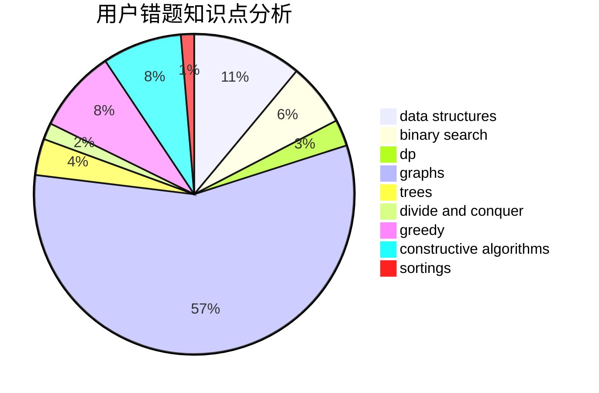

# Isoeasy
<!-- tabs:start -->
#### **用户提交结果分析**

#### **用户做题类型偏好分析**

#### **用户错题知识点分析**

<!-- tabs:end -->
# 推荐题目
[1504E](https://codeforces.com/contest/1504/problem/E)		binary search,
                        data structures,
                        dp,
                        greedy,
                        shortest paths,
                        sortings,
                        two pointers		  
[1472E](http://codeforces.com/problemset/problem/1472/E)		binary search,
                        data structures,
                        dp,
                        sortings,
                        two pointers		  
[103C](http://codeforces.com/problemset/problem/103/C)		constructive algorithms,
                        greedy		  
[1017A](http://codeforces.com/problemset/problem/1017/A)		implementation		  
[154C](http://codeforces.com/problemset/problem/154/C)		graphs,
                        hashing,
                        sortings		  
[919E](http://codeforces.com/problemset/problem/919/E)		chinese remainder theorem,
                        math,
                        number theory		  
[258D](http://codeforces.com/problemset/problem/258/D)		dp,
                        math,
                        probabilities		  
[87C](http://codeforces.com/problemset/problem/87/C)		dp,
                        games,
                        math		  
[919F](http://codeforces.com/problemset/problem/919/F)		games,
                        graphs,
                        shortest paths		  
[883G](http://codeforces.com/problemset/problem/883/G)		dfs and similar,
                        graphs		  
<!-- tabs:start -->
#### **data structures**
[1504E](https://codeforces.com/contest/1504/problem/E)		binary search,
                        data structures,
                        dp,
                        greedy,
                        shortest paths,
                        sortings,
                        two pointers		  
[1472E](http://codeforces.com/problemset/problem/1472/E)		binary search,
                        data structures,
                        dp,
                        sortings,
                        two pointers		  
[276C](http://codeforces.com/problemset/problem/276/C)		data structures,
                        greedy,
                        implementation,
                        sortings		  
[1266E](http://codeforces.com/problemset/problem/1266/E)		data structures,
                        greedy,
                        implementation		  
[813F](http://codeforces.com/problemset/problem/813/F)		data structures,
                        dsu,
                        graphs		  
[793G](http://codeforces.com/problemset/problem/793/G)		data structures,
                        divide and conquer,
                        flows,
                        graph matchings		  
[1500D](http://codeforces.com/problemset/problem/1500/D)		data structures,
                        sortings,
                        two pointers		  
[1492C](http://codeforces.com/problemset/problem/1492/C)		binary search,
                        data structures,
                        dp,
                        greedy,
                        two pointers		  
[1490G](http://codeforces.com/problemset/problem/1490/G)		binary search,
                        data structures,
                        math		  
[1479D](http://codeforces.com/problemset/problem/1479/D)		binary search,
                        bitmasks,
                        brute force,
                        data structures,
                        probabilities,
                        trees		  
#### **binary search**
[1504E](https://codeforces.com/contest/1504/problem/E)		binary search,
                        data structures,
                        dp,
                        greedy,
                        shortest paths,
                        sortings,
                        two pointers		  
[1472E](http://codeforces.com/problemset/problem/1472/E)		binary search,
                        data structures,
                        dp,
                        sortings,
                        two pointers		  
[883C](http://codeforces.com/problemset/problem/883/C)		binary search,
                        implementation		  
[333E](http://codeforces.com/problemset/problem/333/E)		binary search,
                        bitmasks,
                        brute force,
                        geometry,
                        sortings		  
[1492C](http://codeforces.com/problemset/problem/1492/C)		binary search,
                        data structures,
                        dp,
                        greedy,
                        two pointers		  
[1463D](http://codeforces.com/problemset/problem/1463/D)		binary search,
                        constructive algorithms,
                        greedy,
                        two pointers		  
[1490G](http://codeforces.com/problemset/problem/1490/G)		binary search,
                        data structures,
                        math		  
[1479D](http://codeforces.com/problemset/problem/1479/D)		binary search,
                        bitmasks,
                        brute force,
                        data structures,
                        probabilities,
                        trees		  
[1436E](http://codeforces.com/problemset/problem/1436/E)		binary search,
                        data structures,
                        two pointers		  
[1461D](http://codeforces.com/problemset/problem/1461/D)		binary search,
                        brute force,
                        data structures,
                        divide and conquer,
                        implementation,
                        sortings		  
#### **dp**
[1504E](https://codeforces.com/contest/1504/problem/E)		binary search,
                        data structures,
                        dp,
                        greedy,
                        shortest paths,
                        sortings,
                        two pointers		  
[1472E](http://codeforces.com/problemset/problem/1472/E)		binary search,
                        data structures,
                        dp,
                        sortings,
                        two pointers		  
[258D](http://codeforces.com/problemset/problem/258/D)		dp,
                        math,
                        probabilities		  
[87C](http://codeforces.com/problemset/problem/87/C)		dp,
                        games,
                        math		  
[768E](http://codeforces.com/problemset/problem/768/E)		bitmasks,
                        dp,
                        games		  
[1293E](https://codeforces.com/contest/1293/problem/E)		combinatorics,
                        dfs and similar,
                        dp,
                        greedy,
                        trees		  
[1277C](https://codeforces.com/contest/1277/problem/C)		dp,
                        greedy		  
[1042B](http://codeforces.com/problemset/problem/1042/B)		bitmasks,
                        brute force,
                        dp,
                        implementation		  
[1469B](http://codeforces.com/problemset/problem/1469/B)		dp,
                        greedy		  
[401D](http://codeforces.com/problemset/problem/401/D)		bitmasks,
                        brute force,
                        combinatorics,
                        dp,
                        number theory		  
#### **graph**
[154C](http://codeforces.com/problemset/problem/154/C)		graphs,
                        hashing,
                        sortings		  
[919F](http://codeforces.com/problemset/problem/919/F)		games,
                        graphs,
                        shortest paths		  
[883G](http://codeforces.com/problemset/problem/883/G)		dfs and similar,
                        graphs		  
[1272E](http://codeforces.com/problemset/problem/1272/E)		dfs and similar,
                        graphs,
                        shortest paths		  
[1482F](http://codeforces.com/problemset/problem/1482/F)		graphs,
                        shortest paths		  
[132E](http://codeforces.com/problemset/problem/132/E)		flows,
                        graphs		  
[813F](http://codeforces.com/problemset/problem/813/F)		data structures,
                        dsu,
                        graphs		  
[793G](http://codeforces.com/problemset/problem/793/G)		data structures,
                        divide and conquer,
                        flows,
                        graph matchings		  
[1487C](http://codeforces.com/problemset/problem/1487/C)		brute force,
                        constructive algorithms,
                        dfs and similar,
                        graphs,
                        greedy,
                        implementation,
                        math		  
[1437C](http://codeforces.com/problemset/problem/1437/C)		dp,
                        flows,
                        graph matchings,
                        greedy,
                        math,
                        sortings		  
#### **trees**
[1293E](https://codeforces.com/contest/1293/problem/E)		combinatorics,
                        dfs and similar,
                        dp,
                        greedy,
                        trees		  
[1097G](http://codeforces.com/problemset/problem/1097/G)		combinatorics,
                        dp,
                        trees		  
[1479D](http://codeforces.com/problemset/problem/1479/D)		binary search,
                        bitmasks,
                        brute force,
                        data structures,
                        probabilities,
                        trees		  
[1511C](http://codeforces.com/problemset/problem/1511/C)		brute force,
                        data structures,
                        implementation,
                        trees		  
[1499F](http://codeforces.com/problemset/problem/1499/F)		combinatorics,
                        dfs and similar,
                        dp,
                        trees		  
[1491E](http://codeforces.com/problemset/problem/1491/E)		brute force,
                        dfs and similar,
                        divide and conquer,
                        number theory,
                        trees		  
[1466D](http://codeforces.com/problemset/problem/1466/D)		data structures,
                        greedy,
                        sortings,
                        trees		  
[1495D](http://codeforces.com/problemset/problem/1495/D)		combinatorics,
                        dfs and similar,
                        graphs,
                        math,
                        shortest paths,
                        trees		  
[1303G](http://codeforces.com/problemset/problem/1303/G)		data structures,
                        divide and conquer,
                        geometry,
                        trees		  
[1454E](http://codeforces.com/problemset/problem/1454/E)		combinatorics,
                        dfs and similar,
                        graphs,
                        trees		  
#### **divide and conquer**
[793G](http://codeforces.com/problemset/problem/793/G)		data structures,
                        divide and conquer,
                        flows,
                        graph matchings		  
[1461D](http://codeforces.com/problemset/problem/1461/D)		binary search,
                        brute force,
                        data structures,
                        divide and conquer,
                        implementation,
                        sortings		  
[1466G](http://codeforces.com/problemset/problem/1466/G)		combinatorics,
                        divide and conquer,
                        hashing,
                        math,
                        string suffix structures,
                        strings		  
[1490D](http://codeforces.com/problemset/problem/1490/D)		dfs and similar,
                        divide and conquer,
                        implementation		  
[1483C](https://codeforces.com/contest/1483/problem/C)		data structures,
                        divide and conquer,
                        dp		  
[1491E](http://codeforces.com/problemset/problem/1491/E)		brute force,
                        dfs and similar,
                        divide and conquer,
                        number theory,
                        trees		  
[1303G](http://codeforces.com/problemset/problem/1303/G)		data structures,
                        divide and conquer,
                        geometry,
                        trees		  
[1494D](http://codeforces.com/problemset/problem/1494/D)		constructive algorithms,
                        data structures,
                        dfs and similar,
                        divide and conquer,
                        dsu,
                        greedy,
                        sortings,
                        trees		  
[1482E](http://codeforces.com/problemset/problem/1482/E)		data structures,
                        divide and conquer,
                        dp		  
[566C](http://codeforces.com/problemset/problem/566/C)		dfs and similar,
                        divide and conquer,
                        trees		  
#### **greedy**
[1504E](https://codeforces.com/contest/1504/problem/E)		binary search,
                        data structures,
                        dp,
                        greedy,
                        shortest paths,
                        sortings,
                        two pointers		  
[103C](http://codeforces.com/problemset/problem/103/C)		constructive algorithms,
                        greedy		  
[1005C](http://codeforces.com/problemset/problem/1005/C)		brute force,
                        greedy,
                        implementation		  
[276C](http://codeforces.com/problemset/problem/276/C)		data structures,
                        greedy,
                        implementation,
                        sortings		  
[1266E](http://codeforces.com/problemset/problem/1266/E)		data structures,
                        greedy,
                        implementation		  
[605A](http://codeforces.com/problemset/problem/605/A)		constructive algorithms,
                        greedy		  
[483C](https://codeforces.com/contest/483/problem/C)		constructive algorithms,
                        greedy		  
[1293E](https://codeforces.com/contest/1293/problem/E)		combinatorics,
                        dfs and similar,
                        dp,
                        greedy,
                        trees		  
[1457E](https://codeforces.com/contest/1457/problem/E)		constructive algorithms,
                        greedy,
                        math		  
[1472A](http://codeforces.com/problemset/problem/1472/A)		greedy,
                        math		  
#### **constructive algorithms**
[103C](http://codeforces.com/problemset/problem/103/C)		constructive algorithms,
                        greedy		  
[605A](http://codeforces.com/problemset/problem/605/A)		constructive algorithms,
                        greedy		  
[652F](http://codeforces.com/problemset/problem/652/F)		constructive algorithms,
                        math		  
[10E](http://codeforces.com/problemset/problem/10/E)		constructive algorithms		  
[483C](https://codeforces.com/contest/483/problem/C)		constructive algorithms,
                        greedy		  
[1131F](http://codeforces.com/problemset/problem/1131/F)		constructive algorithms,
                        dsu		  
[1088A](http://codeforces.com/problemset/problem/1088/A)		brute force,
                        constructive algorithms		  
[1457E](https://codeforces.com/contest/1457/problem/E)		constructive algorithms,
                        greedy,
                        math		  
[1305A](http://codeforces.com/problemset/problem/1305/A)		brute force,
                        constructive algorithms,
                        greedy,
                        sortings		  
[1305E](http://codeforces.com/problemset/problem/1305/E)		constructive algorithms,
                        greedy,
                        implementation,
                        math		  
#### **sortings**
[1504E](https://codeforces.com/contest/1504/problem/E)		binary search,
                        data structures,
                        dp,
                        greedy,
                        shortest paths,
                        sortings,
                        two pointers		  
[1472E](http://codeforces.com/problemset/problem/1472/E)		binary search,
                        data structures,
                        dp,
                        sortings,
                        two pointers		  
[154C](http://codeforces.com/problemset/problem/154/C)		graphs,
                        hashing,
                        sortings		  
[558A](http://codeforces.com/problemset/problem/558/A)		brute force,
                        implementation,
                        sortings		  
[276C](http://codeforces.com/problemset/problem/276/C)		data structures,
                        greedy,
                        implementation,
                        sortings		  
[864A](http://codeforces.com/problemset/problem/864/A)		implementation,
                        sortings		  
[34C](http://codeforces.com/problemset/problem/34/C)		expression parsing,
                        implementation,
                        sortings,
                        strings		  
[333E](http://codeforces.com/problemset/problem/333/E)		binary search,
                        bitmasks,
                        brute force,
                        geometry,
                        sortings		  
[1305A](http://codeforces.com/problemset/problem/1305/A)		brute force,
                        constructive algorithms,
                        greedy,
                        sortings		  
[1475E](http://codeforces.com/problemset/problem/1475/E)		combinatorics,
                        math,
                        sortings		  
<!-- tabs:end -->
