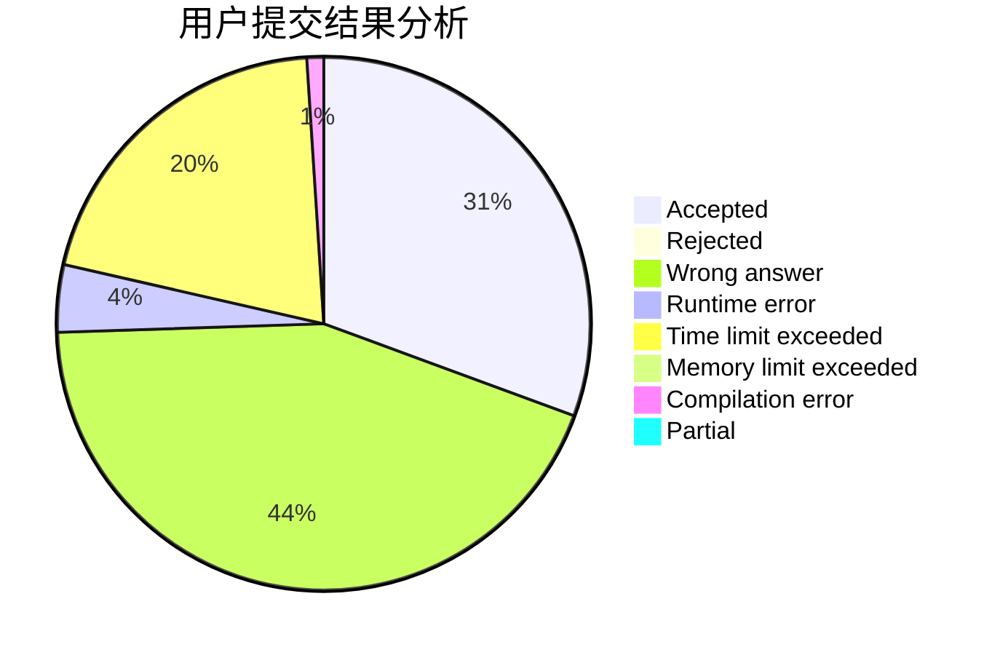
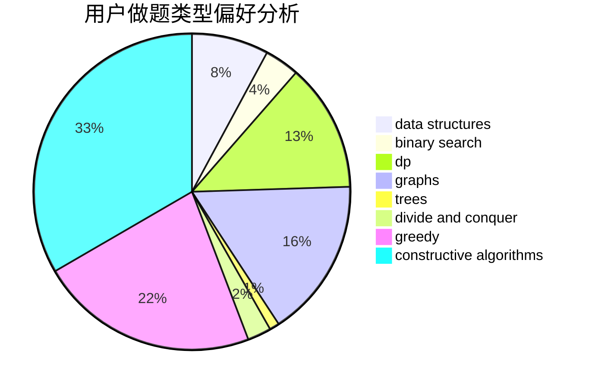
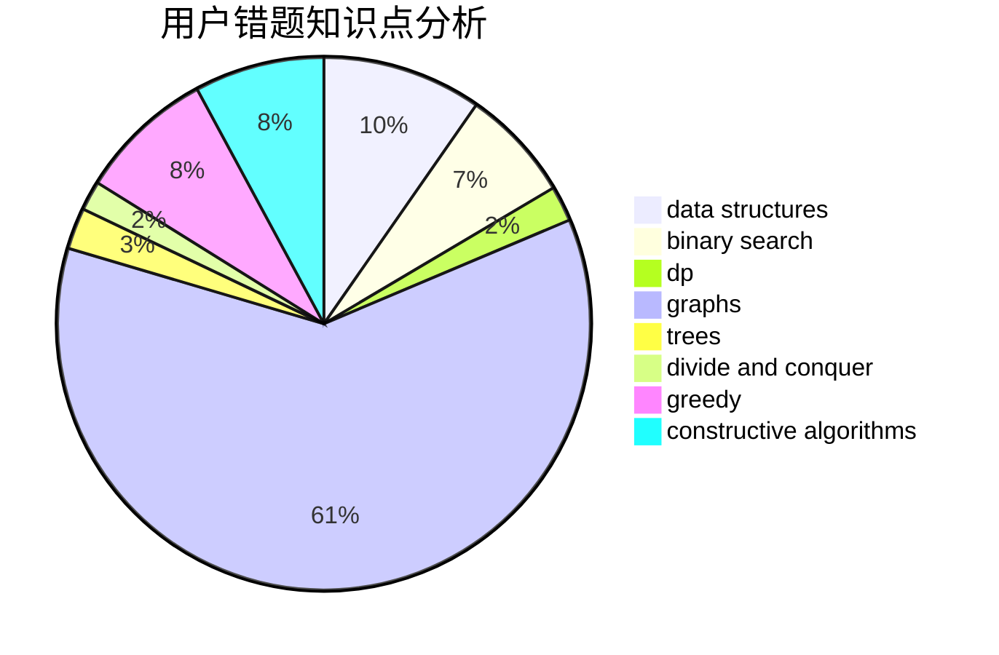

# Isoeasy

<!-- tabs:start -->

#### **用户提交结果分析**

#### **用户做题类型偏好分析**

#### **用户错题知识点分析**

<!-- tabs:end -->
# 推荐题目
[1513D](https://codeforces.com/contest/1513/problem/D)		constructive algorithms,
                        dsu,
                        graphs,
                        greedy,
                        number theory,
                        sortings		  
[1481A](https://codeforces.com/contest/1481/problem/A)		greedy,
                        strings		  
[93A](https://codeforces.com/contest/93/problem/A)		implementation		  
[788D](https://codeforces.com/contest/788/problem/D)		constructive algorithms,
                        divide and conquer,
                        interactive		  
[290C](https://codeforces.com/contest/290/problem/C)		*special problem,
                        graph matchings,
                        implementation,
                        trees		  
[1133C](https://codeforces.com/contest/1133/problem/C)		sortings,
                        two pointers		  
[1040A](https://codeforces.com/contest/1040/problem/A)		greedy		  
[900B](https://codeforces.com/contest/900/problem/B)		math,
                        number theory		  
[176B](https://codeforces.com/contest/176/problem/B)		dp		  
[1017D](https://codeforces.com/contest/1017/problem/D)		bitmasks,
                        brute force,
                        data structures		  
