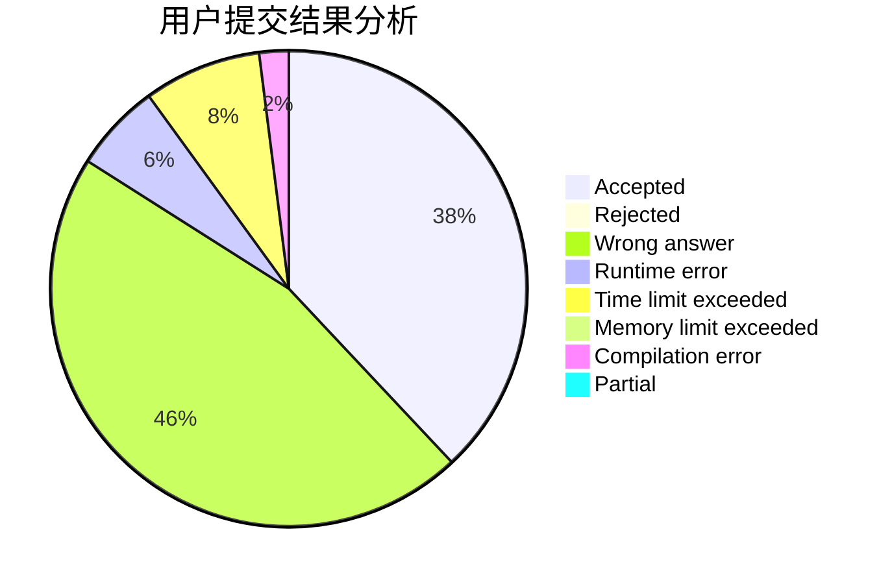
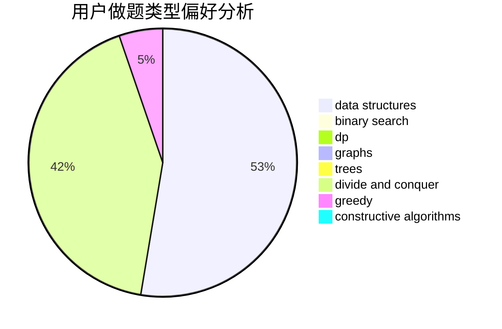

# Isonan

<!-- tabs:start -->

#### **用户提交结果分析**

#### **用户做题类型偏好分析**

#### **用户错题知识点分析**

<!-- tabs:end -->
# 推荐题目
[555B](https://codeforces.com/contest/555/problem/B)		data structures,
                        greedy,
                        sortings		  
[653E](https://codeforces.com/contest/653/problem/E)		dfs and similar,
                        dsu,
                        graphs,
                        trees		  
[604A](https://codeforces.com/contest/604/problem/A)		implementation		  
[1185A](https://codeforces.com/contest/1185/problem/A)		math		  
[1100C](https://codeforces.com/contest/1100/problem/C)		binary search,
                        geometry,
                        math		  
[632D](https://codeforces.com/contest/632/problem/D)		brute force,
                        math,
                        number theory		  
[1175A](https://codeforces.com/contest/1175/problem/A)		implementation,
                        math		  
[1490C](https://codeforces.com/contest/1490/problem/C)		binary search,
                        brute force,
                        brute force,
                        math		  
[1497B](https://codeforces.com/contest/1497/problem/B)		constructive algorithms,
                        greedy,
                        math		  
[1491C](https://codeforces.com/contest/1491/problem/C)		brute force,
                        data structures,
                        dp,
                        greedy,
                        implementation		  
