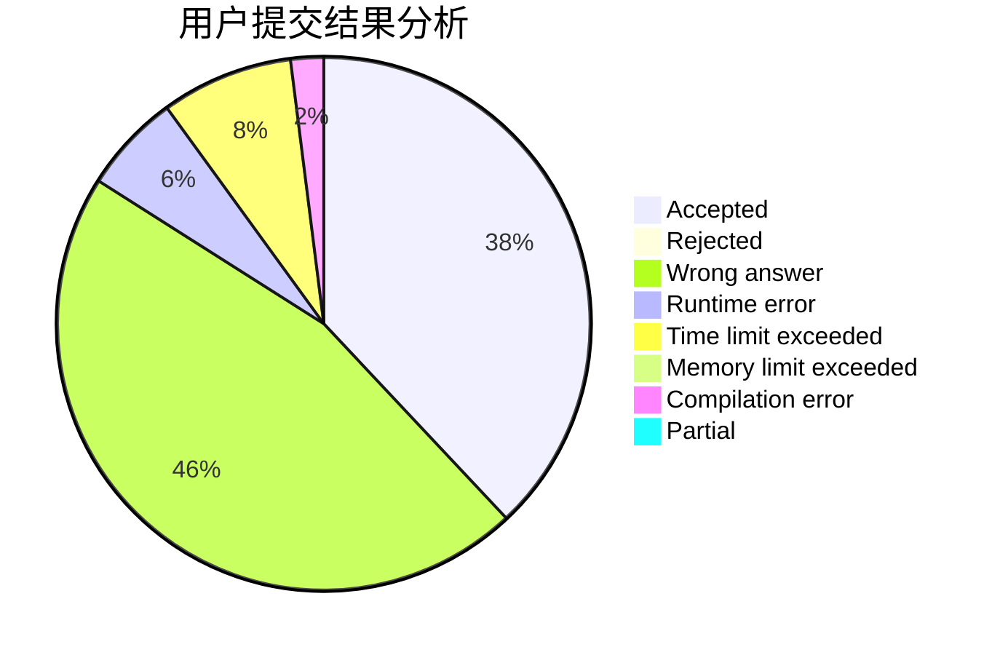
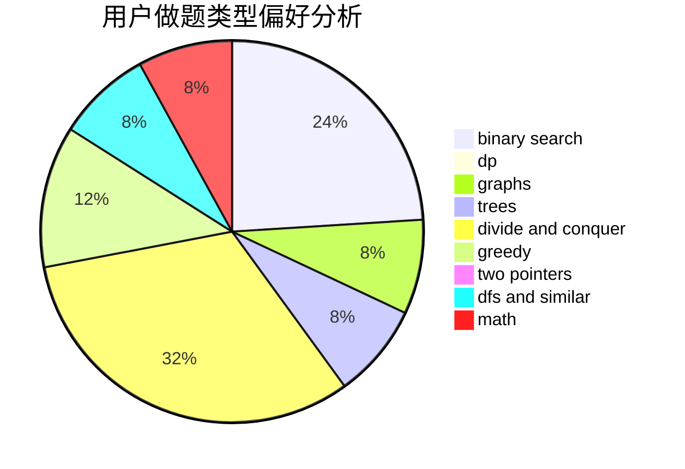

# Isonan

<!-- tabs:start -->

#### **用户提交结果分析**

#### **用户做题类型偏好分析**

<!-- tabs:end -->
# 推荐题目
[555B](https://codeforces.com/contest/555/problem/B)
[653E](https://codeforces.com/contest/653/problem/E)
[604A](https://codeforces.com/contest/604/problem/A)
[1185A](https://codeforces.com/contest/1185/problem/A)
[1100C](https://codeforces.com/contest/1100/problem/C)
[632D](https://codeforces.com/contest/632/problem/D)
[1175A](https://codeforces.com/contest/1175/problem/A)
[1490C](https://codeforces.com/contest/1490/problem/C)
[1497B](https://codeforces.com/contest/1497/problem/B)
[1491C](https://codeforces.com/contest/1491/problem/C)
