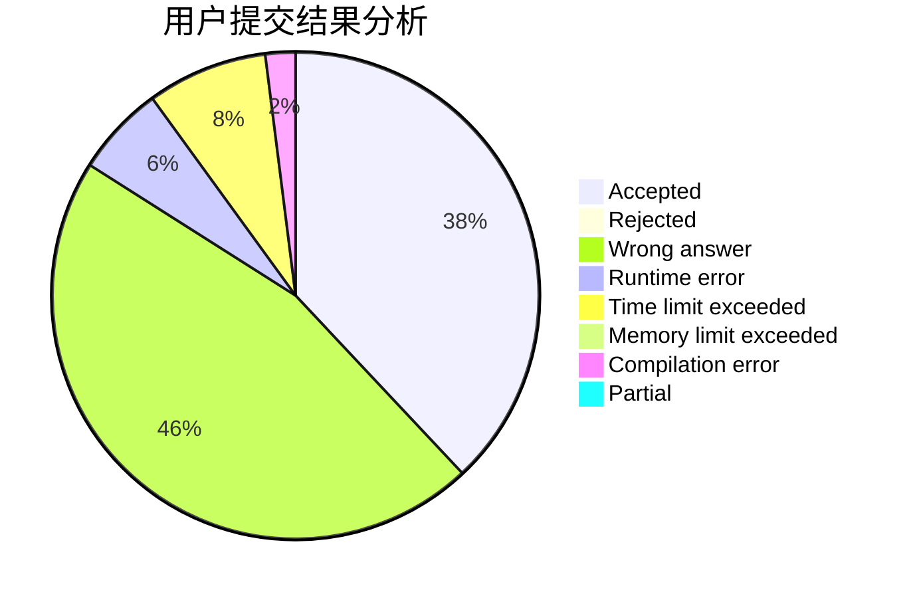
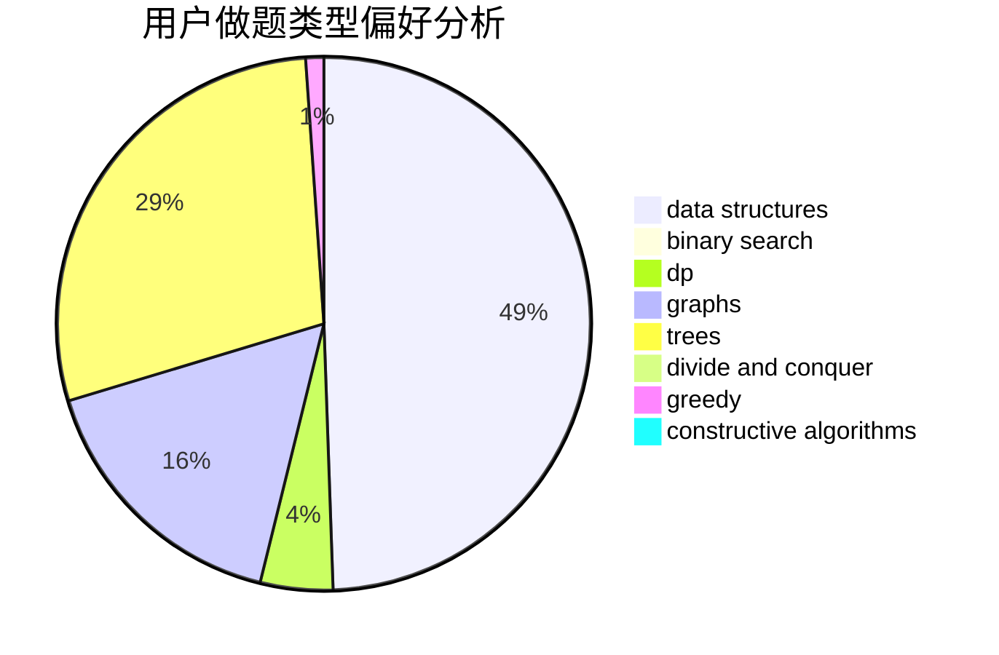
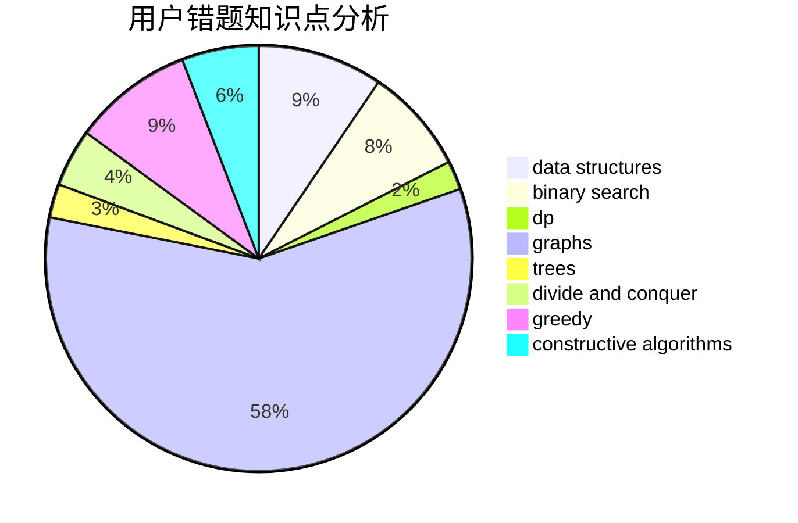

# Isonan

<!-- tabs:start -->

#### **用户提交结果分析**

#### **用户做题类型偏好分析**

#### **用户错题知识点分析**

<!-- tabs:end -->
# 推荐题目
[533D](https://codeforces.com/contest/533/problem/D)		data structures,
                        dp		  
[627E](https://codeforces.com/contest/627/problem/E)		two pointers		  
[582E](https://codeforces.com/contest/582/problem/E)		bitmasks,
                        dp,
                        expression parsing		  
[1182E](https://codeforces.com/contest/1182/problem/E)		dp,
                        math,
                        matrices,
                        number theory		  
[10E](https://codeforces.com/contest/10/problem/E)		constructive algorithms		  
[613A](https://codeforces.com/contest/613/problem/A)		binary search,
                        geometry,
                        ternary search		  
[1172D](https://codeforces.com/contest/1172/problem/D)		constructive algorithms		  
[1482E](https://codeforces.com/contest/1482/problem/E)		data structures,
                        divide and conquer,
                        dp		  
[1489D](https://codeforces.com/contest/1489/problem/D)		dsu,graphs,sortings,trees		  
[1483E](https://codeforces.com/contest/1483/problem/E)		dsu,graphs,sortings,trees		  
