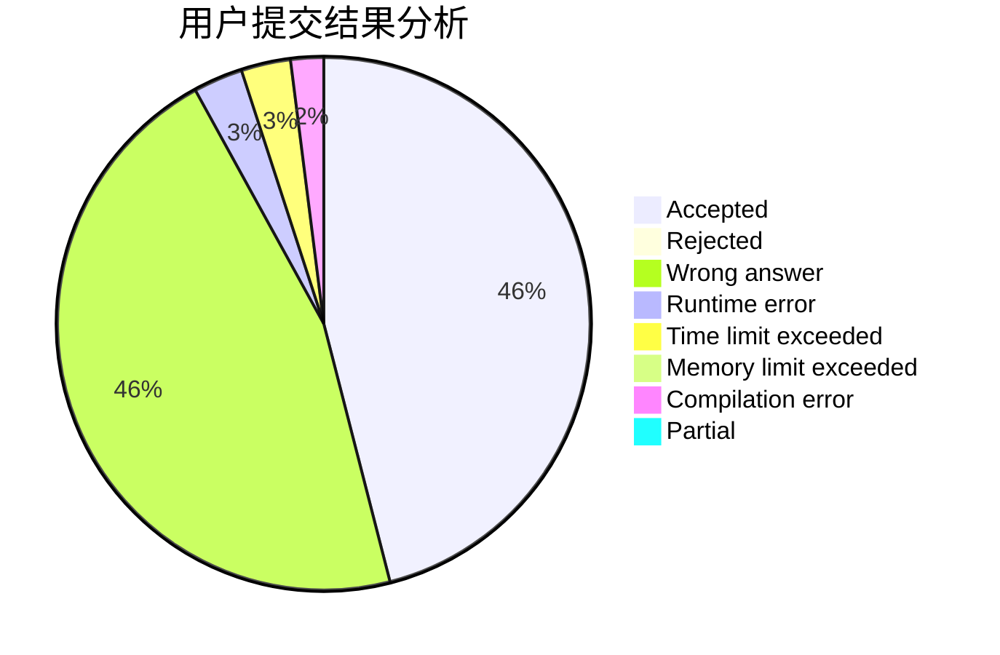
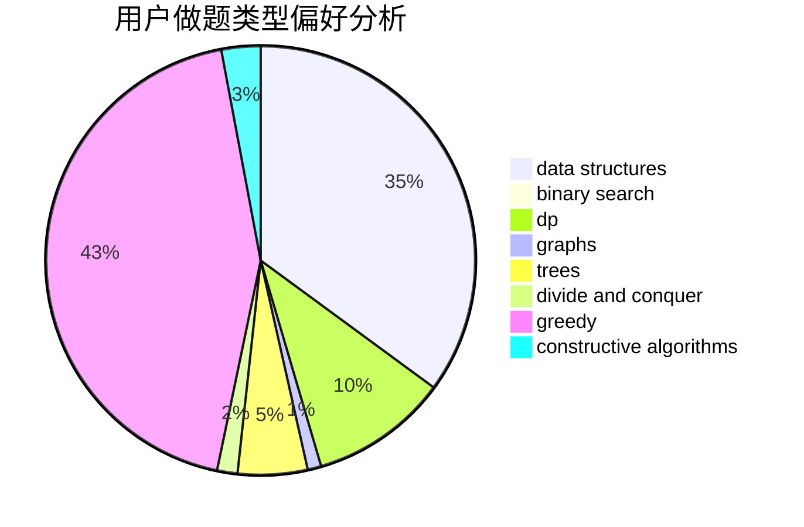
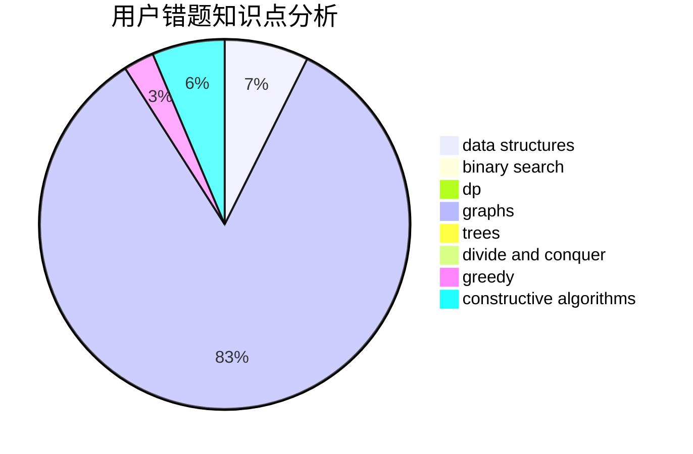

# 0Mordecai0

<!-- tabs:start -->

#### **用户提交结果分析**

#### **用户做题类型偏好分析**

#### **用户错题知识点分析**

<!-- tabs:end -->
# 推荐题目
[1040D](https://codeforces.com/contest/1040/problem/D)		dsu,graphs,sortings,trees		  
[103C](https://codeforces.com/contest/103/problem/C)		constructive algorithms,
                        greedy		  
[1041C](https://codeforces.com/contest/1041/problem/C)		binary search,
                        data structures,
                        greedy,
                        two pointers		  
[1039C](https://codeforces.com/contest/1039/problem/C)		dfs and similar,
                        dsu,
                        graphs,
                        math,
                        sortings		  
[1042C](https://codeforces.com/contest/1042/problem/C)		constructive algorithms,
                        greedy,
                        math		  
[103E](https://codeforces.com/contest/103/problem/E)		flows,
                        graph matchings		  
[103D](https://codeforces.com/contest/103/problem/D)		brute force,
                        data structures,
                        sortings		  
[1041A](https://codeforces.com/contest/1041/problem/A)		greedy,
                        implementation,
                        sortings		  
[1042A](https://codeforces.com/contest/1042/problem/A)		binary search,
                        implementation		  
[103B](https://codeforces.com/contest/103/problem/B)		dfs and similar,
                        dsu,
                        graphs		  
