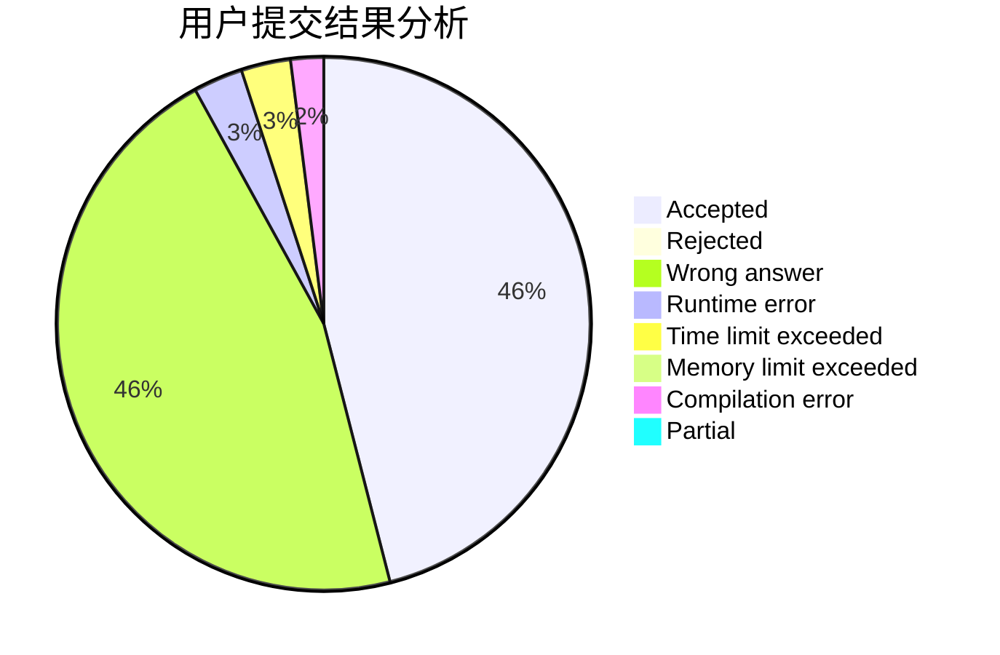
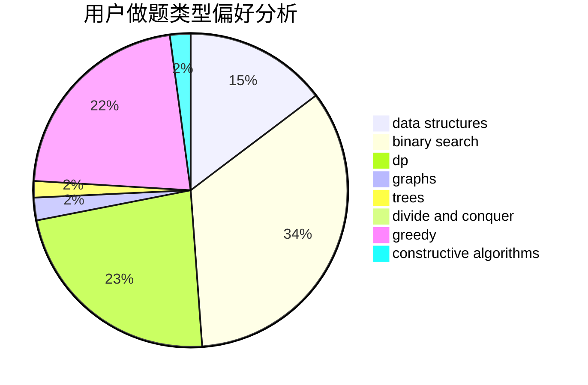

# 0Mordecai0

<!-- tabs:start -->

#### **用户提交结果分析**

#### **用户做题类型偏好分析**

#### **用户错题知识点分析**

<!-- tabs:end -->
# 推荐题目
[1041C](https://codeforces.com/contest/1041/problem/C)		binary search,
                        data structures,
                        greedy,
                        two pointers		  
[1040A](https://codeforces.com/contest/1040/problem/A)		greedy		  
[1041F](https://codeforces.com/contest/1041/problem/F)		data structures,
                        divide and conquer,
                        dp,
                        math		  
[103A](https://codeforces.com/contest/103/problem/A)		greedy,
                        implementation,
                        math		  
[1042F](https://codeforces.com/contest/1042/problem/F)		data structures,
                        dfs and similar,
                        dsu,
                        graphs,
                        greedy,
                        sortings,
                        trees		  
[1040D](https://codeforces.com/contest/1040/problem/D)		dsu,graphs,sortings,trees		  
[1040B](https://codeforces.com/contest/1040/problem/B)		dp,
                        greedy,
                        math		  
[1041D](https://codeforces.com/contest/1041/problem/D)		binary search,
                        data structures,
                        two pointers		  
[1042D](https://codeforces.com/contest/1042/problem/D)		data structures,
                        divide and conquer,
                        two pointers		  
[103E](https://codeforces.com/contest/103/problem/E)		flows,
                        graph matchings		  
