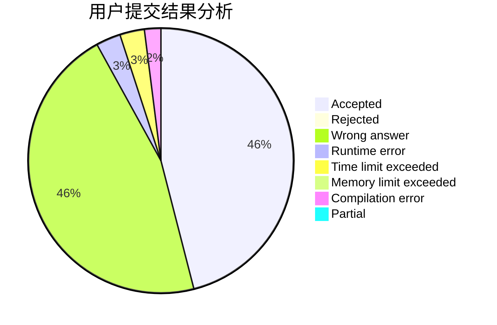
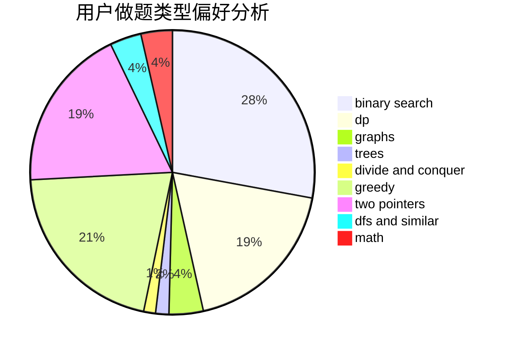

# 0Mordecai0

<!-- tabs:start -->

#### **用户提交结果分析**

#### **用户做题类型偏好分析**

<!-- tabs:end -->
# 推荐题目
[1041C](https://codeforces.com/contest/1041/problem/C)
[1040A](https://codeforces.com/contest/1040/problem/A)
[1041F](https://codeforces.com/contest/1041/problem/F)
[103A](https://codeforces.com/contest/103/problem/A)
[1042F](https://codeforces.com/contest/1042/problem/F)
[1040D](https://codeforces.com/contest/1040/problem/D)
[1040B](https://codeforces.com/contest/1040/problem/B)
[1041D](https://codeforces.com/contest/1041/problem/D)
[1042D](https://codeforces.com/contest/1042/problem/D)
[103E](https://codeforces.com/contest/103/problem/E)
