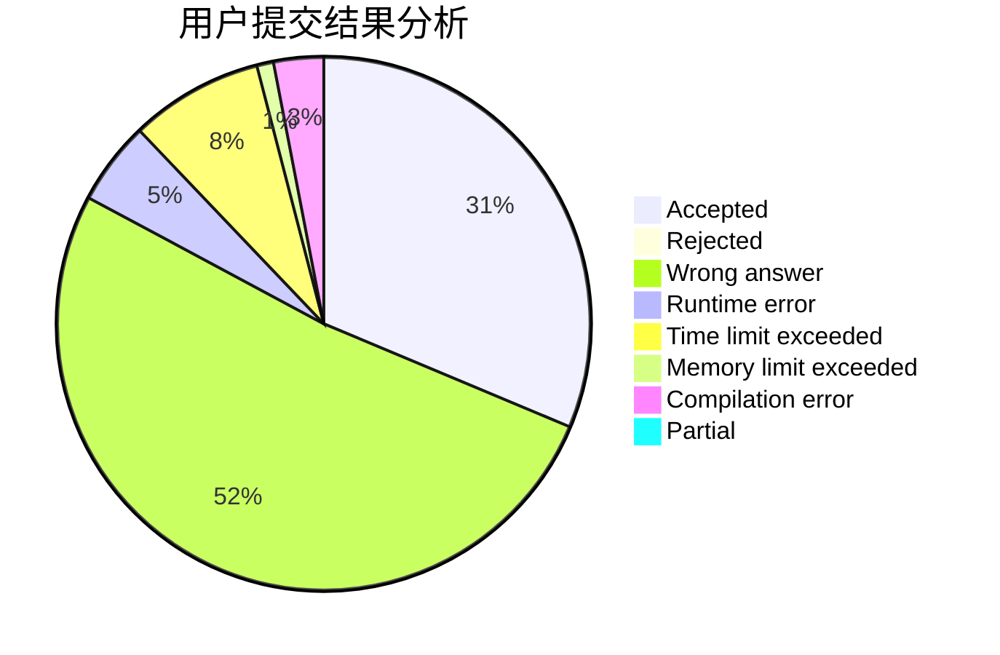
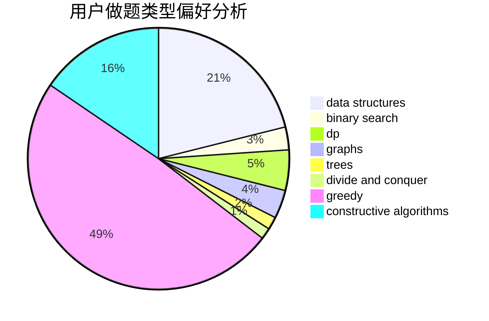

# 2sozx

<!-- tabs:start -->

#### **用户提交结果分析**

#### **用户做题类型偏好分析**

#### **用户错题知识点分析**

<!-- tabs:end -->
# 推荐题目
[1342A](https://codeforces.com/contest/1342/problem/A)		greedy,
                        math		  
[1343E](https://codeforces.com/contest/1343/problem/E)		brute force,
                        graphs,
                        greedy,
                        shortest paths,
                        sortings		  
[1340B](https://codeforces.com/contest/1340/problem/B)		bitmasks,
                        dp,
                        graphs,
                        greedy		  
[1338C](https://codeforces.com/contest/1338/problem/C)		bitmasks,
                        brute force,
                        constructive algorithms,
                        divide and conquer,
                        math		  
[1343F](https://codeforces.com/contest/1343/problem/F)		brute force,
                        constructive algorithms,
                        data structures,
                        greedy,
                        implementation		  
[1338A](https://codeforces.com/contest/1338/problem/A)		greedy,
                        math		  
[1344A](https://codeforces.com/contest/1344/problem/A)		math,
                        number theory,
                        sortings		  
[1342B](https://codeforces.com/contest/1342/problem/B)		constructive algorithms,
                        strings		  
[1337D](https://codeforces.com/contest/1337/problem/D)		dsu,graphs,sortings,trees		  
[1002B4](https://codeforces.com/contest/1002B/problem/4)		nan		  
