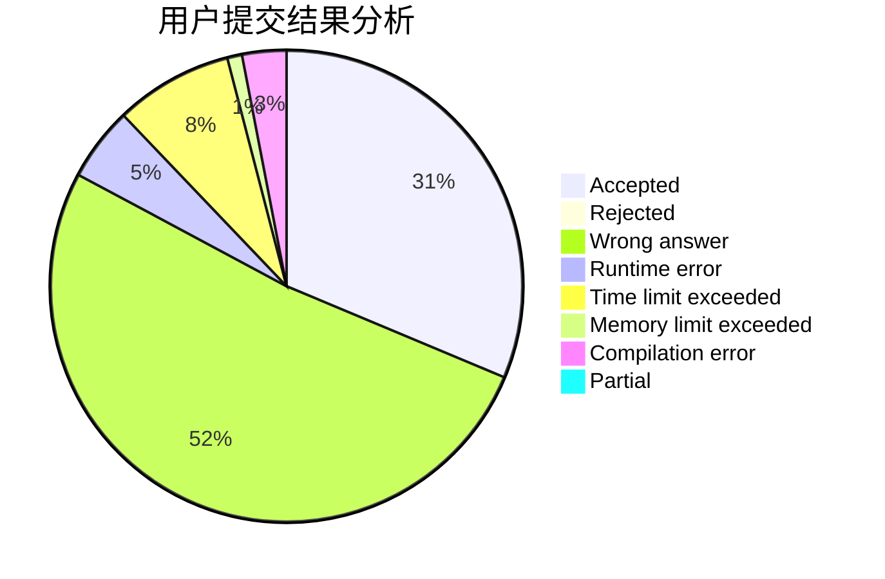
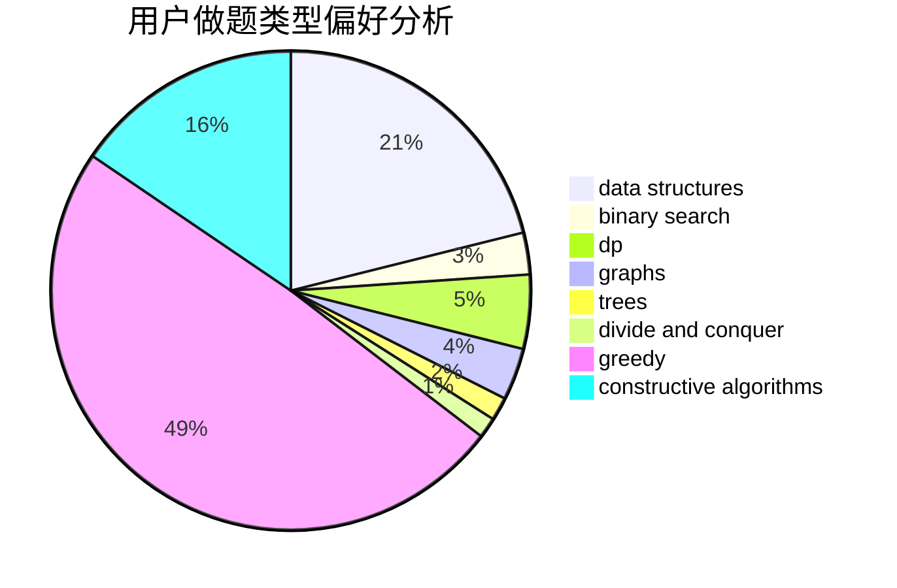

# 2sozx
<!-- tabs:start -->
#### **用户提交结果分析**

#### **用户做题类型偏好分析**

#### **用户错题知识点分析**

<!-- tabs:end -->
# 推荐题目
[Edge Weight Assignment](http://codeforces.com/problemset/problem/1338/B)		bitmasks,
                        constructive algorithms,
                        dfs and similar,
                        greedy,
                        math,
                        trees		  
[Perfect Triples](http://codeforces.com/problemset/problem/1338/C)		bitmasks,
                        brute force,
                        constructive algorithms,
                        divide and conquer,
                        math		  
[Xenia and Colorful Gems](https://codeforces.com/contest/1337/problem/D)		binary search,
                        greedy,
                        math,
                        sortings,
                        two pointers		  
[Shooting](http://codeforces.com/problemset/problem/1216/B)		greedy,
                        implementation,
                        sortings		  
[Nastya and CBS](http://codeforces.com/problemset/problem/1340/F)		brute force,
                        data structures,
                        hashing		  
[Hilbert's Hotel](http://codeforces.com/problemset/problem/1344/A)		math,
                        number theory,
                        sortings		  
[Emotes](http://codeforces.com/problemset/problem/1117/B)		greedy,
                        math,
                        sortings		  
[Circus](http://codeforces.com/problemset/problem/1138/B)		brute force,
                        greedy,
                        math,
                        strings		  
[Weights Distributing](http://codeforces.com/problemset/problem/1343/E)		brute force,
                        graphs,
                        greedy,
                        shortest paths,
                        sortings		  
[Restore the Permutation by Sorted Segments](http://codeforces.com/problemset/problem/1343/F)		brute force,
                        constructive algorithms,
                        data structures,
                        greedy,
                        implementation		  
<!-- tabs:start -->
#### **data structures**
[Edge Weight Assignment](http://codeforces.com/problemset/problem/1340/F)		brute force,
                        data structures,
                        hashing		  
[Perfect Triples](http://codeforces.com/problemset/problem/1343/F)		brute force,
                        constructive algorithms,
                        data structures,
                        greedy,
                        implementation		  
[Xenia and Colorful Gems](http://codeforces.com/problemset/problem/1195/E)		data structures,
                        two pointers		  
[Shooting](http://codeforces.com/problemset/problem/1342/D)		binary search,
                        constructive algorithms,
                        data structures,
                        greedy,
                        sortings,
                        two pointers		  
[Nastya and CBS](http://codeforces.com/problemset/problem/1340/A)		brute force,
                        data structures,
                        greedy,
                        implementation		  
[Hilbert's Hotel](http://codeforces.com/problemset/problem/1284/D)		binary search,
                        data structures,
                        hashing,
                        sortings		  
[Emotes](https://codeforces.com/contest/1341/problem/C)		brute force,
                        data structures,
                        greedy,
                        implementation		  
[Circus](http://codeforces.com/problemset/problem/1163/B2)		data structures,
                        implementation		  
[Weights Distributing](http://codeforces.com/problemset/problem/1343/D)		brute force,
                        data structures,
                        greedy,
                        two pointers		  
[Restore the Permutation by Sorted Segments](http://codeforces.com/problemset/problem/1209/H)		data structures,
                        greedy,
                        math		  
#### **binary search**
[Edge Weight Assignment](https://codeforces.com/contest/1337/problem/D)		binary search,
                        greedy,
                        math,
                        sortings,
                        two pointers		  
[Perfect Triples](http://codeforces.com/problemset/problem/1342/D)		binary search,
                        constructive algorithms,
                        data structures,
                        greedy,
                        sortings,
                        two pointers		  
[Xenia and Colorful Gems](http://codeforces.com/problemset/problem/1284/D)		binary search,
                        data structures,
                        hashing,
                        sortings		  
[Shooting](http://codeforces.com/problemset/problem/1492/C)		binary search,
                        data structures,
                        dp,
                        greedy,
                        two pointers		  
[Nastya and CBS](http://codeforces.com/problemset/problem/1463/D)		binary search,
                        constructive algorithms,
                        greedy,
                        two pointers		  
[Hilbert's Hotel](http://codeforces.com/problemset/problem/1490/G)		binary search,
                        data structures,
                        math		  
[Emotes](http://codeforces.com/problemset/problem/1479/D)		binary search,
                        bitmasks,
                        brute force,
                        data structures,
                        probabilities,
                        trees		  
[Circus](http://codeforces.com/problemset/problem/1436/E)		binary search,
                        data structures,
                        two pointers		  
[Weights Distributing](http://codeforces.com/problemset/problem/1461/D)		binary search,
                        brute force,
                        data structures,
                        divide and conquer,
                        implementation,
                        sortings		  
[Restore the Permutation by Sorted Segments](http://codeforces.com/problemset/problem/1493/C)		binary search,
                        brute force,
                        constructive algorithms,
                        greedy,
                        strings		  
#### **dp**
[Edge Weight Assignment](https://codeforces.com/contest/1341/problem/D)		bitmasks,
                        dp,
                        graphs,
                        greedy		  
[Perfect Triples](https://codeforces.com/contest/1341/problem/E)		dfs and similar,
                        dp,
                        graphs,
                        shortest paths		  
[Xenia and Colorful Gems](https://codeforces.com/contest/1337/problem/E)		dp,
                        strings		  
[Shooting](http://codeforces.com/problemset/problem/1339/A)		brute force,
                        dp,
                        implementation,
                        math		  
[Nastya and CBS](http://codeforces.com/problemset/problem/1342/F)		bitmasks,
                        brute force,
                        dp		  
[Hilbert's Hotel](http://codeforces.com/problemset/problem/1340/C)		dfs and similar,
                        dp,
                        graphs,
                        shortest paths		  
[Emotes](http://codeforces.com/problemset/problem/1338/D)		constructive algorithms,
                        dfs and similar,
                        dp,
                        math,
                        trees		  
[Circus](http://codeforces.com/problemset/problem/1340/B)		bitmasks,
                        dp,
                        graphs,
                        greedy		  
[Weights Distributing](http://codeforces.com/problemset/problem/1343/C)		dp,
                        greedy,
                        two pointers		  
[Restore the Permutation by Sorted Segments](https://codeforces.com/contest/1337/problem/C)		dfs and similar,
                        dp,
                        greedy,
                        sortings,
                        trees		  
#### **graph**
[Edge Weight Assignment](http://codeforces.com/problemset/problem/1343/E)		brute force,
                        graphs,
                        greedy,
                        shortest paths,
                        sortings		  
[Perfect Triples](http://codeforces.com/problemset/problem/1340/E)		graphs,
                        interactive,
                        probabilities		  
[Xenia and Colorful Gems](http://codeforces.com/problemset/problem/1338/E)		graphs		  
[Shooting](https://codeforces.com/contest/1341/problem/D)		bitmasks,
                        dp,
                        graphs,
                        greedy		  
[Nastya and CBS](http://codeforces.com/problemset/problem/1340/D)		constructive algorithms,
                        dfs and similar,
                        graphs,
                        trees		  
[Hilbert's Hotel](https://codeforces.com/contest/1341/problem/F)		constructive algorithms,
                        dfs and similar,
                        graphs,
                        trees		  
[Emotes](https://codeforces.com/contest/1341/problem/E)		dfs and similar,
                        dp,
                        graphs,
                        shortest paths		  
[Circus](http://codeforces.com/problemset/problem/1340/C)		dfs and similar,
                        dp,
                        graphs,
                        shortest paths		  
[Weights Distributing](http://codeforces.com/problemset/problem/1009/G)		bitmasks,
                        flows,
                        graph matchings,
                        graphs,
                        greedy		  
[Restore the Permutation by Sorted Segments](http://codeforces.com/problemset/problem/1340/B)		bitmasks,
                        dp,
                        graphs,
                        greedy		  
#### **trees**
[Edge Weight Assignment](http://codeforces.com/problemset/problem/1338/B)		bitmasks,
                        constructive algorithms,
                        dfs and similar,
                        greedy,
                        math,
                        trees		  
[Perfect Triples](https://codeforces.com/contest/1339/problem/D)		bitmasks,
                        constructive algorithms,
                        dfs and similar,
                        greedy,
                        math,
                        trees		  
[Xenia and Colorful Gems](http://codeforces.com/problemset/problem/1340/D)		constructive algorithms,
                        dfs and similar,
                        graphs,
                        trees		  
[Shooting](https://codeforces.com/contest/1341/problem/F)		constructive algorithms,
                        dfs and similar,
                        graphs,
                        trees		  
[Nastya and CBS](http://codeforces.com/problemset/problem/1338/D)		constructive algorithms,
                        dfs and similar,
                        dp,
                        math,
                        trees		  
[Hilbert's Hotel](https://codeforces.com/contest/1337/problem/C)		dfs and similar,
                        dp,
                        greedy,
                        sortings,
                        trees		  
[Emotes](http://codeforces.com/problemset/problem/1479/D)		binary search,
                        bitmasks,
                        brute force,
                        data structures,
                        probabilities,
                        trees		  
[Circus](http://codeforces.com/problemset/problem/1511/C)		brute force,
                        data structures,
                        implementation,
                        trees		  
[Weights Distributing](http://codeforces.com/problemset/problem/1499/F)		combinatorics,
                        dfs and similar,
                        dp,
                        trees		  
[Restore the Permutation by Sorted Segments](http://codeforces.com/problemset/problem/1491/E)		brute force,
                        dfs and similar,
                        divide and conquer,
                        number theory,
                        trees		  
#### **divide and conquer**
[Edge Weight Assignment](http://codeforces.com/problemset/problem/1338/C)		bitmasks,
                        brute force,
                        constructive algorithms,
                        divide and conquer,
                        math		  
[Perfect Triples](https://codeforces.com/contest/1339/problem/E)		bitmasks,
                        brute force,
                        constructive algorithms,
                        divide and conquer,
                        math		  
[Xenia and Colorful Gems](http://codeforces.com/problemset/problem/1250/M)		constructive algorithms,
                        divide and conquer		  
[Shooting](http://codeforces.com/problemset/problem/1461/D)		binary search,
                        brute force,
                        data structures,
                        divide and conquer,
                        implementation,
                        sortings		  
[Nastya and CBS](http://codeforces.com/problemset/problem/1466/G)		combinatorics,
                        divide and conquer,
                        hashing,
                        math,
                        string suffix structures,
                        strings		  
[Hilbert's Hotel](http://codeforces.com/problemset/problem/1490/D)		dfs and similar,
                        divide and conquer,
                        implementation		  
[Emotes](https://codeforces.com/contest/1483/problem/C)		data structures,
                        divide and conquer,
                        dp		  
[Circus](http://codeforces.com/problemset/problem/1491/E)		brute force,
                        dfs and similar,
                        divide and conquer,
                        number theory,
                        trees		  
[Weights Distributing](http://codeforces.com/problemset/problem/1303/G)		data structures,
                        divide and conquer,
                        geometry,
                        trees		  
[Restore the Permutation by Sorted Segments](http://codeforces.com/problemset/problem/1494/D)		constructive algorithms,
                        data structures,
                        dfs and similar,
                        divide and conquer,
                        dsu,
                        greedy,
                        sortings,
                        trees		  
#### **greedy**
[Edge Weight Assignment](http://codeforces.com/problemset/problem/1338/B)		bitmasks,
                        constructive algorithms,
                        dfs and similar,
                        greedy,
                        math,
                        trees		  
[Perfect Triples](https://codeforces.com/contest/1337/problem/D)		binary search,
                        greedy,
                        math,
                        sortings,
                        two pointers		  
[Xenia and Colorful Gems](http://codeforces.com/problemset/problem/1216/B)		greedy,
                        implementation,
                        sortings		  
[Shooting](http://codeforces.com/problemset/problem/1117/B)		greedy,
                        math,
                        sortings		  
[Nastya and CBS](http://codeforces.com/problemset/problem/1138/B)		brute force,
                        greedy,
                        math,
                        strings		  
[Hilbert's Hotel](http://codeforces.com/problemset/problem/1343/E)		brute force,
                        graphs,
                        greedy,
                        shortest paths,
                        sortings		  
[Emotes](http://codeforces.com/problemset/problem/1343/F)		brute force,
                        constructive algorithms,
                        data structures,
                        greedy,
                        implementation		  
[Circus](https://codeforces.com/contest/1339/problem/D)		bitmasks,
                        constructive algorithms,
                        dfs and similar,
                        greedy,
                        math,
                        trees		  
[Weights Distributing](https://codeforces.com/contest/1298/problem/C)		greedy,
                        strings		  
[Restore the Permutation by Sorted Segments](https://codeforces.com/contest/1341/problem/D)		bitmasks,
                        dp,
                        graphs,
                        greedy		  
#### **constructive algorithms**
[Edge Weight Assignment](http://codeforces.com/problemset/problem/1338/B)		bitmasks,
                        constructive algorithms,
                        dfs and similar,
                        greedy,
                        math,
                        trees		  
[Perfect Triples](http://codeforces.com/problemset/problem/1338/C)		bitmasks,
                        brute force,
                        constructive algorithms,
                        divide and conquer,
                        math		  
[Xenia and Colorful Gems](http://codeforces.com/problemset/problem/1343/F)		brute force,
                        constructive algorithms,
                        data structures,
                        greedy,
                        implementation		  
[Shooting](https://codeforces.com/contest/1339/problem/E)		bitmasks,
                        brute force,
                        constructive algorithms,
                        divide and conquer,
                        math		  
[Nastya and CBS](https://codeforces.com/contest/1339/problem/D)		bitmasks,
                        constructive algorithms,
                        dfs and similar,
                        greedy,
                        math,
                        trees		  
[Hilbert's Hotel](http://codeforces.com/problemset/problem/1250/M)		constructive algorithms,
                        divide and conquer		  
[Emotes](http://codeforces.com/problemset/problem/1340/D)		constructive algorithms,
                        dfs and similar,
                        graphs,
                        trees		  
[Circus](https://codeforces.com/contest/1341/problem/F)		constructive algorithms,
                        dfs and similar,
                        graphs,
                        trees		  
[Weights Distributing](http://codeforces.com/problemset/problem/1342/D)		binary search,
                        constructive algorithms,
                        data structures,
                        greedy,
                        sortings,
                        two pointers		  
[Restore the Permutation by Sorted Segments](http://codeforces.com/problemset/problem/1338/D)		constructive algorithms,
                        dfs and similar,
                        dp,
                        math,
                        trees		  
#### **sortings**
[Edge Weight Assignment](https://codeforces.com/contest/1337/problem/D)		binary search,
                        greedy,
                        math,
                        sortings,
                        two pointers		  
[Perfect Triples](http://codeforces.com/problemset/problem/1216/B)		greedy,
                        implementation,
                        sortings		  
[Xenia and Colorful Gems](http://codeforces.com/problemset/problem/1344/A)		math,
                        number theory,
                        sortings		  
[Shooting](http://codeforces.com/problemset/problem/1117/B)		greedy,
                        math,
                        sortings		  
[Nastya and CBS](http://codeforces.com/problemset/problem/1343/E)		brute force,
                        graphs,
                        greedy,
                        shortest paths,
                        sortings		  
[Hilbert's Hotel](http://codeforces.com/problemset/problem/1342/D)		binary search,
                        constructive algorithms,
                        data structures,
                        greedy,
                        sortings,
                        two pointers		  
[Emotes](http://codeforces.com/problemset/problem/1284/D)		binary search,
                        data structures,
                        hashing,
                        sortings		  
[Circus](http://codeforces.com/problemset/problem/1175/D)		greedy,
                        sortings		  
[Weights Distributing](https://codeforces.com/contest/1337/problem/C)		dfs and similar,
                        dp,
                        greedy,
                        sortings,
                        trees		  
[Restore the Permutation by Sorted Segments](http://codeforces.com/problemset/problem/1339/B)		constructive algorithms,
                        sortings		  
<!-- tabs:end -->
