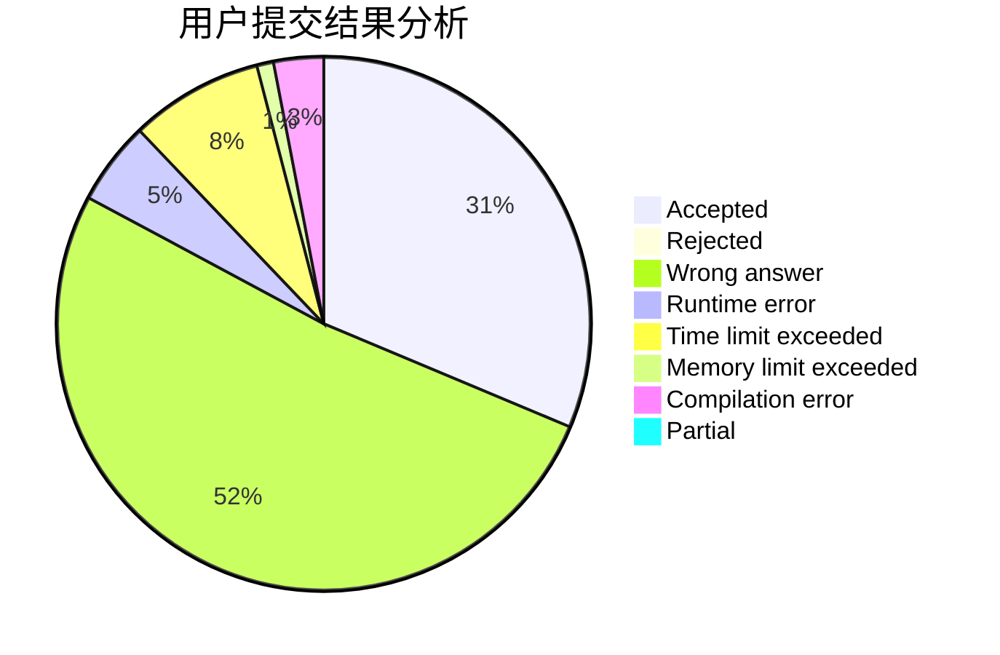
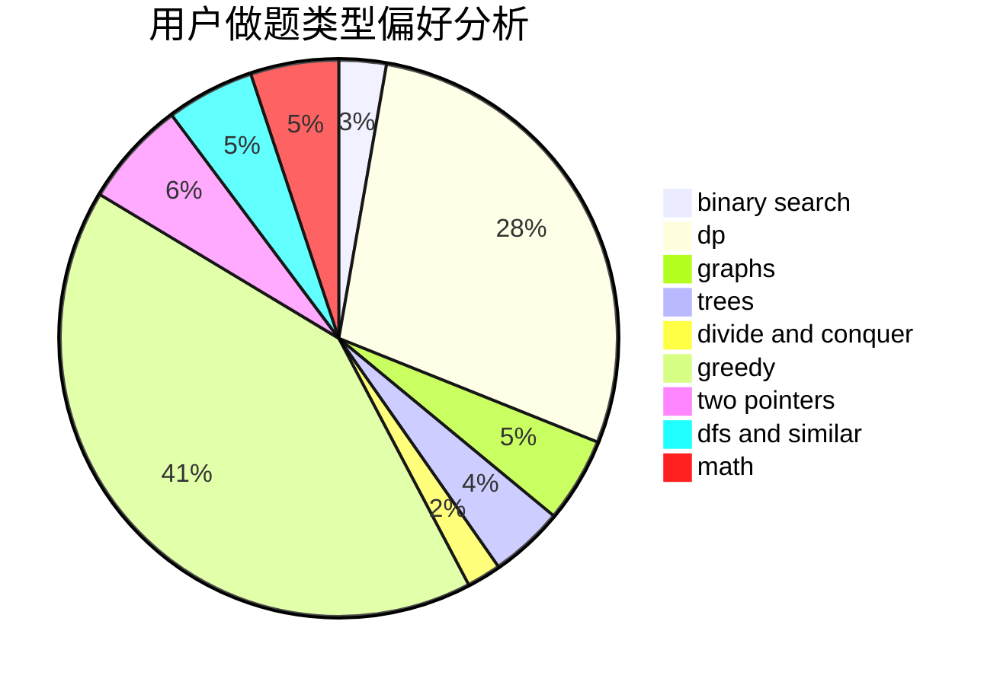

# 2sozx

<!-- tabs:start -->

#### **用户提交结果分析**

#### **用户做题类型偏好分析**

<!-- tabs:end -->
# 推荐题目
[13491](https://codeforces.com/contest/1349/problem/1)
[1350C](https://codeforces.com/contest/1350/problem/C)
[1347A](https://codeforces.com/contest/1347/problem/A)
[1345D](https://codeforces.com/contest/1345/problem/D)
[1350D](https://codeforces.com/contest/1350/problem/D)
[1345B](https://codeforces.com/contest/1345/problem/B)
[1350E](https://codeforces.com/contest/1350/problem/E)
[13492](https://codeforces.com/contest/1349/problem/2)
[1344F](https://codeforces.com/contest/1344/problem/F)
[10023](https://codeforces.com/contest/1002/problem/3)
