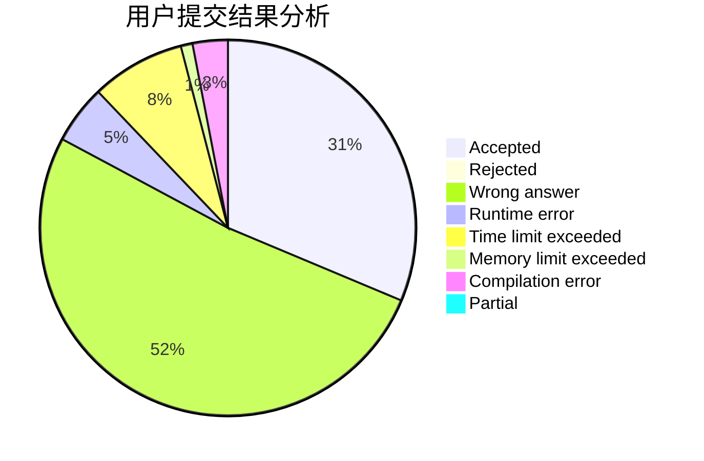
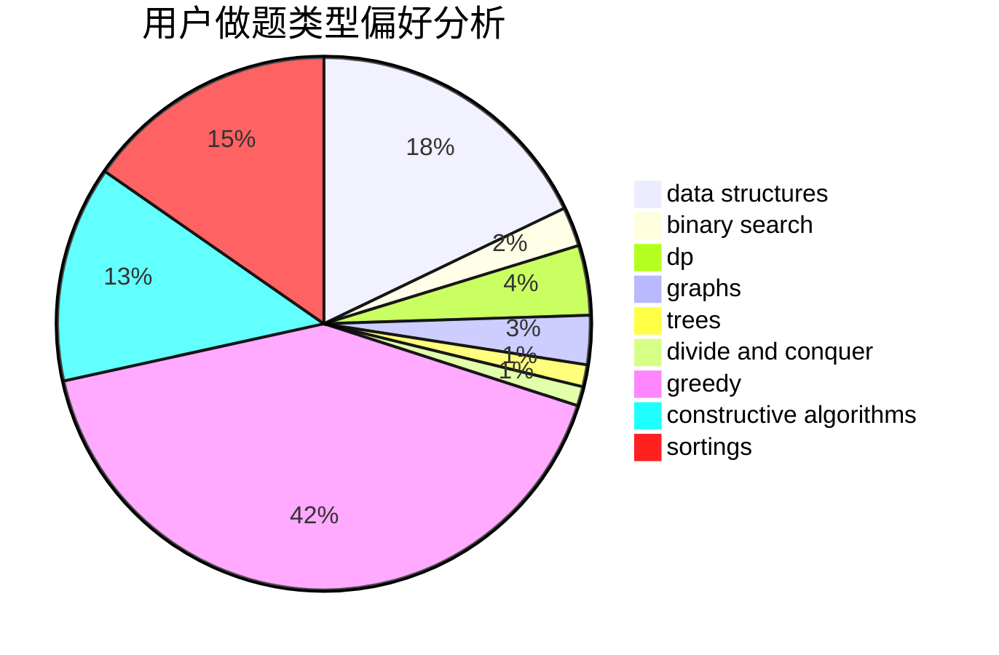

# 2sozx
<!-- tabs:start -->
#### **用户提交结果分析**

#### **用户做题类型偏好分析**

#### **用户错题知识点分析**

<!-- tabs:end -->
# 推荐题目
[1338B](http://codeforces.com/problemset/problem/1338/B)		bitmasks,
                        constructive algorithms,
                        dfs and similar,
                        greedy,
                        math,
                        trees		  
[1338C](http://codeforces.com/problemset/problem/1338/C)		bitmasks,
                        brute force,
                        constructive algorithms,
                        divide and conquer,
                        math		  
[1337D](https://codeforces.com/contest/1337/problem/D)		binary search,
                        greedy,
                        math,
                        sortings,
                        two pointers		  
[1216B](http://codeforces.com/problemset/problem/1216/B)		greedy,
                        implementation,
                        sortings		  
[1340F](http://codeforces.com/problemset/problem/1340/F)		brute force,
                        data structures,
                        hashing		  
[1344A](http://codeforces.com/problemset/problem/1344/A)		math,
                        number theory,
                        sortings		  
[1117B](http://codeforces.com/problemset/problem/1117/B)		greedy,
                        math,
                        sortings		  
[1138B](http://codeforces.com/problemset/problem/1138/B)		brute force,
                        greedy,
                        math,
                        strings		  
[1343E](http://codeforces.com/problemset/problem/1343/E)		brute force,
                        graphs,
                        greedy,
                        shortest paths,
                        sortings		  
[1343F](http://codeforces.com/problemset/problem/1343/F)		brute force,
                        constructive algorithms,
                        data structures,
                        greedy,
                        implementation		  
<!-- tabs:start -->
#### **data structures**
[1340F](http://codeforces.com/problemset/problem/1340/F)		brute force,
                        data structures,
                        hashing		  
[1343F](http://codeforces.com/problemset/problem/1343/F)		brute force,
                        constructive algorithms,
                        data structures,
                        greedy,
                        implementation		  
[1195E](http://codeforces.com/problemset/problem/1195/E)		data structures,
                        two pointers		  
[1342D](http://codeforces.com/problemset/problem/1342/D)		binary search,
                        constructive algorithms,
                        data structures,
                        greedy,
                        sortings,
                        two pointers		  
[1340A](http://codeforces.com/problemset/problem/1340/A)		brute force,
                        data structures,
                        greedy,
                        implementation		  
[1284D](http://codeforces.com/problemset/problem/1284/D)		binary search,
                        data structures,
                        hashing,
                        sortings		  
[1341C](https://codeforces.com/contest/1341/problem/C)		brute force,
                        data structures,
                        greedy,
                        implementation		  
[1163B2](http://codeforces.com/problemset/problem/1163/B2)		data structures,
                        implementation		  
[1343D](http://codeforces.com/problemset/problem/1343/D)		brute force,
                        data structures,
                        greedy,
                        two pointers		  
[1209H](http://codeforces.com/problemset/problem/1209/H)		data structures,
                        greedy,
                        math		  
#### **binary search**
[1337D](https://codeforces.com/contest/1337/problem/D)		binary search,
                        greedy,
                        math,
                        sortings,
                        two pointers		  
[1342D](http://codeforces.com/problemset/problem/1342/D)		binary search,
                        constructive algorithms,
                        data structures,
                        greedy,
                        sortings,
                        two pointers		  
[1284D](http://codeforces.com/problemset/problem/1284/D)		binary search,
                        data structures,
                        hashing,
                        sortings		  
[1492C](http://codeforces.com/problemset/problem/1492/C)		binary search,
                        data structures,
                        dp,
                        greedy,
                        two pointers		  
[1463D](http://codeforces.com/problemset/problem/1463/D)		binary search,
                        constructive algorithms,
                        greedy,
                        two pointers		  
[1490G](http://codeforces.com/problemset/problem/1490/G)		binary search,
                        data structures,
                        math		  
[1479D](http://codeforces.com/problemset/problem/1479/D)		binary search,
                        bitmasks,
                        brute force,
                        data structures,
                        probabilities,
                        trees		  
[1436E](http://codeforces.com/problemset/problem/1436/E)		binary search,
                        data structures,
                        two pointers		  
[1461D](http://codeforces.com/problemset/problem/1461/D)		binary search,
                        brute force,
                        data structures,
                        divide and conquer,
                        implementation,
                        sortings		  
[1493C](http://codeforces.com/problemset/problem/1493/C)		binary search,
                        brute force,
                        constructive algorithms,
                        greedy,
                        strings		  
#### **dp**
[1341D](https://codeforces.com/contest/1341/problem/D)		bitmasks,
                        dp,
                        graphs,
                        greedy		  
[1341E](https://codeforces.com/contest/1341/problem/E)		dfs and similar,
                        dp,
                        graphs,
                        shortest paths		  
[1337E](https://codeforces.com/contest/1337/problem/E)		dp,
                        strings		  
[1339A](http://codeforces.com/problemset/problem/1339/A)		brute force,
                        dp,
                        implementation,
                        math		  
[1342F](http://codeforces.com/problemset/problem/1342/F)		bitmasks,
                        brute force,
                        dp		  
[1340C](http://codeforces.com/problemset/problem/1340/C)		dfs and similar,
                        dp,
                        graphs,
                        shortest paths		  
[1338D](http://codeforces.com/problemset/problem/1338/D)		constructive algorithms,
                        dfs and similar,
                        dp,
                        math,
                        trees		  
[1340B](http://codeforces.com/problemset/problem/1340/B)		bitmasks,
                        dp,
                        graphs,
                        greedy		  
[1343C](http://codeforces.com/problemset/problem/1343/C)		dp,
                        greedy,
                        two pointers		  
[1337C](https://codeforces.com/contest/1337/problem/C)		dfs and similar,
                        dp,
                        greedy,
                        sortings,
                        trees		  
#### **graph**
[1343E](http://codeforces.com/problemset/problem/1343/E)		brute force,
                        graphs,
                        greedy,
                        shortest paths,
                        sortings		  
[1340E](http://codeforces.com/problemset/problem/1340/E)		graphs,
                        interactive,
                        probabilities		  
[1338E](http://codeforces.com/problemset/problem/1338/E)		graphs		  
[1341D](https://codeforces.com/contest/1341/problem/D)		bitmasks,
                        dp,
                        graphs,
                        greedy		  
[1340D](http://codeforces.com/problemset/problem/1340/D)		constructive algorithms,
                        dfs and similar,
                        graphs,
                        trees		  
[1341F](https://codeforces.com/contest/1341/problem/F)		constructive algorithms,
                        dfs and similar,
                        graphs,
                        trees		  
[1341E](https://codeforces.com/contest/1341/problem/E)		dfs and similar,
                        dp,
                        graphs,
                        shortest paths		  
[1340C](http://codeforces.com/problemset/problem/1340/C)		dfs and similar,
                        dp,
                        graphs,
                        shortest paths		  
[1009G](http://codeforces.com/problemset/problem/1009/G)		bitmasks,
                        flows,
                        graph matchings,
                        graphs,
                        greedy		  
[1340B](http://codeforces.com/problemset/problem/1340/B)		bitmasks,
                        dp,
                        graphs,
                        greedy		  
#### **trees**
[1338B](http://codeforces.com/problemset/problem/1338/B)		bitmasks,
                        constructive algorithms,
                        dfs and similar,
                        greedy,
                        math,
                        trees		  
[1339D](https://codeforces.com/contest/1339/problem/D)		bitmasks,
                        constructive algorithms,
                        dfs and similar,
                        greedy,
                        math,
                        trees		  
[1340D](http://codeforces.com/problemset/problem/1340/D)		constructive algorithms,
                        dfs and similar,
                        graphs,
                        trees		  
[1341F](https://codeforces.com/contest/1341/problem/F)		constructive algorithms,
                        dfs and similar,
                        graphs,
                        trees		  
[1338D](http://codeforces.com/problemset/problem/1338/D)		constructive algorithms,
                        dfs and similar,
                        dp,
                        math,
                        trees		  
[1337C](https://codeforces.com/contest/1337/problem/C)		dfs and similar,
                        dp,
                        greedy,
                        sortings,
                        trees		  
[1479D](http://codeforces.com/problemset/problem/1479/D)		binary search,
                        bitmasks,
                        brute force,
                        data structures,
                        probabilities,
                        trees		  
[1511C](http://codeforces.com/problemset/problem/1511/C)		brute force,
                        data structures,
                        implementation,
                        trees		  
[1499F](http://codeforces.com/problemset/problem/1499/F)		combinatorics,
                        dfs and similar,
                        dp,
                        trees		  
[1491E](http://codeforces.com/problemset/problem/1491/E)		brute force,
                        dfs and similar,
                        divide and conquer,
                        number theory,
                        trees		  
#### **divide and conquer**
[1338C](http://codeforces.com/problemset/problem/1338/C)		bitmasks,
                        brute force,
                        constructive algorithms,
                        divide and conquer,
                        math		  
[1339E](https://codeforces.com/contest/1339/problem/E)		bitmasks,
                        brute force,
                        constructive algorithms,
                        divide and conquer,
                        math		  
[1250M](http://codeforces.com/problemset/problem/1250/M)		constructive algorithms,
                        divide and conquer		  
[1461D](http://codeforces.com/problemset/problem/1461/D)		binary search,
                        brute force,
                        data structures,
                        divide and conquer,
                        implementation,
                        sortings		  
[1466G](http://codeforces.com/problemset/problem/1466/G)		combinatorics,
                        divide and conquer,
                        hashing,
                        math,
                        string suffix structures,
                        strings		  
[1490D](http://codeforces.com/problemset/problem/1490/D)		dfs and similar,
                        divide and conquer,
                        implementation		  
[1483C](https://codeforces.com/contest/1483/problem/C)		data structures,
                        divide and conquer,
                        dp		  
[1491E](http://codeforces.com/problemset/problem/1491/E)		brute force,
                        dfs and similar,
                        divide and conquer,
                        number theory,
                        trees		  
[1303G](http://codeforces.com/problemset/problem/1303/G)		data structures,
                        divide and conquer,
                        geometry,
                        trees		  
[1494D](http://codeforces.com/problemset/problem/1494/D)		constructive algorithms,
                        data structures,
                        dfs and similar,
                        divide and conquer,
                        dsu,
                        greedy,
                        sortings,
                        trees		  
#### **greedy**
[1338B](http://codeforces.com/problemset/problem/1338/B)		bitmasks,
                        constructive algorithms,
                        dfs and similar,
                        greedy,
                        math,
                        trees		  
[1337D](https://codeforces.com/contest/1337/problem/D)		binary search,
                        greedy,
                        math,
                        sortings,
                        two pointers		  
[1216B](http://codeforces.com/problemset/problem/1216/B)		greedy,
                        implementation,
                        sortings		  
[1117B](http://codeforces.com/problemset/problem/1117/B)		greedy,
                        math,
                        sortings		  
[1138B](http://codeforces.com/problemset/problem/1138/B)		brute force,
                        greedy,
                        math,
                        strings		  
[1343E](http://codeforces.com/problemset/problem/1343/E)		brute force,
                        graphs,
                        greedy,
                        shortest paths,
                        sortings		  
[1343F](http://codeforces.com/problemset/problem/1343/F)		brute force,
                        constructive algorithms,
                        data structures,
                        greedy,
                        implementation		  
[1339D](https://codeforces.com/contest/1339/problem/D)		bitmasks,
                        constructive algorithms,
                        dfs and similar,
                        greedy,
                        math,
                        trees		  
[1298C](https://codeforces.com/contest/1298/problem/C)		greedy,
                        strings		  
[1341D](https://codeforces.com/contest/1341/problem/D)		bitmasks,
                        dp,
                        graphs,
                        greedy		  
#### **constructive algorithms**
[1338B](http://codeforces.com/problemset/problem/1338/B)		bitmasks,
                        constructive algorithms,
                        dfs and similar,
                        greedy,
                        math,
                        trees		  
[1338C](http://codeforces.com/problemset/problem/1338/C)		bitmasks,
                        brute force,
                        constructive algorithms,
                        divide and conquer,
                        math		  
[1343F](http://codeforces.com/problemset/problem/1343/F)		brute force,
                        constructive algorithms,
                        data structures,
                        greedy,
                        implementation		  
[1339E](https://codeforces.com/contest/1339/problem/E)		bitmasks,
                        brute force,
                        constructive algorithms,
                        divide and conquer,
                        math		  
[1339D](https://codeforces.com/contest/1339/problem/D)		bitmasks,
                        constructive algorithms,
                        dfs and similar,
                        greedy,
                        math,
                        trees		  
[1250M](http://codeforces.com/problemset/problem/1250/M)		constructive algorithms,
                        divide and conquer		  
[1340D](http://codeforces.com/problemset/problem/1340/D)		constructive algorithms,
                        dfs and similar,
                        graphs,
                        trees		  
[1341F](https://codeforces.com/contest/1341/problem/F)		constructive algorithms,
                        dfs and similar,
                        graphs,
                        trees		  
[1342D](http://codeforces.com/problemset/problem/1342/D)		binary search,
                        constructive algorithms,
                        data structures,
                        greedy,
                        sortings,
                        two pointers		  
[1338D](http://codeforces.com/problemset/problem/1338/D)		constructive algorithms,
                        dfs and similar,
                        dp,
                        math,
                        trees		  
#### **sortings**
[1337D](https://codeforces.com/contest/1337/problem/D)		binary search,
                        greedy,
                        math,
                        sortings,
                        two pointers		  
[1216B](http://codeforces.com/problemset/problem/1216/B)		greedy,
                        implementation,
                        sortings		  
[1344A](http://codeforces.com/problemset/problem/1344/A)		math,
                        number theory,
                        sortings		  
[1117B](http://codeforces.com/problemset/problem/1117/B)		greedy,
                        math,
                        sortings		  
[1343E](http://codeforces.com/problemset/problem/1343/E)		brute force,
                        graphs,
                        greedy,
                        shortest paths,
                        sortings		  
[1342D](http://codeforces.com/problemset/problem/1342/D)		binary search,
                        constructive algorithms,
                        data structures,
                        greedy,
                        sortings,
                        two pointers		  
[1284D](http://codeforces.com/problemset/problem/1284/D)		binary search,
                        data structures,
                        hashing,
                        sortings		  
[1175D](http://codeforces.com/problemset/problem/1175/D)		greedy,
                        sortings		  
[1337C](https://codeforces.com/contest/1337/problem/C)		dfs and similar,
                        dp,
                        greedy,
                        sortings,
                        trees		  
[1339B](http://codeforces.com/problemset/problem/1339/B)		constructive algorithms,
                        sortings		  
<!-- tabs:end -->
