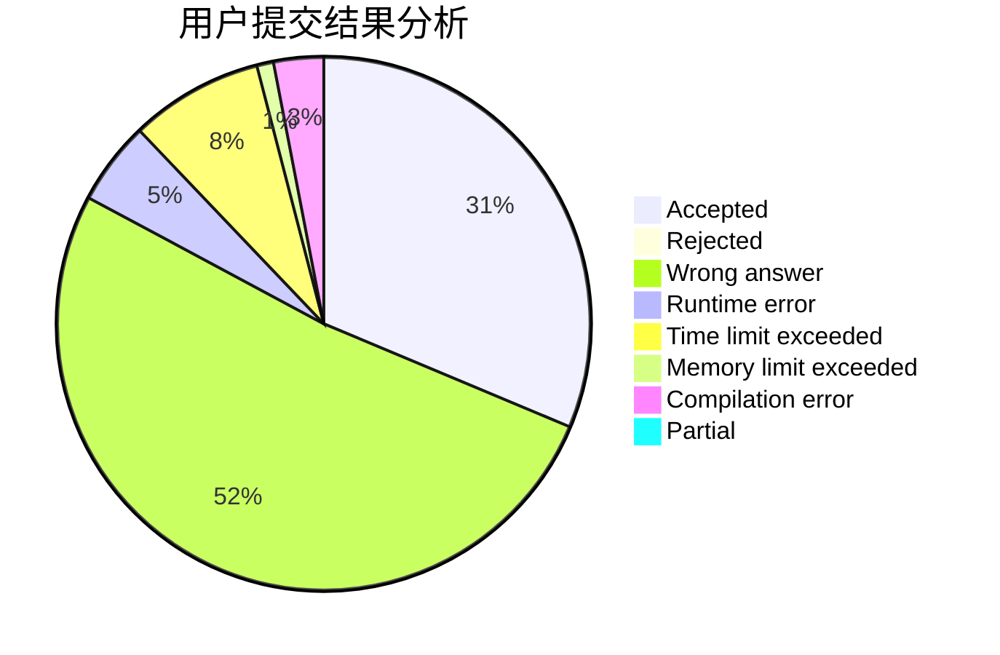
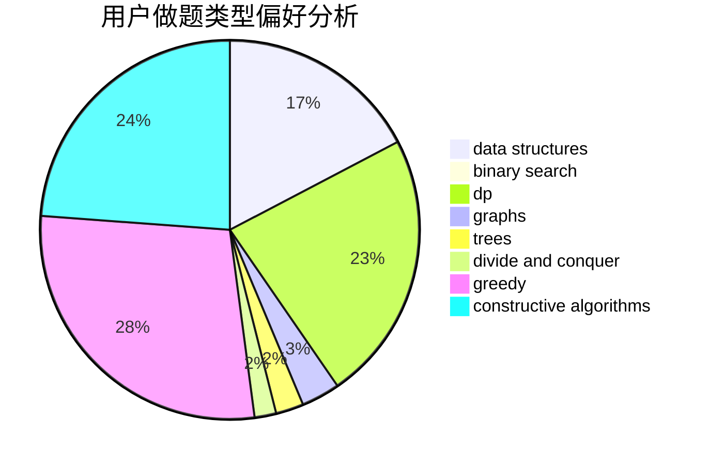

# 2sozx

<!-- tabs:start -->

#### **用户提交结果分析**

#### **用户做题类型偏好分析**

#### **用户错题知识点分析**

<!-- tabs:end -->
# 推荐题目
[13491](https://codeforces.com/contest/1349/problem/1)		dsu,graphs,sortings,trees		  
[1350C](https://codeforces.com/contest/1350/problem/C)		dsu,graphs,sortings,trees		  
[1347A](https://codeforces.com/contest/1347/problem/A)		dsu,graphs,sortings,trees		  
[1345D](https://codeforces.com/contest/1345/problem/D)		dsu,graphs,sortings,trees		  
[1350D](https://codeforces.com/contest/1350/problem/D)		dsu,graphs,sortings,trees		  
[1345B](https://codeforces.com/contest/1345/problem/B)		binary search,
                        brute force,
                        dp,
                        math		  
[1350E](https://codeforces.com/contest/1350/problem/E)		dsu,graphs,sortings,trees		  
[13492](https://codeforces.com/contest/1349/problem/2)		dsu,graphs,sortings,trees		  
[1344F](https://codeforces.com/contest/1344/problem/F)		matrices		  
[10023](https://codeforces.com/contest/1002/problem/3)		dsu,graphs,sortings,trees		  
