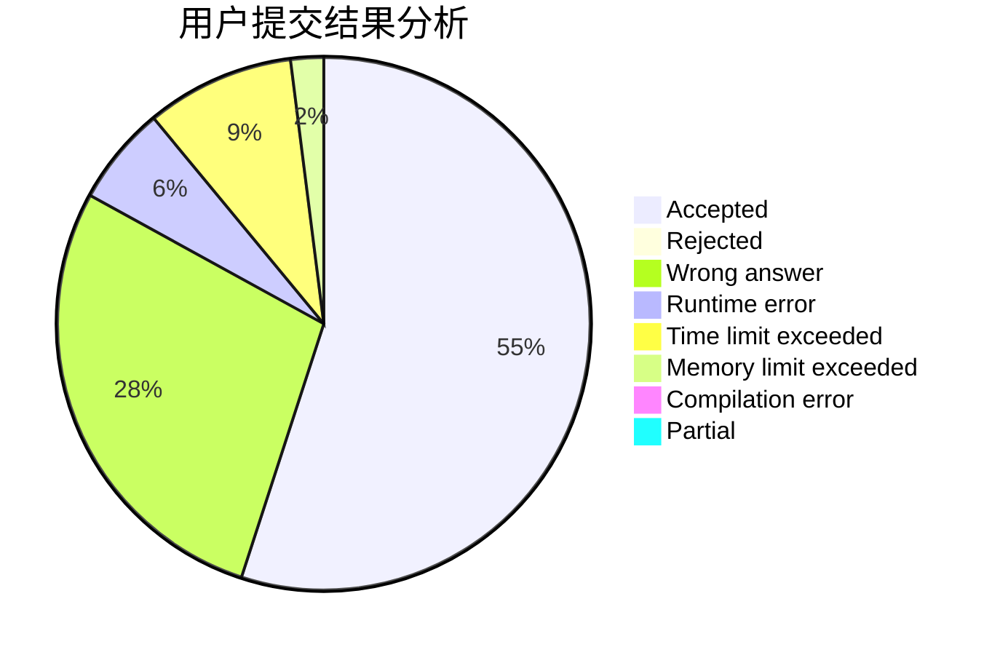
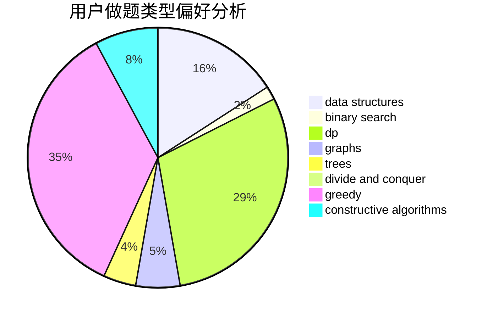
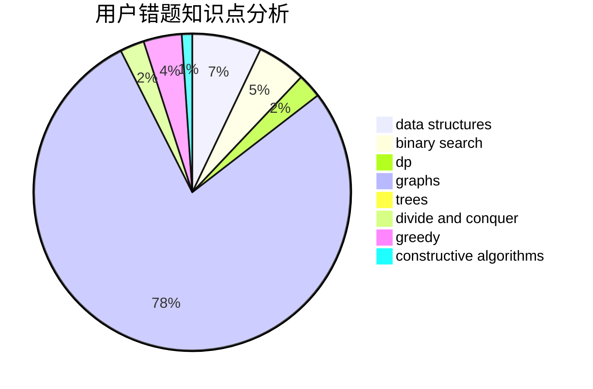

# Itst

<!-- tabs:start -->

#### **用户提交结果分析**

#### **用户做题类型偏好分析**

#### **用户错题知识点分析**

<!-- tabs:end -->
# 推荐题目
[472D](https://codeforces.com/contest/472/problem/D)		dfs and similar,
                        dsu,
                        shortest paths,
                        trees		  
[1245C](https://codeforces.com/contest/1245/problem/C)		dp		  
[1154G](https://codeforces.com/contest/1154/problem/G)		brute force,
                        greedy,
                        math,
                        number theory		  
[868D](https://codeforces.com/contest/868/problem/D)		bitmasks,
                        brute force,
                        dp,
                        implementation,
                        strings		  
[664A](https://codeforces.com/contest/664/problem/A)		math,
                        number theory		  
[510E](https://codeforces.com/contest/510/problem/E)		flows		  
[592A](https://codeforces.com/contest/592/problem/A)		implementation		  
[940B](https://codeforces.com/contest/940/problem/B)		dp,
                        greedy		  
[803D](https://codeforces.com/contest/803/problem/D)		binary search,
                        greedy		  
[478D](https://codeforces.com/contest/478/problem/D)		dp		  
