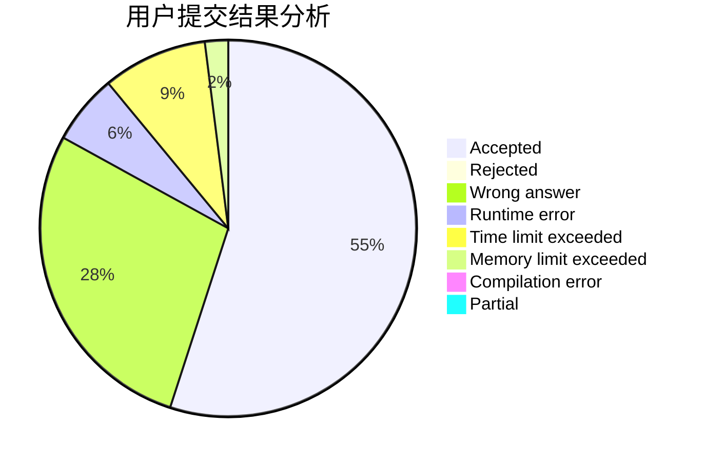
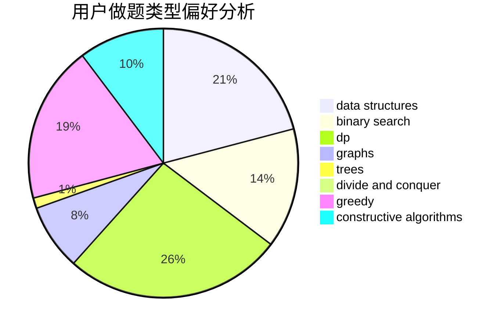

# Itst

<!-- tabs:start -->

#### **用户提交结果分析**

#### **用户做题类型偏好分析**

#### **用户错题知识点分析**

<!-- tabs:end -->
# 推荐题目
[451A](https://codeforces.com/contest/451/problem/A)		implementation		  
[123E](https://codeforces.com/contest/123/problem/E)		dfs and similar,
                        dp,
                        probabilities,
                        trees		  
[1152F2](https://codeforces.com/contest/1152F/problem/2)		bitmasks,
                        dp,
                        matrices		  
[849B](https://codeforces.com/contest/849/problem/B)		brute force,
                        geometry		  
[632D](https://codeforces.com/contest/632/problem/D)		brute force,
                        math,
                        number theory		  
[490F](https://codeforces.com/contest/490/problem/F)		data structures,
                        dfs and similar,
                        dp,
                        trees		  
[571D](https://codeforces.com/contest/571/problem/D)		binary search,
                        data structures,
                        dsu,
                        trees		  
[920B](https://codeforces.com/contest/920/problem/B)		implementation		  
[787D](https://codeforces.com/contest/787/problem/D)		dsu,graphs,sortings,trees		  
[459E](https://codeforces.com/contest/459/problem/E)		dp,
                        sortings		  
