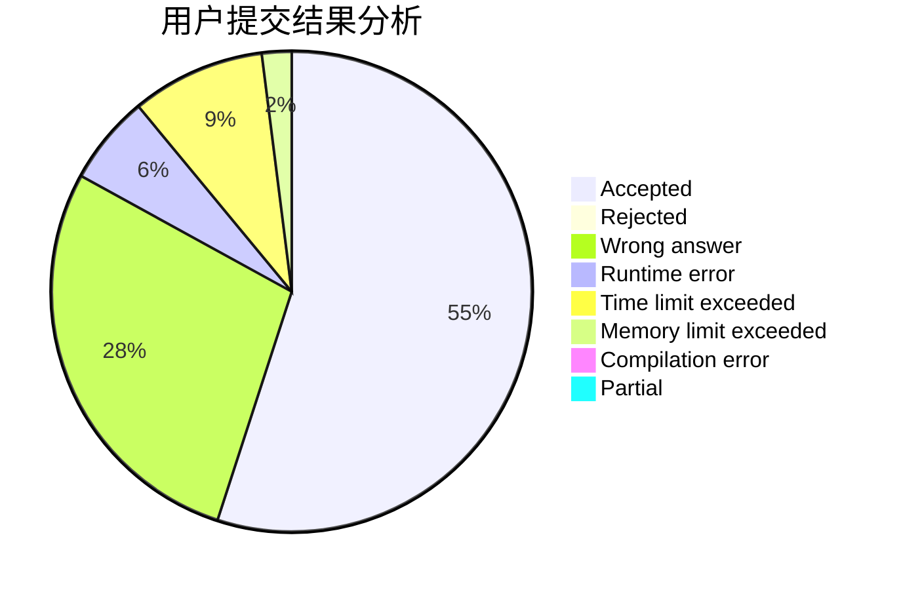
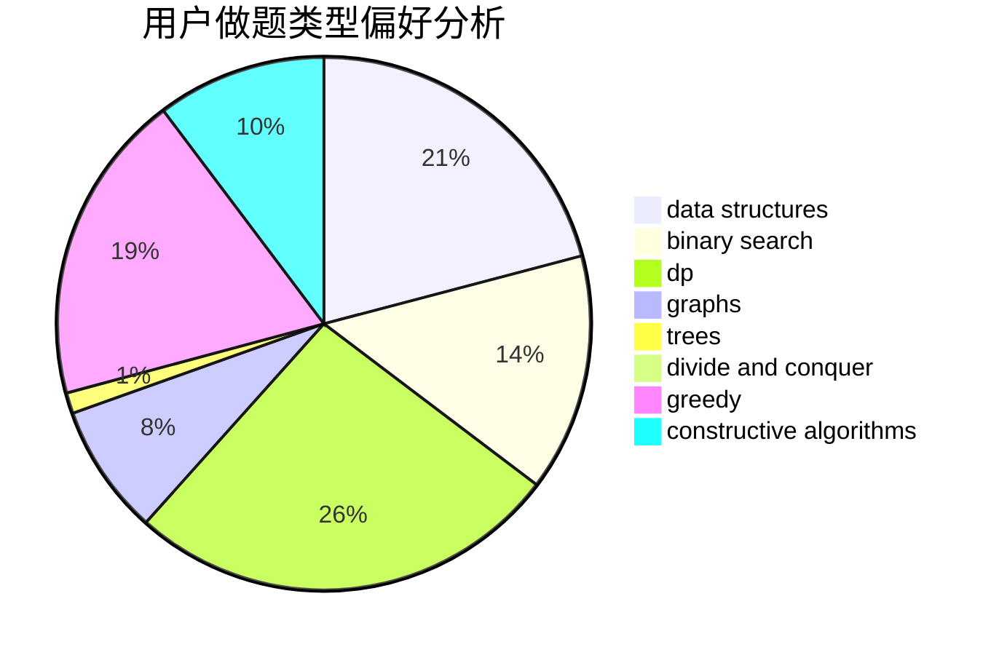

# Itst
<!-- tabs:start -->
#### **用户提交结果分析**

#### **用户做题类型偏好分析**

#### **用户错题知识点分析**

<!-- tabs:end -->
# 推荐题目
[Same Parity Summands](http://codeforces.com/problemset/problem/1352/B)		constructive algorithms,
                        math		  
[Number of Simple Paths](http://codeforces.com/problemset/problem/1454/E)		combinatorics,
                        dfs and similar,
                        graphs,
                        trees		  
[Binary Table (Hard Version)](http://codeforces.com/problemset/problem/1439/A2)		constructive algorithms,
                        graphs,
                        greedy,
                        implementation		  
[Complete Mirror](http://codeforces.com/problemset/problem/1182/D)		constructive algorithms,
                        dfs and similar,
                        dp,
                        hashing,
                        implementation,
                        trees		  
[Chess For Three](http://codeforces.com/problemset/problem/893/A)		implementation		  
[Neko Rules the Catniverse (Large Version)](http://codeforces.com/problemset/problem/1152/F2)		bitmasks,
                        dp,
                        matrices		  
[Treeland Tour](http://codeforces.com/problemset/problem/490/F)		data structures,
                        dfs and similar,
                        dp,
                        trees		  
[Cup Trick](http://codeforces.com/problemset/problem/420/D)		data structures		  
[Tell Your World](http://codeforces.com/problemset/problem/849/B)		brute force,
                        geometry		  
[Sonya and Queries](http://codeforces.com/problemset/problem/713/A)		data structures,
                        implementation		  
<!-- tabs:start -->
#### **data structures**
[Same Parity Summands](http://codeforces.com/problemset/problem/490/F)		data structures,
                        dfs and similar,
                        dp,
                        trees		  
[Number of Simple Paths](http://codeforces.com/problemset/problem/420/D)		data structures		  
[Binary Table (Hard Version)](http://codeforces.com/problemset/problem/713/A)		data structures,
                        implementation		  
[Complete Mirror](http://codeforces.com/problemset/problem/1380/A)		brute force,
                        data structures		  
[Chess For Three](http://codeforces.com/problemset/problem/431/E)		binary search,
                        data structures,
                        ternary search		  
[Neko Rules the Catniverse (Large Version)](http://codeforces.com/problemset/problem/524/E)		data structures,
                        sortings		  
[Treeland Tour](https://codeforces.com/contest/787/problem/D)		data structures,
                        graphs,
                        shortest paths		  
[Cup Trick](https://codeforces.com/contest/1269/problem/E)		binary search,
                        data structures		  
[Tell Your World](http://codeforces.com/problemset/problem/571/D)		binary search,
                        data structures,
                        dsu,
                        trees		  
[Sonya and Queries](http://codeforces.com/problemset/problem/91/B)		binary search,
                        data structures		  
#### **binary search**
[Same Parity Summands](http://codeforces.com/problemset/problem/1244/E)		binary search,
                        constructive algorithms,
                        greedy,
                        sortings,
                        ternary search,
                        two pointers		  
[Number of Simple Paths](http://codeforces.com/problemset/problem/431/E)		binary search,
                        data structures,
                        ternary search		  
[Binary Table (Hard Version)](https://codeforces.com/contest/737/problem/A)		binary search,
                        greedy,
                        sortings		  
[Complete Mirror](https://codeforces.com/contest/1269/problem/E)		binary search,
                        data structures		  
[Chess For Three](http://codeforces.com/problemset/problem/571/D)		binary search,
                        data structures,
                        dsu,
                        trees		  
[Neko Rules the Catniverse (Large Version)](http://codeforces.com/problemset/problem/91/B)		binary search,
                        data structures		  
[Treeland Tour](http://codeforces.com/problemset/problem/1103/B)		binary search,
                        constructive algorithms,
                        interactive		  
[Cup Trick](http://codeforces.com/problemset/problem/1372/F)		binary search,
                        divide and conquer,
                        interactive		  
[Tell Your World](http://codeforces.com/problemset/problem/1492/C)		binary search,
                        data structures,
                        dp,
                        greedy,
                        two pointers		  
[Sonya and Queries](http://codeforces.com/problemset/problem/1463/D)		binary search,
                        constructive algorithms,
                        greedy,
                        two pointers		  
#### **dp**
[Same Parity Summands](http://codeforces.com/problemset/problem/1182/D)		constructive algorithms,
                        dfs and similar,
                        dp,
                        hashing,
                        implementation,
                        trees		  
[Number of Simple Paths](http://codeforces.com/problemset/problem/1152/F2)		bitmasks,
                        dp,
                        matrices		  
[Binary Table (Hard Version)](http://codeforces.com/problemset/problem/490/F)		data structures,
                        dfs and similar,
                        dp,
                        trees		  
[Complete Mirror](http://codeforces.com/problemset/problem/459/E)		dp,
                        sortings		  
[Chess For Three](http://codeforces.com/problemset/problem/123/E)		dfs and similar,
                        dp,
                        probabilities,
                        trees		  
[Neko Rules the Catniverse (Large Version)](https://codeforces.com/contest/674/problem/F)		dp,
                        math,
                        meet-in-the-middle		  
[Treeland Tour](http://codeforces.com/problemset/problem/798/C)		dp,
                        greedy,
                        number theory		  
[Cup Trick](http://codeforces.com/problemset/problem/44/E)		dp		  
[Tell Your World](http://codeforces.com/problemset/problem/582/D)		dp,
                        math,
                        number theory		  
[Sonya and Queries](https://codeforces.com/contest/1341/problem/E)		dfs and similar,
                        dp,
                        graphs,
                        shortest paths		  
#### **graph**
[Same Parity Summands](http://codeforces.com/problemset/problem/1454/E)		combinatorics,
                        dfs and similar,
                        graphs,
                        trees		  
[Number of Simple Paths](http://codeforces.com/problemset/problem/1439/A2)		constructive algorithms,
                        graphs,
                        greedy,
                        implementation		  
[Binary Table (Hard Version)](https://codeforces.com/contest/787/problem/D)		data structures,
                        graphs,
                        shortest paths		  
[Complete Mirror](https://codeforces.com/contest/1341/problem/E)		dfs and similar,
                        dp,
                        graphs,
                        shortest paths		  
[Chess For Three](http://codeforces.com/problemset/problem/1213/G)		divide and conquer,
                        dsu,
                        graphs,
                        sortings,
                        trees		  
[Neko Rules the Catniverse (Large Version)](https://codeforces.com/contest/1440/problem/D)		constructive algorithms,
                        data structures,
                        graphs		  
[Treeland Tour](http://codeforces.com/problemset/problem/1292/D)		dp,
                        graphs,
                        greedy,
                        math,
                        number theory,
                        trees		  
[Cup Trick](http://codeforces.com/problemset/problem/1487/C)		brute force,
                        constructive algorithms,
                        dfs and similar,
                        graphs,
                        greedy,
                        implementation,
                        math		  
[Tell Your World](http://codeforces.com/problemset/problem/1437/C)		dp,
                        flows,
                        graph matchings,
                        greedy,
                        math,
                        sortings		  
[Sonya and Queries](http://codeforces.com/problemset/problem/1470/D)		constructive algorithms,
                        dfs and similar,
                        graph matchings,
                        graphs,
                        greedy		  
#### **trees**
[Same Parity Summands](http://codeforces.com/problemset/problem/1454/E)		combinatorics,
                        dfs and similar,
                        graphs,
                        trees		  
[Number of Simple Paths](http://codeforces.com/problemset/problem/1182/D)		constructive algorithms,
                        dfs and similar,
                        dp,
                        hashing,
                        implementation,
                        trees		  
[Binary Table (Hard Version)](http://codeforces.com/problemset/problem/490/F)		data structures,
                        dfs and similar,
                        dp,
                        trees		  
[Complete Mirror](http://codeforces.com/problemset/problem/1053/E)		constructive algorithms,
                        trees		  
[Chess For Three](https://codeforces.com/contest/1087/problem/D)		constructive algorithms,
                        implementation,
                        trees		  
[Neko Rules the Catniverse (Large Version)](http://codeforces.com/problemset/problem/123/E)		dfs and similar,
                        dp,
                        probabilities,
                        trees		  
[Treeland Tour](https://codeforces.com/contest/430/problem/C)		dfs and similar,
                        trees		  
[Cup Trick](http://codeforces.com/problemset/problem/571/D)		binary search,
                        data structures,
                        dsu,
                        trees		  
[Tell Your World](http://codeforces.com/problemset/problem/1213/G)		divide and conquer,
                        dsu,
                        graphs,
                        sortings,
                        trees		  
[Sonya and Queries](http://codeforces.com/problemset/problem/1118/F1)		dfs and similar,
                        trees		  
#### **divide and conquer**
[Same Parity Summands](http://codeforces.com/problemset/problem/1213/G)		divide and conquer,
                        dsu,
                        graphs,
                        sortings,
                        trees		  
[Number of Simple Paths](http://codeforces.com/problemset/problem/1372/F)		binary search,
                        divide and conquer,
                        interactive		  
[Binary Table (Hard Version)](http://codeforces.com/problemset/problem/1461/D)		binary search,
                        brute force,
                        data structures,
                        divide and conquer,
                        implementation,
                        sortings		  
[Complete Mirror](http://codeforces.com/problemset/problem/1466/G)		combinatorics,
                        divide and conquer,
                        hashing,
                        math,
                        string suffix structures,
                        strings		  
[Chess For Three](http://codeforces.com/problemset/problem/1490/D)		dfs and similar,
                        divide and conquer,
                        implementation		  
[Neko Rules the Catniverse (Large Version)](https://codeforces.com/contest/1483/problem/C)		data structures,
                        divide and conquer,
                        dp		  
[Treeland Tour](http://codeforces.com/problemset/problem/1491/E)		brute force,
                        dfs and similar,
                        divide and conquer,
                        number theory,
                        trees		  
[Cup Trick](http://codeforces.com/problemset/problem/1303/G)		data structures,
                        divide and conquer,
                        geometry,
                        trees		  
[Tell Your World](http://codeforces.com/problemset/problem/1494/D)		constructive algorithms,
                        data structures,
                        dfs and similar,
                        divide and conquer,
                        dsu,
                        greedy,
                        sortings,
                        trees		  
[Sonya and Queries](http://codeforces.com/problemset/problem/1482/E)		data structures,
                        divide and conquer,
                        dp		  
#### **greedy**
[Same Parity Summands](http://codeforces.com/problemset/problem/1439/A2)		constructive algorithms,
                        graphs,
                        greedy,
                        implementation		  
[Number of Simple Paths](http://codeforces.com/problemset/problem/1244/E)		binary search,
                        constructive algorithms,
                        greedy,
                        sortings,
                        ternary search,
                        two pointers		  
[Binary Table (Hard Version)](http://codeforces.com/problemset/problem/730/E)		greedy,
                        implementation		  
[Complete Mirror](https://codeforces.com/contest/737/problem/A)		binary search,
                        greedy,
                        sortings		  
[Chess For Three](http://codeforces.com/problemset/problem/798/C)		dp,
                        greedy,
                        number theory		  
[Neko Rules the Catniverse (Large Version)](http://codeforces.com/problemset/problem/1108/E1)		brute force,
                        greedy,
                        implementation		  
[Treeland Tour](http://codeforces.com/problemset/problem/91/A)		greedy,
                        strings		  
[Cup Trick](http://codeforces.com/problemset/problem/1388/B)		greedy,
                        math		  
[Tell Your World](http://codeforces.com/problemset/problem/1203/B)		greedy,
                        math		  
[Sonya and Queries](http://codeforces.com/problemset/problem/1305/E)		constructive algorithms,
                        greedy,
                        implementation,
                        math		  
#### **constructive algorithms**
[Same Parity Summands](http://codeforces.com/problemset/problem/1352/B)		constructive algorithms,
                        math		  
[Number of Simple Paths](http://codeforces.com/problemset/problem/1439/A2)		constructive algorithms,
                        graphs,
                        greedy,
                        implementation		  
[Binary Table (Hard Version)](http://codeforces.com/problemset/problem/1182/D)		constructive algorithms,
                        dfs and similar,
                        dp,
                        hashing,
                        implementation,
                        trees		  
[Complete Mirror](http://codeforces.com/problemset/problem/1053/E)		constructive algorithms,
                        trees		  
[Chess For Three](https://codeforces.com/contest/1087/problem/D)		constructive algorithms,
                        implementation,
                        trees		  
[Neko Rules the Catniverse (Large Version)](http://codeforces.com/problemset/problem/1244/E)		binary search,
                        constructive algorithms,
                        greedy,
                        sortings,
                        ternary search,
                        two pointers		  
[Treeland Tour](http://codeforces.com/problemset/problem/1103/B)		binary search,
                        constructive algorithms,
                        interactive		  
[Cup Trick](http://codeforces.com/problemset/problem/1305/E)		constructive algorithms,
                        greedy,
                        implementation,
                        math		  
[Tell Your World](https://codeforces.com/contest/1277/problem/F)		brute force,
                        combinatorics,
                        constructive algorithms,
                        data structures,
                        greedy,
                        math		  
[Sonya and Queries](https://codeforces.com/contest/1440/problem/D)		constructive algorithms,
                        data structures,
                        graphs		  
#### **sortings**
[Same Parity Summands](http://codeforces.com/problemset/problem/459/E)		dp,
                        sortings		  
[Number of Simple Paths](http://codeforces.com/problemset/problem/1244/E)		binary search,
                        constructive algorithms,
                        greedy,
                        sortings,
                        ternary search,
                        two pointers		  
[Binary Table (Hard Version)](https://codeforces.com/contest/737/problem/A)		binary search,
                        greedy,
                        sortings		  
[Complete Mirror](http://codeforces.com/problemset/problem/524/E)		data structures,
                        sortings		  
[Chess For Three](http://codeforces.com/problemset/problem/1213/G)		divide and conquer,
                        dsu,
                        graphs,
                        sortings,
                        trees		  
[Neko Rules the Catniverse (Large Version)](https://codeforces.com/contest/1496/problem/C)		geometry,
                        greedy,
                        math,
                        sortings		  
[Treeland Tour](http://codeforces.com/problemset/problem/1495/A)		geometry,
                        greedy,
                        math,
                        sortings		  
[Cup Trick](http://codeforces.com/problemset/problem/1497/A)		brute force,
                        data structures,
                        greedy,
                        sortings		  
[Tell Your World](http://codeforces.com/problemset/problem/1427/A)		math,
                        sortings		  
[Sonya and Queries](http://codeforces.com/problemset/problem/1461/D)		binary search,
                        brute force,
                        data structures,
                        divide and conquer,
                        implementation,
                        sortings		  
<!-- tabs:end -->
