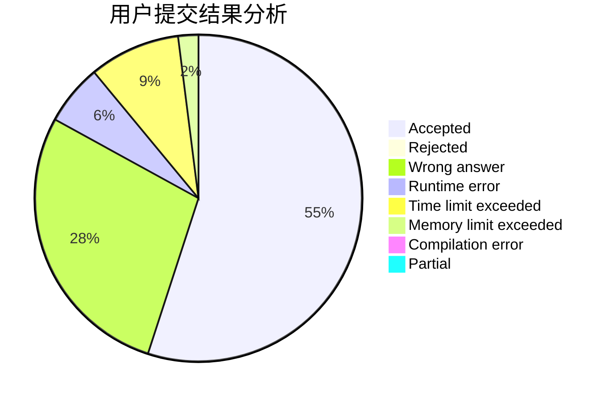
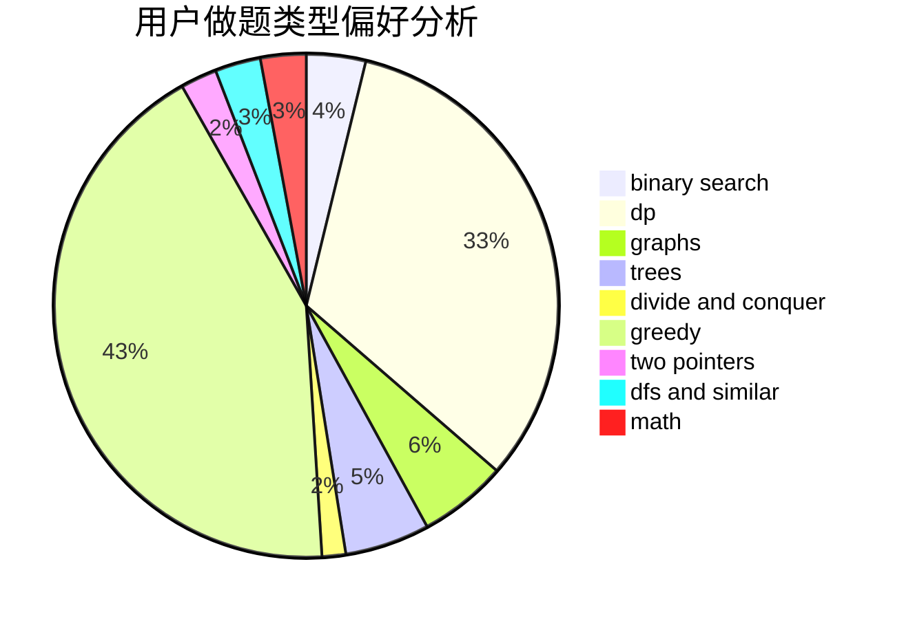

# Itst

<!-- tabs:start -->

#### **用户提交结果分析**

#### **用户做题类型偏好分析**

<!-- tabs:end -->
# 推荐题目
[472D](https://codeforces.com/contest/472/problem/D)
[1245C](https://codeforces.com/contest/1245/problem/C)
[1154G](https://codeforces.com/contest/1154/problem/G)
[868D](https://codeforces.com/contest/868/problem/D)
[664A](https://codeforces.com/contest/664/problem/A)
[510E](https://codeforces.com/contest/510/problem/E)
[592A](https://codeforces.com/contest/592/problem/A)
[940B](https://codeforces.com/contest/940/problem/B)
[803D](https://codeforces.com/contest/803/problem/D)
[478D](https://codeforces.com/contest/478/problem/D)
