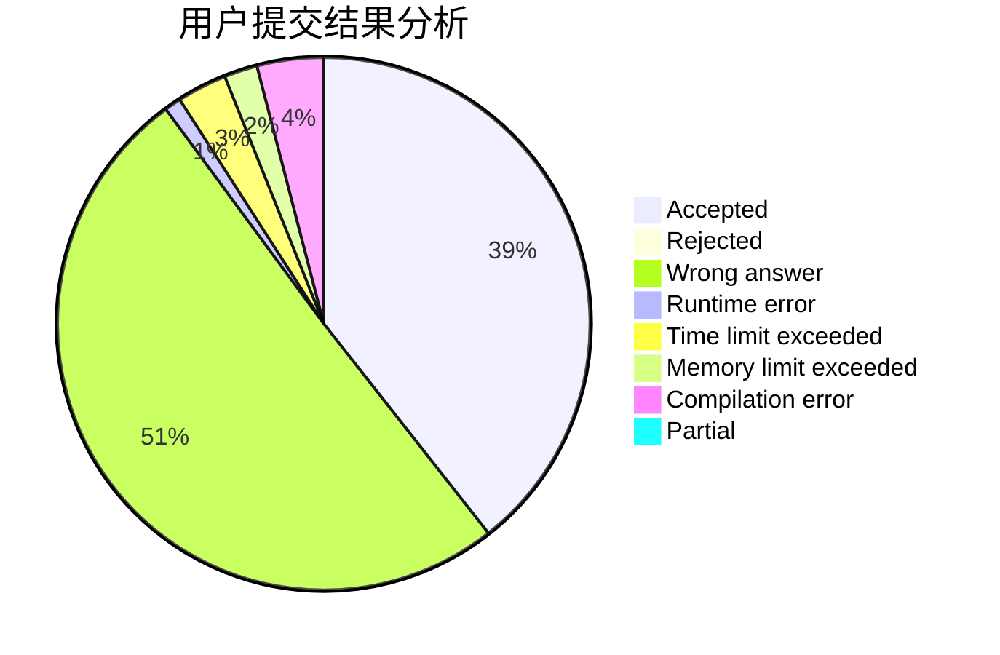
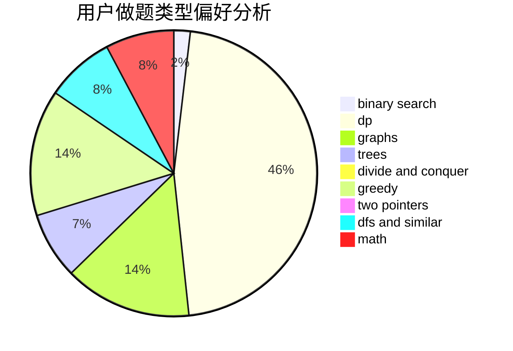

# ItstInternationalTourist

<!-- tabs:start -->

#### **用户提交结果分析**

#### **用户做题类型偏好分析**

<!-- tabs:end -->
# 推荐题目
[831F](https://codeforces.com/contest/831/problem/F)
[578B](https://codeforces.com/contest/578/problem/B)
[1424M](https://codeforces.com/contest/1424/problem/M)
[277D](https://codeforces.com/contest/277/problem/D)
[101D](https://codeforces.com/contest/101/problem/D)
[651B](https://codeforces.com/contest/651/problem/B)
[1166B](https://codeforces.com/contest/1166/problem/B)
[689B](https://codeforces.com/contest/689/problem/B)
[766B](https://codeforces.com/contest/766/problem/B)
[1147F](https://codeforces.com/contest/1147/problem/F)
