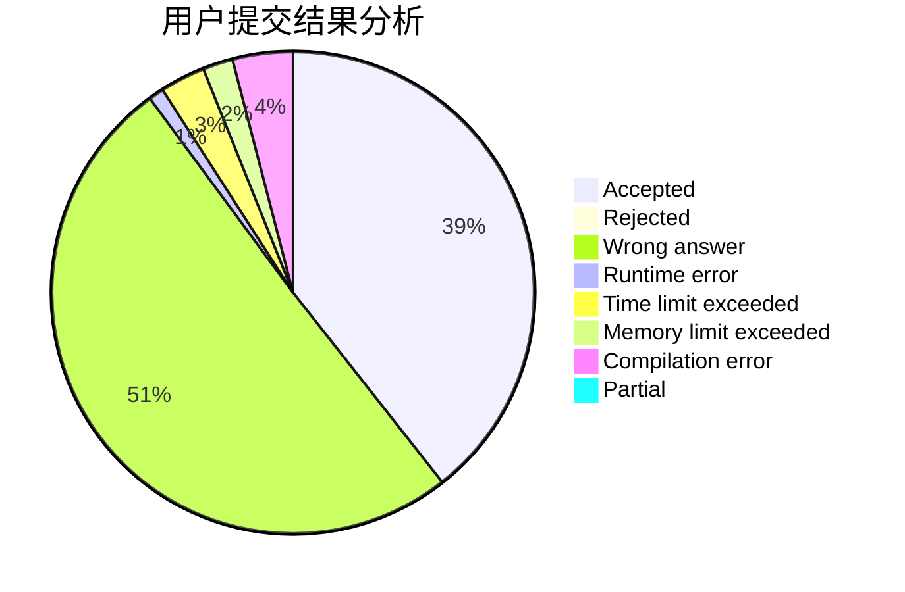
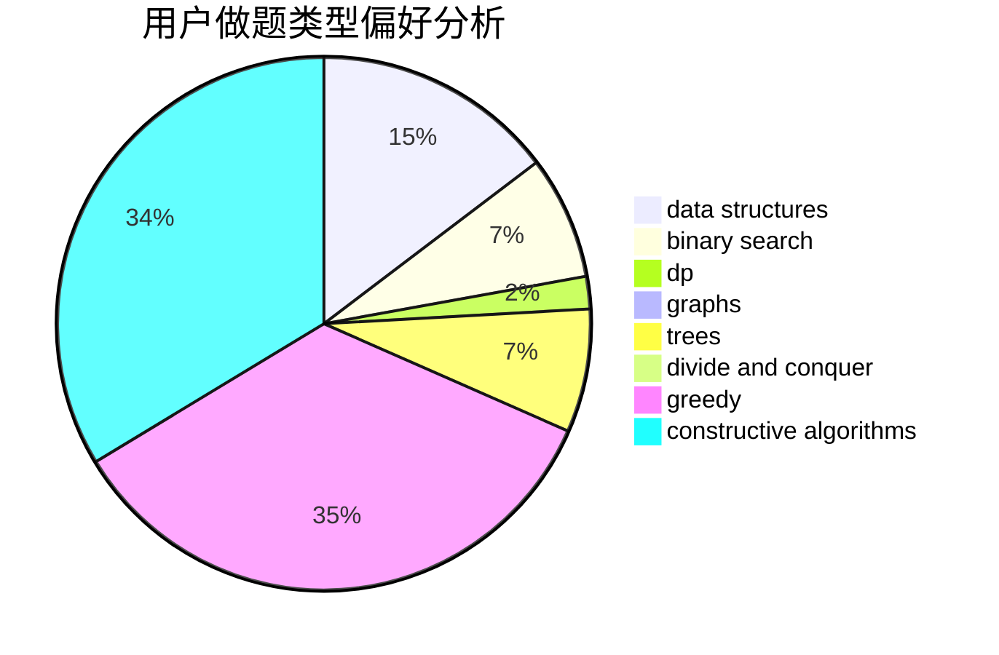
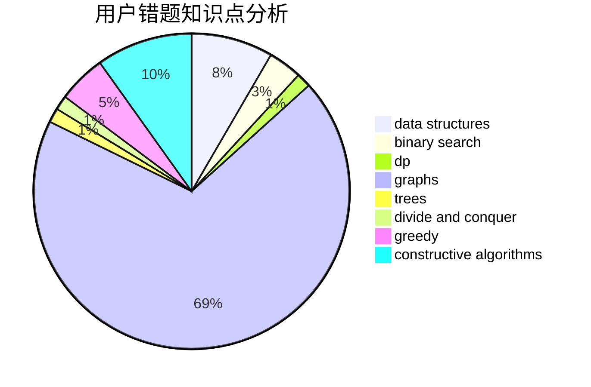

# ItstInternationalTourist

<!-- tabs:start -->

#### **用户提交结果分析**

#### **用户做题类型偏好分析**

#### **用户错题知识点分析**

<!-- tabs:end -->
# 推荐题目
[813D](https://codeforces.com/contest/813/problem/D)		dp,
                        flows		  
[552E](https://codeforces.com/contest/552/problem/E)		brute force,
                        dp,
                        expression parsing,
                        greedy,
                        implementation,
                        strings		  
[1417C](https://codeforces.com/contest/1417/problem/C)		dsu,graphs,sortings,trees		  
[25D](https://codeforces.com/contest/25/problem/D)		dsu,
                        graphs,
                        trees		  
[1019D](https://codeforces.com/contest/1019/problem/D)		binary search,
                        geometry,
                        sortings		  
[623B](https://codeforces.com/contest/623/problem/B)		dp,
                        greedy,
                        number theory		  
[1164J](https://codeforces.com/contest/1164/problem/J)		dsu,graphs,sortings,trees		  
[667B](https://codeforces.com/contest/667/problem/B)		constructive algorithms,
                        geometry		  
[746F](https://codeforces.com/contest/746/problem/F)		data structures,
                        greedy,
                        two pointers		  
[1145F](https://codeforces.com/contest/1145/problem/F)		nan		  
