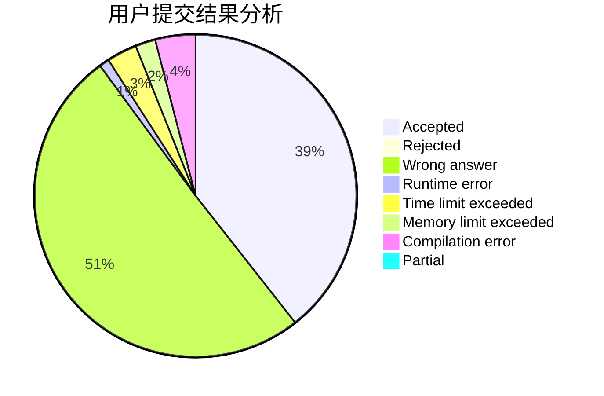
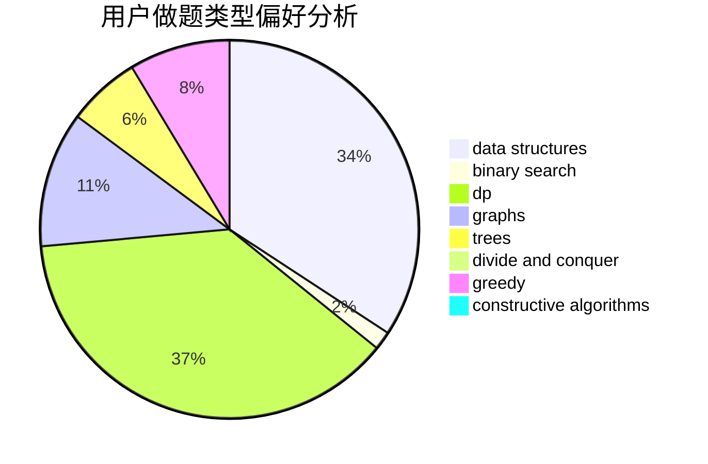
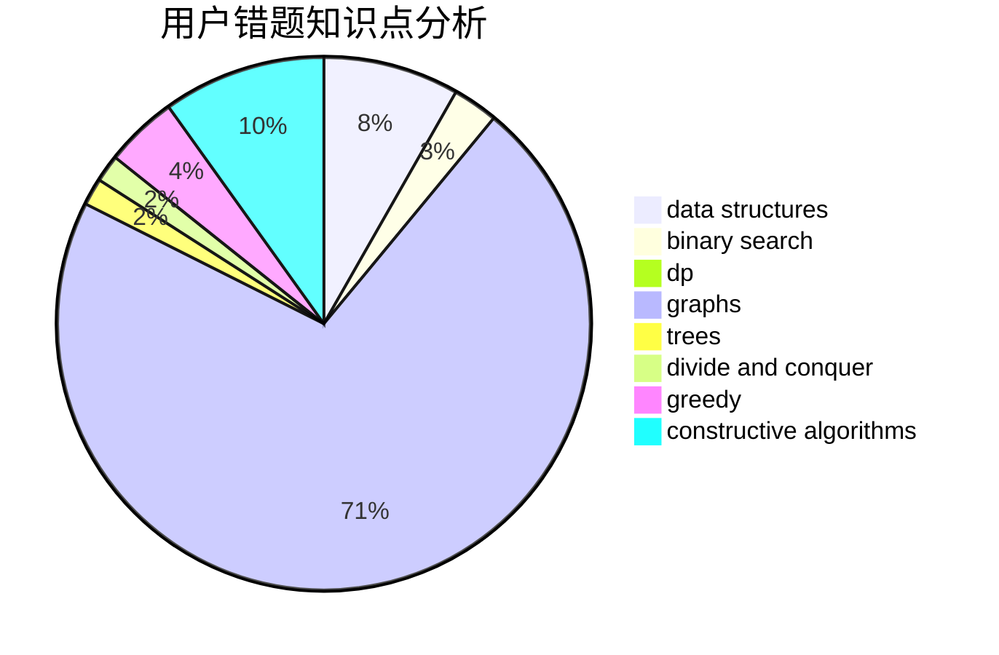

# ItstInternationalTourist

<!-- tabs:start -->

#### **用户提交结果分析**

#### **用户做题类型偏好分析**

#### **用户错题知识点分析**

<!-- tabs:end -->
# 推荐题目
[831F](https://codeforces.com/contest/831/problem/F)		dsu,graphs,sortings,trees		  
[578B](https://codeforces.com/contest/578/problem/B)		brute force,
                        greedy		  
[1424M](https://codeforces.com/contest/1424/problem/M)		graphs,
                        sortings		  
[277D](https://codeforces.com/contest/277/problem/D)		dp,
                        probabilities		  
[101D](https://codeforces.com/contest/101/problem/D)		dp,
                        greedy,
                        probabilities,
                        sortings,
                        trees		  
[651B](https://codeforces.com/contest/651/problem/B)		greedy,
                        sortings		  
[1166B](https://codeforces.com/contest/1166/problem/B)		constructive algorithms,
                        math,
                        number theory		  
[689B](https://codeforces.com/contest/689/problem/B)		dfs and similar,
                        graphs,
                        greedy,
                        shortest paths		  
[766B](https://codeforces.com/contest/766/problem/B)		constructive algorithms,
                        geometry,
                        greedy,
                        math,
                        number theory,
                        sortings		  
[1147F](https://codeforces.com/contest/1147/problem/F)		games,
                        interactive		  
