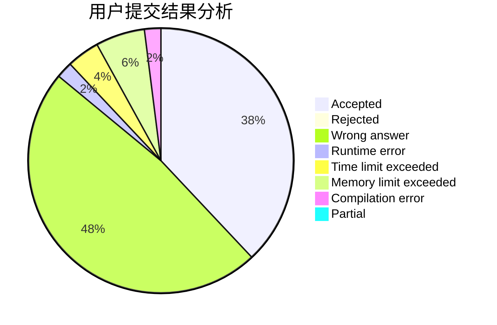
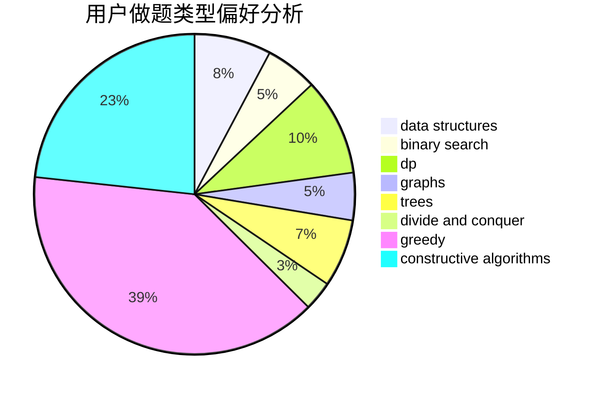
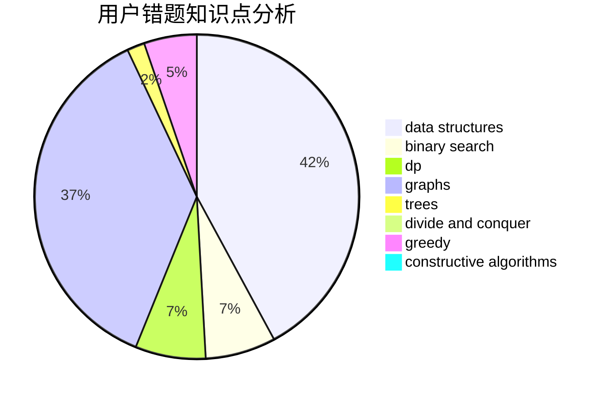

# Itsuka__Shido
<!-- tabs:start -->
#### **用户提交结果分析**

#### **用户做题类型偏好分析**

#### **用户错题知识点分析**

<!-- tabs:end -->
# 推荐题目
[Intellectual Inquiry](http://codeforces.com/problemset/problem/645/E)		dp,
                        greedy,
                        strings		  
[Tic-tac-toe](http://codeforces.com/problemset/problem/3/C)		brute force,
                        games,
                        implementation		  
[Star Trek](http://codeforces.com/problemset/problem/1402/C)		*special problem,
                        combinatorics,
                        dfs and similar,
                        dp,
                        games,
                        graphs,
                        matrices,
                        trees		  
[Duff and Meat](http://codeforces.com/problemset/problem/588/A)		greedy		  
[Enlarge GCD](http://codeforces.com/problemset/problem/1034/A)		number theory		  
[HDD is Outdated Technology](http://codeforces.com/problemset/problem/612/B)		implementation,
                        math		  
[The Intriguing Obsession](http://codeforces.com/problemset/problem/869/C)		combinatorics,
                        dp,
                        math		  
[Appleman and Toastman](http://codeforces.com/problemset/problem/461/A)		greedy,
                        sortings		  
[Ehab and subtraction](http://codeforces.com/problemset/problem/1088/B)		implementation,
                        sortings		  
[Numbers Exchange](http://codeforces.com/problemset/problem/746/E)		greedy,
                        implementation,
                        math		  
<!-- tabs:start -->
#### **data structures**
[Intellectual Inquiry](http://codeforces.com/problemset/problem/190/E)		data structures,
                        dsu,
                        graphs,
                        hashing,
                        sortings		  
[Tic-tac-toe](http://codeforces.com/problemset/problem/920/E)		data structures,
                        dfs and similar,
                        dsu,
                        graphs		  
[Star Trek](http://codeforces.com/problemset/problem/763/E)		data structures,
                        divide and conquer,
                        dsu		  
[Duff and Meat](http://codeforces.com/problemset/problem/1492/C)		binary search,
                        data structures,
                        dp,
                        greedy,
                        two pointers		  
[Enlarge GCD](http://codeforces.com/problemset/problem/1490/G)		binary search,
                        data structures,
                        math		  
[HDD is Outdated Technology](http://codeforces.com/problemset/problem/1479/D)		binary search,
                        bitmasks,
                        brute force,
                        data structures,
                        probabilities,
                        trees		  
[The Intriguing Obsession](http://codeforces.com/problemset/problem/1497/A)		brute force,
                        data structures,
                        greedy,
                        sortings		  
[Appleman and Toastman](http://codeforces.com/problemset/problem/1491/C)		brute force,
                        data structures,
                        dp,
                        greedy,
                        implementation		  
[Ehab and subtraction](http://codeforces.com/problemset/problem/1492/B)		data structures,
                        greedy,
                        math		  
[Numbers Exchange](http://codeforces.com/problemset/problem/1436/E)		binary search,
                        data structures,
                        two pointers		  
#### **binary search**
[Intellectual Inquiry](https://codeforces.com/contest/779/problem/D)		binary search,
                        greedy,
                        strings		  
[Tic-tac-toe](http://codeforces.com/problemset/problem/1305/H)		binary search,
                        greedy		  
[Star Trek](http://codeforces.com/problemset/problem/808/E)		binary search,
                        dp,
                        greedy,
                        ternary search		  
[Duff and Meat](http://codeforces.com/problemset/problem/1260/B)		binary search,
                        math		  
[Enlarge GCD](http://codeforces.com/problemset/problem/1492/C)		binary search,
                        data structures,
                        dp,
                        greedy,
                        two pointers		  
[HDD is Outdated Technology](http://codeforces.com/problemset/problem/1463/D)		binary search,
                        constructive algorithms,
                        greedy,
                        two pointers		  
[The Intriguing Obsession](http://codeforces.com/problemset/problem/1490/G)		binary search,
                        data structures,
                        math		  
[Appleman and Toastman](http://codeforces.com/problemset/problem/1479/D)		binary search,
                        bitmasks,
                        brute force,
                        data structures,
                        probabilities,
                        trees		  
[Ehab and subtraction](http://codeforces.com/problemset/problem/1436/E)		binary search,
                        data structures,
                        two pointers		  
[Numbers Exchange](http://codeforces.com/problemset/problem/1461/D)		binary search,
                        brute force,
                        data structures,
                        divide and conquer,
                        implementation,
                        sortings		  
#### **dp**
[Intellectual Inquiry](http://codeforces.com/problemset/problem/645/E)		dp,
                        greedy,
                        strings		  
[Tic-tac-toe](http://codeforces.com/problemset/problem/1402/C)		*special problem,
                        combinatorics,
                        dfs and similar,
                        dp,
                        games,
                        graphs,
                        matrices,
                        trees		  
[Star Trek](http://codeforces.com/problemset/problem/869/C)		combinatorics,
                        dp,
                        math		  
[Duff and Meat](http://codeforces.com/problemset/problem/1348/E)		brute force,
                        dp,
                        greedy,
                        math		  
[Enlarge GCD](http://codeforces.com/problemset/problem/808/E)		binary search,
                        dp,
                        greedy,
                        ternary search		  
[HDD is Outdated Technology](http://codeforces.com/problemset/problem/1492/C)		binary search,
                        data structures,
                        dp,
                        greedy,
                        two pointers		  
[The Intriguing Obsession](https://codeforces.com/contest/1457/problem/C)		brute force,
                        dp,
                        implementation		  
[Appleman and Toastman](http://codeforces.com/problemset/problem/1491/C)		brute force,
                        data structures,
                        dp,
                        greedy,
                        implementation		  
[Ehab and subtraction](http://codeforces.com/problemset/problem/1437/C)		dp,
                        flows,
                        graph matchings,
                        greedy,
                        math,
                        sortings		  
[Numbers Exchange](http://codeforces.com/problemset/problem/1499/B)		brute force,
                        dp,
                        greedy,
                        implementation		  
#### **graph**
[Intellectual Inquiry](http://codeforces.com/problemset/problem/1402/C)		*special problem,
                        combinatorics,
                        dfs and similar,
                        dp,
                        games,
                        graphs,
                        matrices,
                        trees		  
[Tic-tac-toe](http://codeforces.com/problemset/problem/899/C)		constructive algorithms,
                        graphs,
                        math		  
[Star Trek](http://codeforces.com/problemset/problem/190/E)		data structures,
                        dsu,
                        graphs,
                        hashing,
                        sortings		  
[Duff and Meat](http://codeforces.com/problemset/problem/920/E)		data structures,
                        dfs and similar,
                        dsu,
                        graphs		  
[Enlarge GCD](http://codeforces.com/problemset/problem/164/C)		flows,
                        graphs		  
[HDD is Outdated Technology](http://codeforces.com/problemset/problem/1487/C)		brute force,
                        constructive algorithms,
                        dfs and similar,
                        graphs,
                        greedy,
                        implementation,
                        math		  
[The Intriguing Obsession](http://codeforces.com/problemset/problem/1437/C)		dp,
                        flows,
                        graph matchings,
                        greedy,
                        math,
                        sortings		  
[Appleman and Toastman](http://codeforces.com/problemset/problem/1470/D)		constructive algorithms,
                        dfs and similar,
                        graph matchings,
                        graphs,
                        greedy		  
[Ehab and subtraction](http://codeforces.com/problemset/problem/1476/C)		dp,
                        graphs,
                        greedy		  
[Numbers Exchange](http://codeforces.com/problemset/problem/1304/D)		constructive algorithms,
                        graphs,
                        greedy,
                        two pointers		  
#### **trees**
[Intellectual Inquiry](http://codeforces.com/problemset/problem/1402/C)		*special problem,
                        combinatorics,
                        dfs and similar,
                        dp,
                        games,
                        graphs,
                        matrices,
                        trees		  
[Tic-tac-toe](http://codeforces.com/problemset/problem/1479/D)		binary search,
                        bitmasks,
                        brute force,
                        data structures,
                        probabilities,
                        trees		  
[Star Trek](http://codeforces.com/problemset/problem/1511/C)		brute force,
                        data structures,
                        implementation,
                        trees		  
[Duff and Meat](http://codeforces.com/problemset/problem/1499/F)		combinatorics,
                        dfs and similar,
                        dp,
                        trees		  
[Enlarge GCD](http://codeforces.com/problemset/problem/1491/E)		brute force,
                        dfs and similar,
                        divide and conquer,
                        number theory,
                        trees		  
[HDD is Outdated Technology](http://codeforces.com/problemset/problem/1466/D)		data structures,
                        greedy,
                        sortings,
                        trees		  
[The Intriguing Obsession](http://codeforces.com/problemset/problem/1495/D)		combinatorics,
                        dfs and similar,
                        graphs,
                        math,
                        shortest paths,
                        trees		  
[Appleman and Toastman](http://codeforces.com/problemset/problem/1303/G)		data structures,
                        divide and conquer,
                        geometry,
                        trees		  
[Ehab and subtraction](http://codeforces.com/problemset/problem/1454/E)		combinatorics,
                        dfs and similar,
                        graphs,
                        trees		  
[Numbers Exchange](http://codeforces.com/problemset/problem/1494/D)		constructive algorithms,
                        data structures,
                        dfs and similar,
                        divide and conquer,
                        dsu,
                        greedy,
                        sortings,
                        trees		  
#### **divide and conquer**
[Intellectual Inquiry](http://codeforces.com/problemset/problem/1470/F)		divide and conquer		  
[Tic-tac-toe](http://codeforces.com/problemset/problem/763/E)		data structures,
                        divide and conquer,
                        dsu		  
[Star Trek](http://codeforces.com/problemset/problem/1461/D)		binary search,
                        brute force,
                        data structures,
                        divide and conquer,
                        implementation,
                        sortings		  
[Duff and Meat](http://codeforces.com/problemset/problem/1466/G)		combinatorics,
                        divide and conquer,
                        hashing,
                        math,
                        string suffix structures,
                        strings		  
[Enlarge GCD](http://codeforces.com/problemset/problem/1490/D)		dfs and similar,
                        divide and conquer,
                        implementation		  
[HDD is Outdated Technology](https://codeforces.com/contest/1483/problem/C)		data structures,
                        divide and conquer,
                        dp		  
[The Intriguing Obsession](http://codeforces.com/problemset/problem/1491/E)		brute force,
                        dfs and similar,
                        divide and conquer,
                        number theory,
                        trees		  
[Appleman and Toastman](http://codeforces.com/problemset/problem/1303/G)		data structures,
                        divide and conquer,
                        geometry,
                        trees		  
[Ehab and subtraction](http://codeforces.com/problemset/problem/1494/D)		constructive algorithms,
                        data structures,
                        dfs and similar,
                        divide and conquer,
                        dsu,
                        greedy,
                        sortings,
                        trees		  
[Numbers Exchange](http://codeforces.com/problemset/problem/1482/E)		data structures,
                        divide and conquer,
                        dp		  
#### **greedy**
[Intellectual Inquiry](http://codeforces.com/problemset/problem/645/E)		dp,
                        greedy,
                        strings		  
[Tic-tac-toe](http://codeforces.com/problemset/problem/588/A)		greedy		  
[Star Trek](http://codeforces.com/problemset/problem/461/A)		greedy,
                        sortings		  
[Duff and Meat](http://codeforces.com/problemset/problem/746/E)		greedy,
                        implementation,
                        math		  
[Enlarge GCD](http://codeforces.com/problemset/problem/1348/E)		brute force,
                        dp,
                        greedy,
                        math		  
[HDD is Outdated Technology](http://codeforces.com/problemset/problem/1267/E)		greedy		  
[The Intriguing Obsession](http://codeforces.com/problemset/problem/1452/C)		greedy		  
[Appleman and Toastman](https://codeforces.com/contest/779/problem/D)		binary search,
                        greedy,
                        strings		  
[Ehab and subtraction](http://codeforces.com/problemset/problem/1305/H)		binary search,
                        greedy		  
[Numbers Exchange](https://codeforces.com/contest/1150/problem/C)		constructive algorithms,
                        greedy,
                        math,
                        number theory		  
#### **constructive algorithms**
[Intellectual Inquiry](http://codeforces.com/problemset/problem/899/C)		constructive algorithms,
                        graphs,
                        math		  
[Tic-tac-toe](http://codeforces.com/problemset/problem/369/B)		constructive algorithms,
                        implementation,
                        math		  
[Star Trek](http://codeforces.com/problemset/problem/894/B)		combinatorics,
                        constructive algorithms,
                        math,
                        number theory		  
[Duff and Meat](http://codeforces.com/problemset/problem/271/E)		constructive algorithms,
                        math,
                        number theory		  
[Enlarge GCD](http://codeforces.com/problemset/problem/894/C)		constructive algorithms,
                        math		  
[HDD is Outdated Technology](https://codeforces.com/contest/1150/problem/C)		constructive algorithms,
                        greedy,
                        math,
                        number theory		  
[The Intriguing Obsession](http://codeforces.com/problemset/problem/1110/E)		constructive algorithms,
                        math,
                        sortings		  
[Appleman and Toastman](http://codeforces.com/problemset/problem/1493/A)		constructive algorithms,
                        greedy		  
[Ehab and subtraction](http://codeforces.com/problemset/problem/1463/D)		binary search,
                        constructive algorithms,
                        greedy,
                        two pointers		  
[Numbers Exchange](https://codeforces.com/contest/1456/problem/B)		bitmasks,
                        brute force,
                        constructive algorithms		  
#### **sortings**
[Intellectual Inquiry](http://codeforces.com/problemset/problem/461/A)		greedy,
                        sortings		  
[Tic-tac-toe](http://codeforces.com/problemset/problem/1088/B)		implementation,
                        sortings		  
[Star Trek](http://codeforces.com/problemset/problem/190/E)		data structures,
                        dsu,
                        graphs,
                        hashing,
                        sortings		  
[Duff and Meat](http://codeforces.com/problemset/problem/1297/B)		*special problem,
                        implementation,
                        sortings		  
[Enlarge GCD](http://codeforces.com/problemset/problem/1110/E)		constructive algorithms,
                        math,
                        sortings		  
[HDD is Outdated Technology](https://codeforces.com/contest/1496/problem/C)		geometry,
                        greedy,
                        math,
                        sortings		  
[The Intriguing Obsession](http://codeforces.com/problemset/problem/1495/A)		geometry,
                        greedy,
                        math,
                        sortings		  
[Appleman and Toastman](http://codeforces.com/problemset/problem/1497/A)		brute force,
                        data structures,
                        greedy,
                        sortings		  
[Ehab and subtraction](http://codeforces.com/problemset/problem/1427/A)		math,
                        sortings		  
[Numbers Exchange](http://codeforces.com/problemset/problem/1461/D)		binary search,
                        brute force,
                        data structures,
                        divide and conquer,
                        implementation,
                        sortings		  
<!-- tabs:end -->
