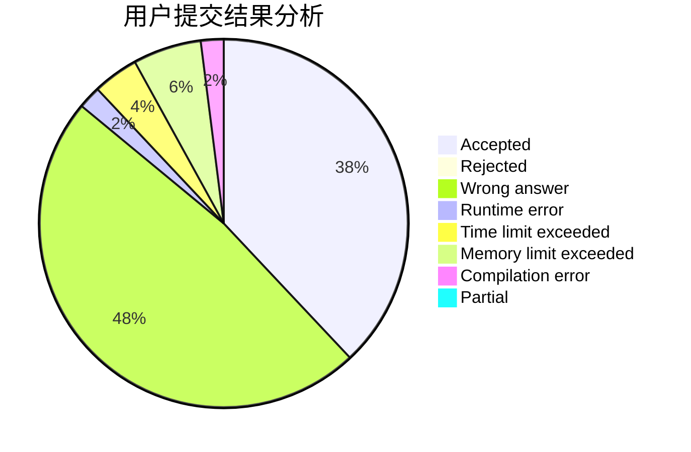
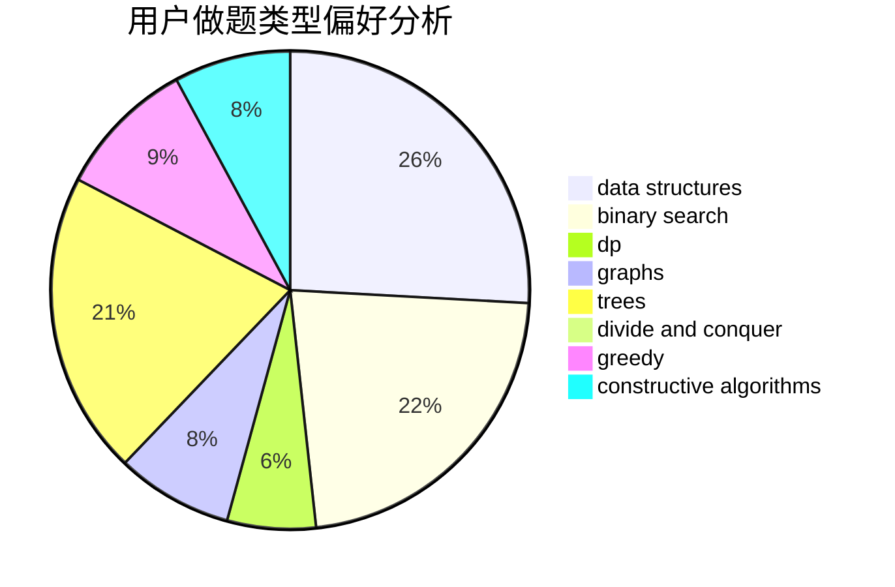
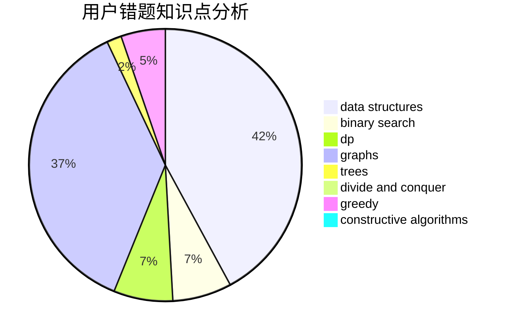

# Itsuka__Shido

<!-- tabs:start -->

#### **用户提交结果分析**

#### **用户做题类型偏好分析**

#### **用户错题知识点分析**

<!-- tabs:end -->
# 推荐题目
[1355C](https://codeforces.com/contest/1355/problem/C)		binary search,
                        implementation,
                        math,
                        two pointers		  
[672A](https://codeforces.com/contest/672/problem/A)		implementation		  
[1088E](https://codeforces.com/contest/1088/problem/E)		dp,
                        greedy,
                        math,
                        trees		  
[429D](https://codeforces.com/contest/429/problem/D)		data structures,
                        divide and conquer,
                        geometry		  
[631D](https://codeforces.com/contest/631/problem/D)		data structures,
                        hashing,
                        implementation,
                        string suffix structures,
                        strings		  
[915C](https://codeforces.com/contest/915/problem/C)		dp,
                        greedy		  
[1034D](https://codeforces.com/contest/1034/problem/D)		binary search,
                        data structures,
                        two pointers		  
[215E](https://codeforces.com/contest/215/problem/E)		combinatorics,
                        dp,
                        number theory		  
[1413E](https://codeforces.com/contest/1413/problem/E)		greedy,
                        math,
                        ternary search		  
[782C](https://codeforces.com/contest/782/problem/C)		dsu,graphs,sortings,trees		  
