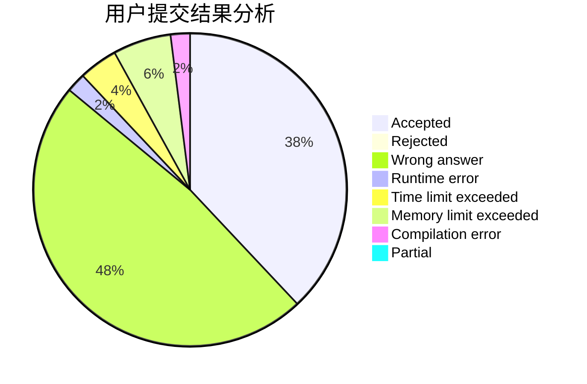
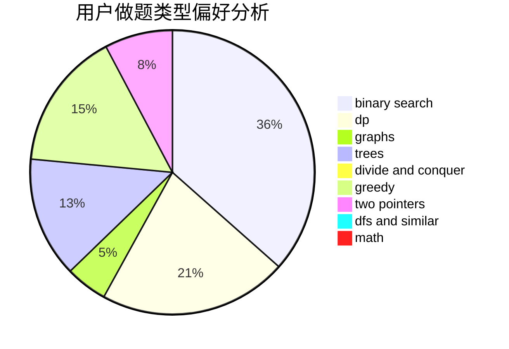

# Itsuka__Shido

<!-- tabs:start -->

#### **用户提交结果分析**

#### **用户做题类型偏好分析**

<!-- tabs:end -->
# 推荐题目
[1355C](https://codeforces.com/contest/1355/problem/C)
[672A](https://codeforces.com/contest/672/problem/A)
[1088E](https://codeforces.com/contest/1088/problem/E)
[429D](https://codeforces.com/contest/429/problem/D)
[631D](https://codeforces.com/contest/631/problem/D)
[915C](https://codeforces.com/contest/915/problem/C)
[1034D](https://codeforces.com/contest/1034/problem/D)
[215E](https://codeforces.com/contest/215/problem/E)
[1413E](https://codeforces.com/contest/1413/problem/E)
[782C](https://codeforces.com/contest/782/problem/C)
