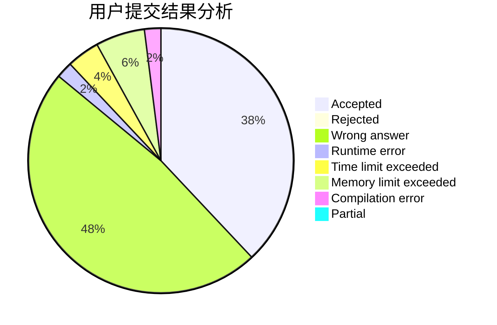
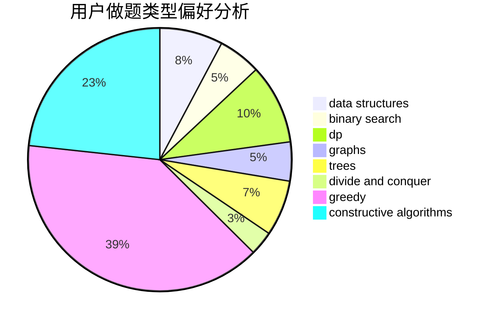
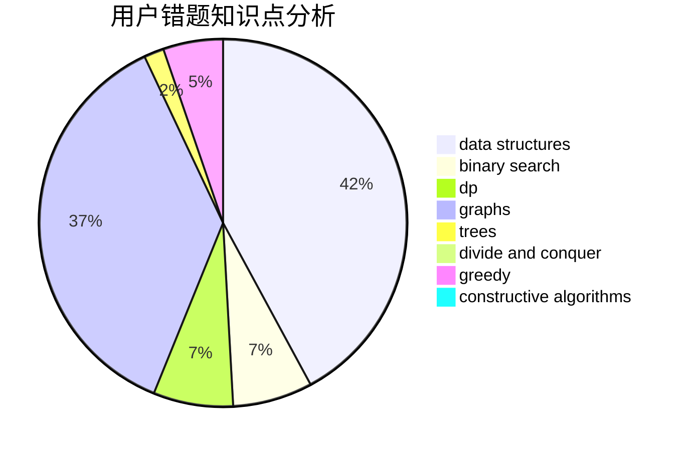

# Itsuka__Shido

<!-- tabs:start -->

#### **用户提交结果分析**

#### **用户做题类型偏好分析**

#### **用户错题知识点分析**

<!-- tabs:end -->
# 推荐题目
[1348E](https://codeforces.com/contest/1348/problem/E)		brute force,
                        dp,
                        greedy,
                        math		  
[645E](https://codeforces.com/contest/645/problem/E)		dp,
                        greedy,
                        strings		  
[1088B](https://codeforces.com/contest/1088/problem/B)		implementation,
                        sortings		  
[3C](https://codeforces.com/contest/3/problem/C)		brute force,
                        games,
                        implementation		  
[612B](https://codeforces.com/contest/612/problem/B)		implementation,
                        math		  
[899C](https://codeforces.com/contest/899/problem/C)		constructive algorithms,
                        graphs,
                        math		  
[1034A](https://codeforces.com/contest/1034/problem/A)		number theory		  
[190E](https://codeforces.com/contest/190/problem/E)		data structures,
                        dsu,
                        graphs,
                        hashing,
                        sortings		  
[1402C](https://codeforces.com/contest/1402/problem/C)		*special problem,
                        combinatorics,
                        dfs and similar,
                        dp,
                        games,
                        graphs,
                        matrices,
                        trees		  
[763E](https://codeforces.com/contest/763/problem/E)		data structures,
                        divide and conquer,
                        dsu		  
