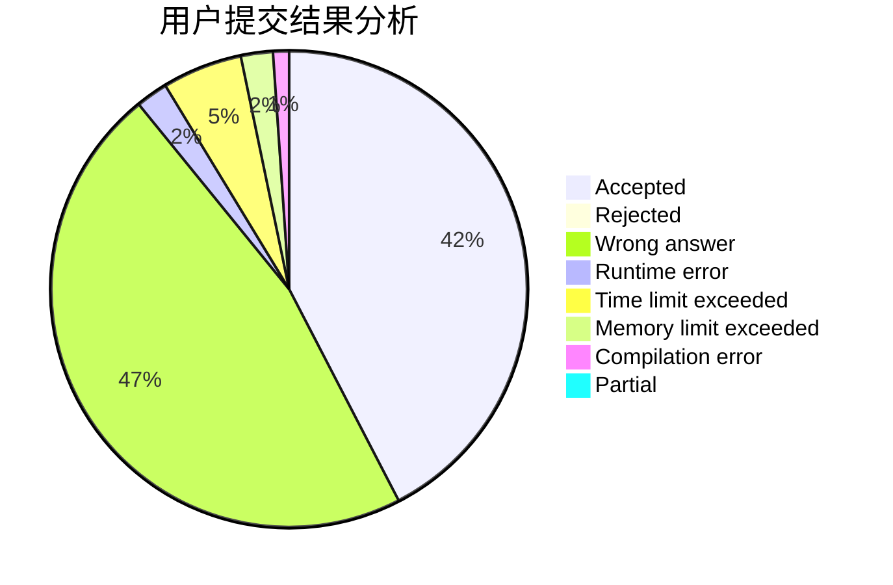
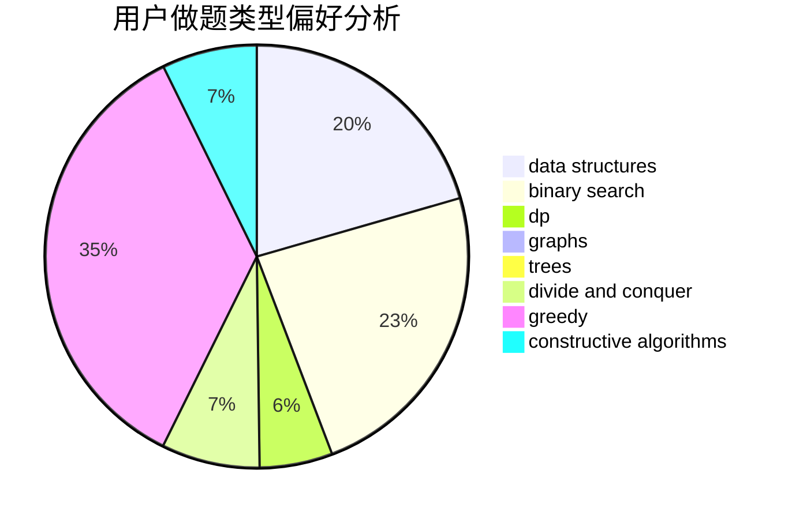
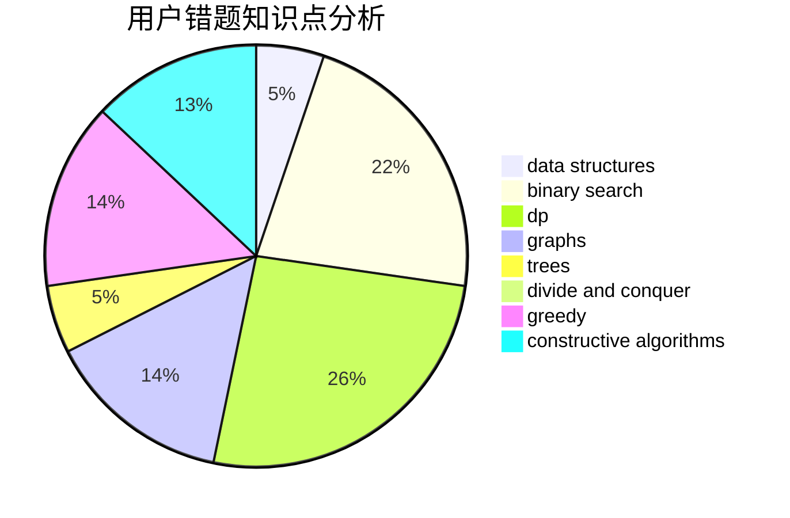

# JJH_QAQ

<!-- tabs:start -->

#### **用户提交结果分析**

#### **用户做题类型偏好分析**

#### **用户错题知识点分析**

<!-- tabs:end -->
# 推荐题目
[1339A](https://codeforces.com/contest/1339/problem/A)		brute force,
                        dp,
                        implementation,
                        math		  
[1294A](https://codeforces.com/contest/1294/problem/A)		math		  
[1253D](https://codeforces.com/contest/1253/problem/D)		constructive algorithms,
                        dfs and similar,
                        dsu,
                        graphs,
                        greedy,
                        sortings		  
[1250F](https://codeforces.com/contest/1250/problem/F)		brute force,
                        implementation		  
[768C](https://codeforces.com/contest/768/problem/C)		brute force,
                        dp,
                        implementation,
                        sortings		  
[1058C](https://codeforces.com/contest/1058/problem/C)		dsu,graphs,sortings,trees		  
[818D](https://codeforces.com/contest/818/problem/D)		data structures,
                        implementation		  
[309C](https://codeforces.com/contest/309/problem/C)		binary search,
                        bitmasks,
                        greedy		  
[8E](https://codeforces.com/contest/8/problem/E)		dp,
                        graphs		  
[407E](https://codeforces.com/contest/407/problem/E)		data structures		  
