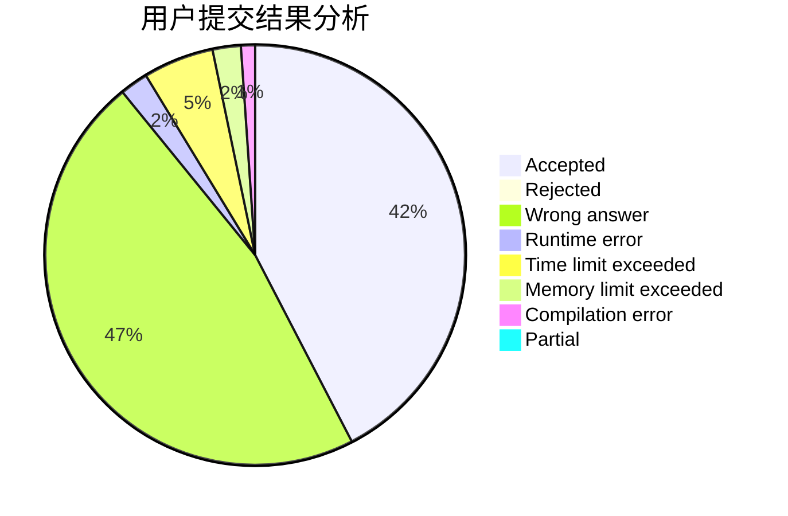
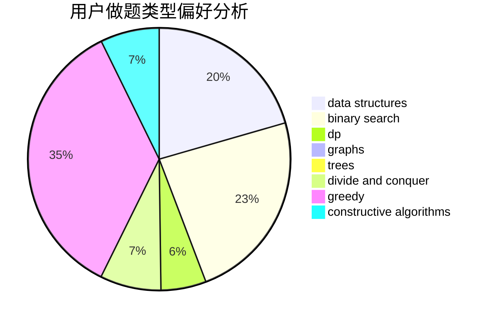
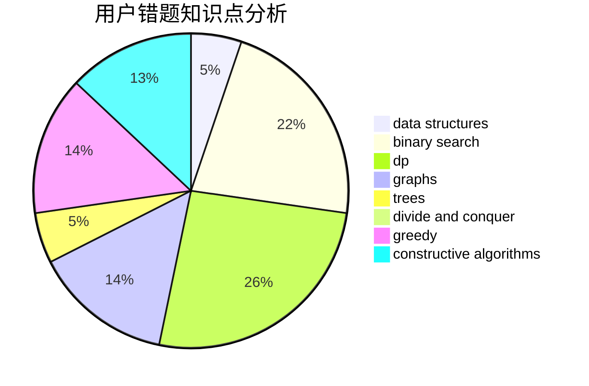

# JJH_QAQ
<!-- tabs:start -->
#### **用户提交结果分析**

#### **用户做题类型偏好分析**

#### **用户错题知识点分析**

<!-- tabs:end -->
# 推荐题目
[Collecting Coins](http://codeforces.com/problemset/problem/1294/A)		math		  
[Vasya and Golden Ticket](https://codeforces.com/contest/1058/problem/C)		implementation		  
[Jon Snow and his Favourite Number](http://codeforces.com/problemset/problem/768/C)		brute force,
                        dp,
                        implementation,
                        sortings		  
[Data Center](http://codeforces.com/problemset/problem/1250/F)		brute force,
                        implementation		  
[Beads](http://codeforces.com/problemset/problem/8/E)		dp,
                        graphs		  
[Harmonious Graph](http://codeforces.com/problemset/problem/1253/D)		constructive algorithms,
                        dfs and similar,
                        dsu,
                        graphs,
                        greedy,
                        sortings		  
[Sereja and Algorithm](http://codeforces.com/problemset/problem/367/A)		data structures,
                        implementation		  
[Memory for Arrays](http://codeforces.com/problemset/problem/309/C)		binary search,
                        bitmasks,
                        greedy		  
[Multicolored Cars](http://codeforces.com/problemset/problem/818/D)		data structures,
                        implementation		  
[Mr. Kitayuta's Gift](http://codeforces.com/problemset/problem/505/A)		brute force,
                        implementation,
                        strings		  
<!-- tabs:start -->
#### **data structures**
[Collecting Coins](http://codeforces.com/problemset/problem/367/A)		data structures,
                        implementation		  
[Vasya and Golden Ticket](http://codeforces.com/problemset/problem/818/D)		data structures,
                        implementation		  
[Jon Snow and his Favourite Number](http://codeforces.com/problemset/problem/1045/J)		data structures,
                        strings,
                        trees		  
[Data Center](http://codeforces.com/problemset/problem/407/E)		data structures		  
[Beads](http://codeforces.com/problemset/problem/464/E)		data structures,
                        graphs,
                        shortest paths		  
[Harmonious Graph](http://codeforces.com/problemset/problem/920/F)		brute force,
                        data structures,
                        dsu,
                        number theory		  
[Sereja and Algorithm](http://codeforces.com/problemset/problem/1151/E)		combinatorics,
                        data structures,
                        dp,
                        math		  
[Memory for Arrays](http://codeforces.com/problemset/problem/1492/C)		binary search,
                        data structures,
                        dp,
                        greedy,
                        two pointers		  
[Multicolored Cars](http://codeforces.com/problemset/problem/1490/G)		binary search,
                        data structures,
                        math		  
[Mr. Kitayuta's Gift](http://codeforces.com/problemset/problem/1479/D)		binary search,
                        bitmasks,
                        brute force,
                        data structures,
                        probabilities,
                        trees		  
#### **binary search**
[Collecting Coins](http://codeforces.com/problemset/problem/309/C)		binary search,
                        bitmasks,
                        greedy		  
[Vasya and Golden Ticket](http://codeforces.com/problemset/problem/721/E)		binary search,
                        dp		  
[Jon Snow and his Favourite Number](http://codeforces.com/problemset/problem/1492/C)		binary search,
                        data structures,
                        dp,
                        greedy,
                        two pointers		  
[Data Center](http://codeforces.com/problemset/problem/1463/D)		binary search,
                        constructive algorithms,
                        greedy,
                        two pointers		  
[Beads](http://codeforces.com/problemset/problem/1490/G)		binary search,
                        data structures,
                        math		  
[Harmonious Graph](http://codeforces.com/problemset/problem/1479/D)		binary search,
                        bitmasks,
                        brute force,
                        data structures,
                        probabilities,
                        trees		  
[Sereja and Algorithm](http://codeforces.com/problemset/problem/1436/E)		binary search,
                        data structures,
                        two pointers		  
[Memory for Arrays](http://codeforces.com/problemset/problem/1461/D)		binary search,
                        brute force,
                        data structures,
                        divide and conquer,
                        implementation,
                        sortings		  
[Multicolored Cars](http://codeforces.com/problemset/problem/1493/C)		binary search,
                        brute force,
                        constructive algorithms,
                        greedy,
                        strings		  
[Mr. Kitayuta's Gift](http://codeforces.com/problemset/problem/1487/D)		binary search,
                        brute force,
                        math,
                        number theory		  
#### **dp**
[Collecting Coins](http://codeforces.com/problemset/problem/768/C)		brute force,
                        dp,
                        implementation,
                        sortings		  
[Vasya and Golden Ticket](http://codeforces.com/problemset/problem/8/E)		dp,
                        graphs		  
[Jon Snow and his Favourite Number](http://codeforces.com/problemset/problem/721/E)		binary search,
                        dp		  
[Data Center](http://codeforces.com/problemset/problem/666/A)		dp,
                        implementation,
                        strings		  
[Beads](http://codeforces.com/problemset/problem/1339/A)		brute force,
                        dp,
                        implementation,
                        math		  
[Harmonious Graph](http://codeforces.com/problemset/problem/1151/E)		combinatorics,
                        data structures,
                        dp,
                        math		  
[Sereja and Algorithm](http://codeforces.com/problemset/problem/1492/C)		binary search,
                        data structures,
                        dp,
                        greedy,
                        two pointers		  
[Memory for Arrays](https://codeforces.com/contest/1457/problem/C)		brute force,
                        dp,
                        implementation		  
[Multicolored Cars](http://codeforces.com/problemset/problem/1491/C)		brute force,
                        data structures,
                        dp,
                        greedy,
                        implementation		  
[Mr. Kitayuta's Gift](http://codeforces.com/problemset/problem/1437/C)		dp,
                        flows,
                        graph matchings,
                        greedy,
                        math,
                        sortings		  
#### **graph**
[Collecting Coins](http://codeforces.com/problemset/problem/8/E)		dp,
                        graphs		  
[Vasya and Golden Ticket](http://codeforces.com/problemset/problem/1253/D)		constructive algorithms,
                        dfs and similar,
                        dsu,
                        graphs,
                        greedy,
                        sortings		  
[Jon Snow and his Favourite Number](http://codeforces.com/problemset/problem/761/E)		constructive algorithms,
                        dfs and similar,
                        graphs,
                        greedy,
                        trees		  
[Data Center](http://codeforces.com/problemset/problem/464/E)		data structures,
                        graphs,
                        shortest paths		  
[Beads](https://codeforces.com/contest/218/problem/C)		brute force,
                        dfs and similar,
                        dsu,
                        graphs		  
[Harmonious Graph](http://codeforces.com/problemset/problem/1019/C)		constructive algorithms,
                        graphs		  
[Sereja and Algorithm](http://codeforces.com/problemset/problem/1487/C)		brute force,
                        constructive algorithms,
                        dfs and similar,
                        graphs,
                        greedy,
                        implementation,
                        math		  
[Memory for Arrays](http://codeforces.com/problemset/problem/1437/C)		dp,
                        flows,
                        graph matchings,
                        greedy,
                        math,
                        sortings		  
[Multicolored Cars](http://codeforces.com/problemset/problem/1470/D)		constructive algorithms,
                        dfs and similar,
                        graph matchings,
                        graphs,
                        greedy		  
[Mr. Kitayuta's Gift](http://codeforces.com/problemset/problem/1476/C)		dp,
                        graphs,
                        greedy		  
#### **trees**
[Collecting Coins](http://codeforces.com/problemset/problem/761/E)		constructive algorithms,
                        dfs and similar,
                        graphs,
                        greedy,
                        trees		  
[Vasya and Golden Ticket](http://codeforces.com/problemset/problem/1045/J)		data structures,
                        strings,
                        trees		  
[Jon Snow and his Favourite Number](http://codeforces.com/problemset/problem/1057/A)		*special problem,
                        dfs and similar,
                        trees		  
[Data Center](http://codeforces.com/problemset/problem/1479/D)		binary search,
                        bitmasks,
                        brute force,
                        data structures,
                        probabilities,
                        trees		  
[Beads](http://codeforces.com/problemset/problem/1511/C)		brute force,
                        data structures,
                        implementation,
                        trees		  
[Harmonious Graph](http://codeforces.com/problemset/problem/1499/F)		combinatorics,
                        dfs and similar,
                        dp,
                        trees		  
[Sereja and Algorithm](http://codeforces.com/problemset/problem/1491/E)		brute force,
                        dfs and similar,
                        divide and conquer,
                        number theory,
                        trees		  
[Memory for Arrays](http://codeforces.com/problemset/problem/1466/D)		data structures,
                        greedy,
                        sortings,
                        trees		  
[Multicolored Cars](http://codeforces.com/problemset/problem/1495/D)		combinatorics,
                        dfs and similar,
                        graphs,
                        math,
                        shortest paths,
                        trees		  
[Mr. Kitayuta's Gift](http://codeforces.com/problemset/problem/1303/G)		data structures,
                        divide and conquer,
                        geometry,
                        trees		  
#### **divide and conquer**
[Collecting Coins](http://codeforces.com/problemset/problem/1461/D)		binary search,
                        brute force,
                        data structures,
                        divide and conquer,
                        implementation,
                        sortings		  
[Vasya and Golden Ticket](http://codeforces.com/problemset/problem/1466/G)		combinatorics,
                        divide and conquer,
                        hashing,
                        math,
                        string suffix structures,
                        strings		  
[Jon Snow and his Favourite Number](http://codeforces.com/problemset/problem/1490/D)		dfs and similar,
                        divide and conquer,
                        implementation		  
[Data Center](https://codeforces.com/contest/1483/problem/C)		data structures,
                        divide and conquer,
                        dp		  
[Beads](http://codeforces.com/problemset/problem/1491/E)		brute force,
                        dfs and similar,
                        divide and conquer,
                        number theory,
                        trees		  
[Harmonious Graph](http://codeforces.com/problemset/problem/1303/G)		data structures,
                        divide and conquer,
                        geometry,
                        trees		  
[Sereja and Algorithm](http://codeforces.com/problemset/problem/1494/D)		constructive algorithms,
                        data structures,
                        dfs and similar,
                        divide and conquer,
                        dsu,
                        greedy,
                        sortings,
                        trees		  
[Memory for Arrays](http://codeforces.com/problemset/problem/1482/E)		data structures,
                        divide and conquer,
                        dp		  
[Multicolored Cars](http://codeforces.com/problemset/problem/566/C)		dfs and similar,
                        divide and conquer,
                        trees		  
[Mr. Kitayuta's Gift](http://codeforces.com/problemset/problem/1428/F)		binary search,
                        data structures,
                        divide and conquer,
                        dp,
                        two pointers		  
#### **greedy**
[Collecting Coins](http://codeforces.com/problemset/problem/1253/D)		constructive algorithms,
                        dfs and similar,
                        dsu,
                        graphs,
                        greedy,
                        sortings		  
[Vasya and Golden Ticket](http://codeforces.com/problemset/problem/309/C)		binary search,
                        bitmasks,
                        greedy		  
[Jon Snow and his Favourite Number](http://codeforces.com/problemset/problem/761/E)		constructive algorithms,
                        dfs and similar,
                        graphs,
                        greedy,
                        trees		  
[Data Center](http://codeforces.com/problemset/problem/628/C)		greedy,
                        strings		  
[Beads](http://codeforces.com/problemset/problem/258/A)		greedy,
                        math		  
[Harmonious Graph](http://codeforces.com/problemset/problem/1163/A)		greedy,
                        math		  
[Sereja and Algorithm](http://codeforces.com/problemset/problem/1264/A)		greedy,
                        implementation		  
[Memory for Arrays](http://codeforces.com/problemset/problem/50/A)		greedy,
                        math		  
[Multicolored Cars](http://codeforces.com/problemset/problem/1178/A)		greedy		  
[Mr. Kitayuta's Gift](http://codeforces.com/problemset/problem/1492/C)		binary search,
                        data structures,
                        dp,
                        greedy,
                        two pointers		  
#### **constructive algorithms**
[Collecting Coins](http://codeforces.com/problemset/problem/1253/D)		constructive algorithms,
                        dfs and similar,
                        dsu,
                        graphs,
                        greedy,
                        sortings		  
[Vasya and Golden Ticket](http://codeforces.com/problemset/problem/761/E)		constructive algorithms,
                        dfs and similar,
                        graphs,
                        greedy,
                        trees		  
[Jon Snow and his Favourite Number](http://codeforces.com/problemset/problem/1019/C)		constructive algorithms,
                        graphs		  
[Data Center](http://codeforces.com/problemset/problem/1493/A)		constructive algorithms,
                        greedy		  
[Beads](http://codeforces.com/problemset/problem/1463/D)		binary search,
                        constructive algorithms,
                        greedy,
                        two pointers		  
[Harmonious Graph](https://codeforces.com/contest/1456/problem/B)		bitmasks,
                        brute force,
                        constructive algorithms		  
[Sereja and Algorithm](http://codeforces.com/problemset/problem/1492/D)		bitmasks,
                        constructive algorithms,
                        greedy,
                        math		  
[Memory for Arrays](https://codeforces.com/contest/1504/problem/D)		constructive algorithms,
                        games,
                        interactive		  
[Multicolored Cars](https://codeforces.com/contest/1483/problem/A)		brute force,
                        constructive algorithms,
                        greedy,
                        implementation		  
[Mr. Kitayuta's Gift](https://codeforces.com/contest/1457/problem/D)		bitmasks,
                        brute force,
                        constructive algorithms		  
#### **sortings**
[Collecting Coins](http://codeforces.com/problemset/problem/768/C)		brute force,
                        dp,
                        implementation,
                        sortings		  
[Vasya and Golden Ticket](http://codeforces.com/problemset/problem/1253/D)		constructive algorithms,
                        dfs and similar,
                        dsu,
                        graphs,
                        greedy,
                        sortings		  
[Jon Snow and his Favourite Number](http://codeforces.com/problemset/problem/809/A)		implementation,
                        math,
                        sortings		  
[Data Center](http://codeforces.com/problemset/problem/1397/B)		brute force,
                        math,
                        number theory,
                        sortings		  
[Beads](https://codeforces.com/contest/1496/problem/C)		geometry,
                        greedy,
                        math,
                        sortings		  
[Harmonious Graph](http://codeforces.com/problemset/problem/1495/A)		geometry,
                        greedy,
                        math,
                        sortings		  
[Sereja and Algorithm](http://codeforces.com/problemset/problem/1497/A)		brute force,
                        data structures,
                        greedy,
                        sortings		  
[Memory for Arrays](http://codeforces.com/problemset/problem/1427/A)		math,
                        sortings		  
[Multicolored Cars](http://codeforces.com/problemset/problem/1461/D)		binary search,
                        brute force,
                        data structures,
                        divide and conquer,
                        implementation,
                        sortings		  
[Mr. Kitayuta's Gift](http://codeforces.com/problemset/problem/1437/C)		dp,
                        flows,
                        graph matchings,
                        greedy,
                        math,
                        sortings		  
<!-- tabs:end -->
