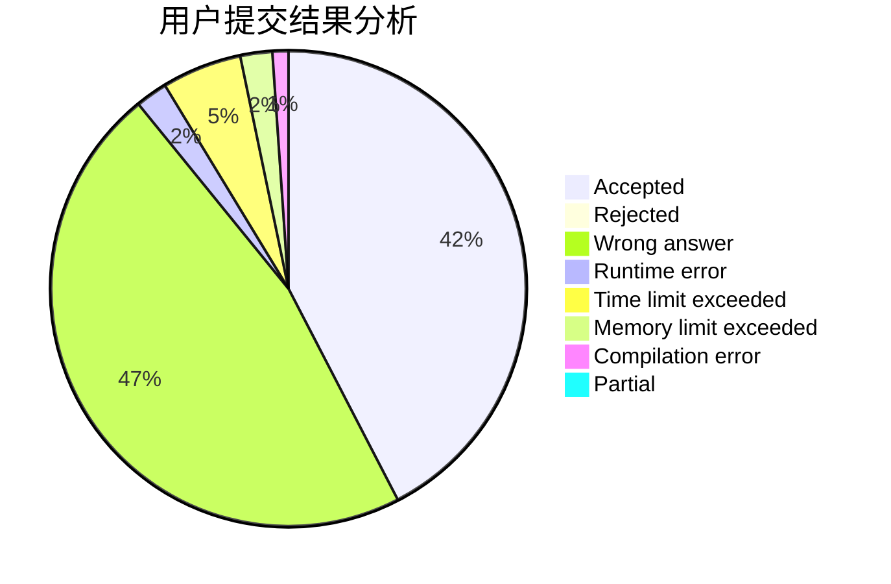
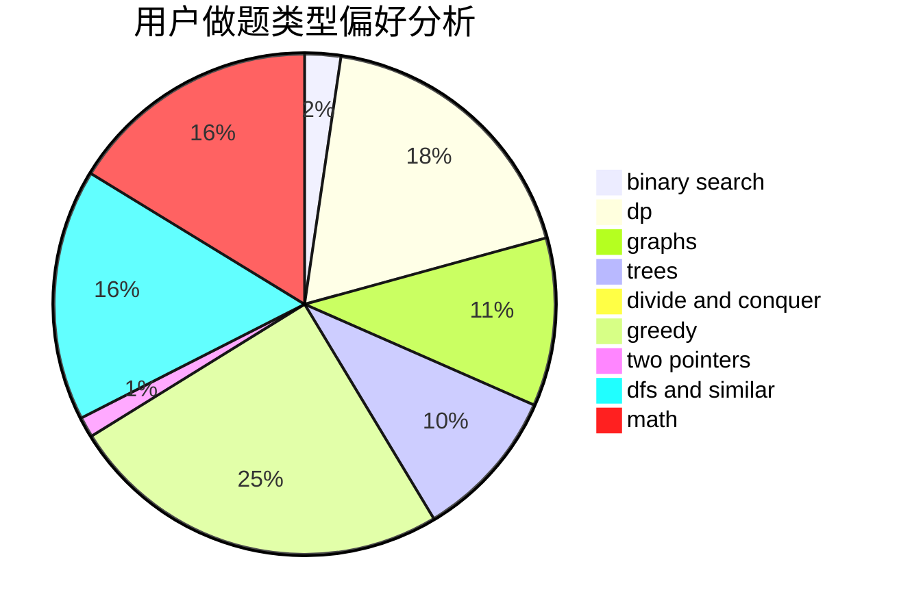

# JJH_QAQ

<!-- tabs:start -->

#### **用户提交结果分析**

#### **用户做题类型偏好分析**

<!-- tabs:end -->
# 推荐题目
[1346A](https://codeforces.com/contest/1346/problem/A)
[1300C](https://codeforces.com/contest/1300/problem/C)
[1260F](https://codeforces.com/contest/1260/problem/F)
[1254E](https://codeforces.com/contest/1254/problem/E)
[788B](https://codeforces.com/contest/788/problem/B)
[1059A](https://codeforces.com/contest/1059/problem/A)
[838C](https://codeforces.com/contest/838/problem/C)
[32B](https://codeforces.com/contest/32/problem/B)
[916C](https://codeforces.com/contest/916/problem/C)
[436C](https://codeforces.com/contest/436/problem/C)
