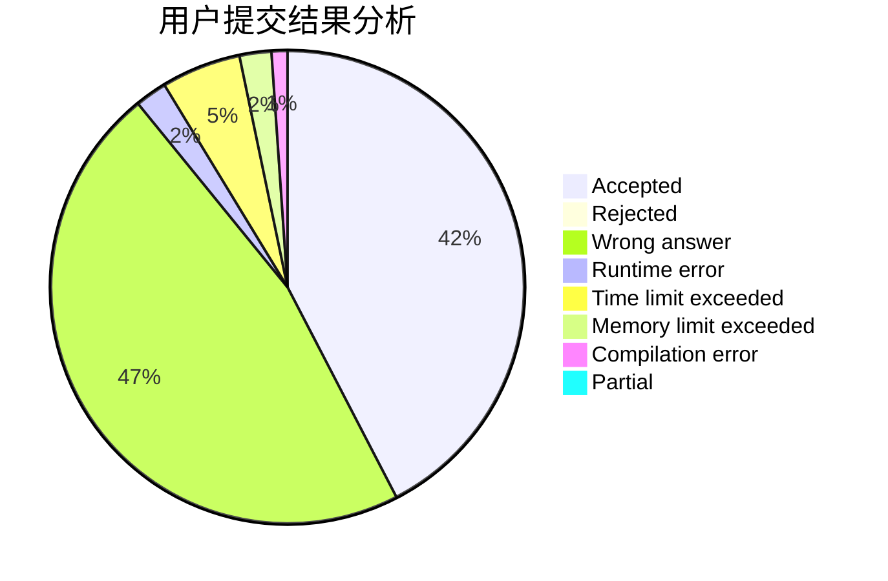
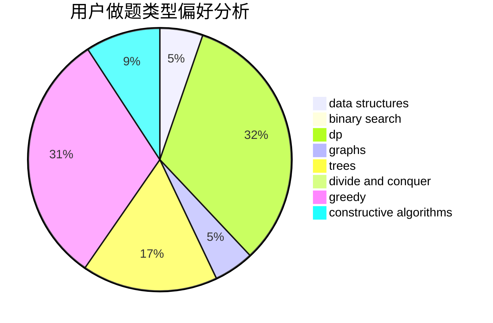
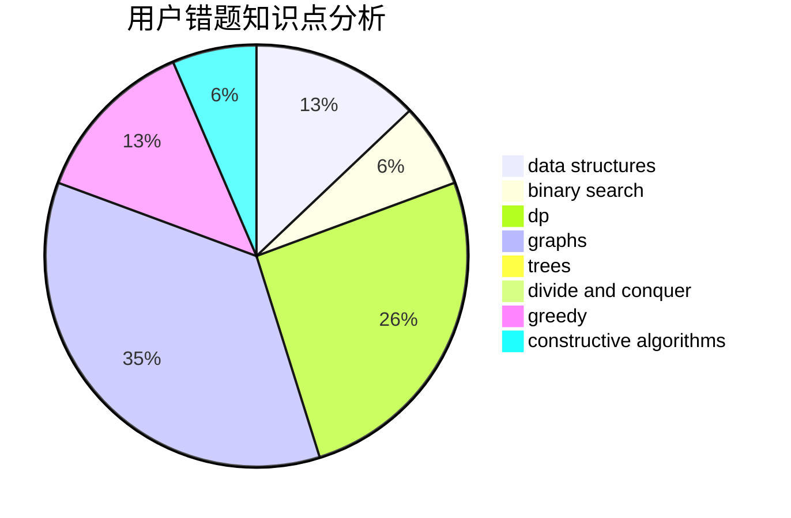

# JJH_QAQ

<!-- tabs:start -->

#### **用户提交结果分析**

#### **用户做题类型偏好分析**

#### **用户错题知识点分析**

<!-- tabs:end -->
# 推荐题目
[1346A](https://codeforces.com/contest/1346/problem/A)		*special problem,
                        math		  
[1300C](https://codeforces.com/contest/1300/problem/C)		dsu,graphs,sortings,trees		  
[1260F](https://codeforces.com/contest/1260/problem/F)		data structures,
                        trees		  
[1254E](https://codeforces.com/contest/1254/problem/E)		combinatorics,
                        dfs and similar,
                        dsu,
                        trees		  
[788B](https://codeforces.com/contest/788/problem/B)		combinatorics,
                        constructive algorithms,
                        dfs and similar,
                        dsu,
                        graphs		  
[1059A](https://codeforces.com/contest/1059/problem/A)		implementation		  
[838C](https://codeforces.com/contest/838/problem/C)		dp,
                        games		  
[32B](https://codeforces.com/contest/32/problem/B)		expression parsing,
                        implementation		  
[916C](https://codeforces.com/contest/916/problem/C)		constructive algorithms,
                        graphs,
                        shortest paths		  
[436C](https://codeforces.com/contest/436/problem/C)		dsu,
                        graphs,
                        greedy,
                        trees		  
