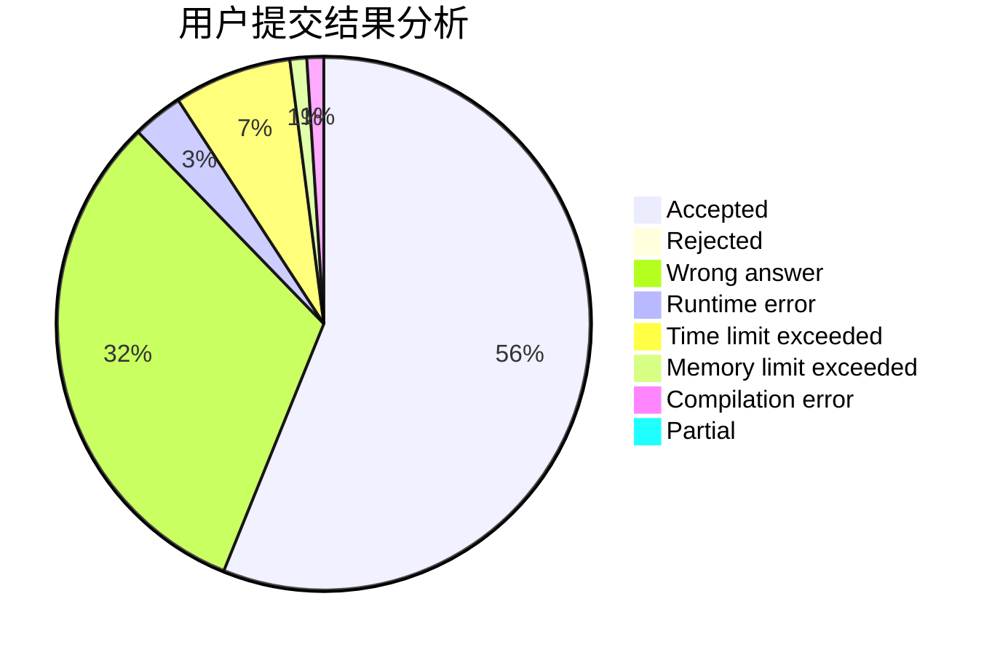
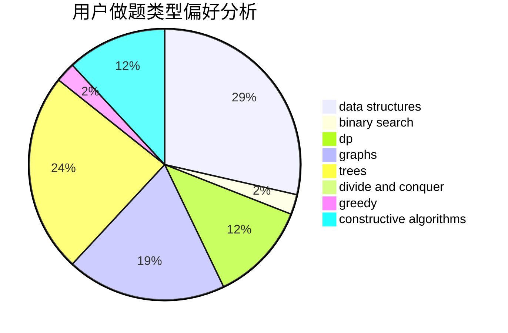
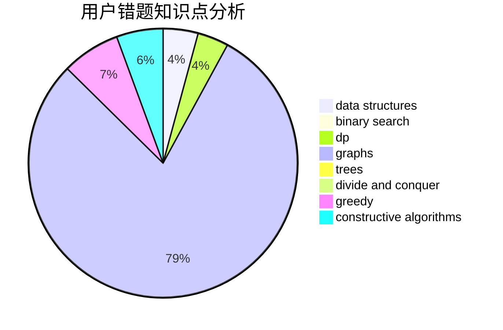

# JJLeo

<!-- tabs:start -->

#### **用户提交结果分析**

#### **用户做题类型偏好分析**

#### **用户错题知识点分析**

<!-- tabs:end -->
# 推荐题目
[1416A](https://codeforces.com/contest/1416/problem/A)		binary search,
                        data structures,
                        implementation,
                        two pointers		  
[548A](https://codeforces.com/contest/548/problem/A)		brute force,
                        implementation,
                        strings		  
[868F](https://codeforces.com/contest/868/problem/F)		divide and conquer,
                        dp		  
[634D](https://codeforces.com/contest/634/problem/D)		dsu,graphs,sortings,trees		  
[940F](https://codeforces.com/contest/940/problem/F)		brute force,
                        data structures		  
[1269E](https://codeforces.com/contest/1269/problem/E)		dsu,graphs,sortings,trees		  
[1076A](https://codeforces.com/contest/1076/problem/A)		greedy,
                        strings		  
[312B](https://codeforces.com/contest/312/problem/B)		math,
                        probabilities		  
[81E](https://codeforces.com/contest/81/problem/E)		dfs and similar,
                        dp,
                        dsu,
                        graphs,
                        implementation,
                        trees		  
[1493A](https://codeforces.com/contest/1493/problem/A)		constructive algorithms,
                        greedy		  
