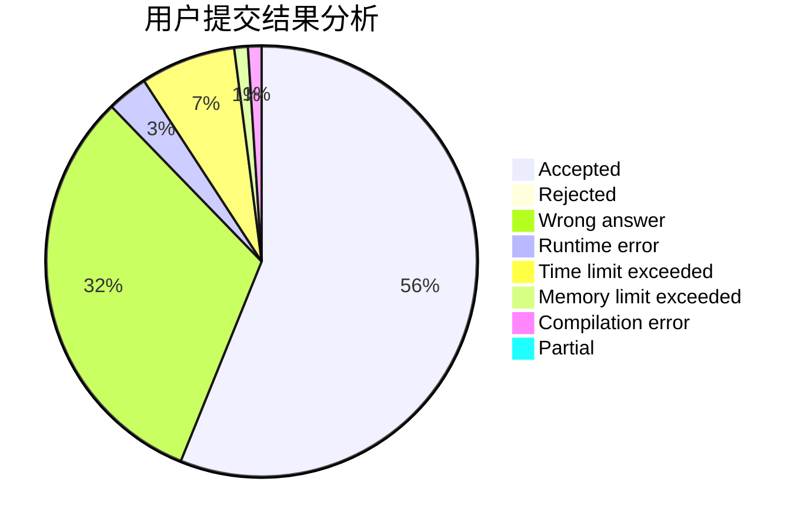
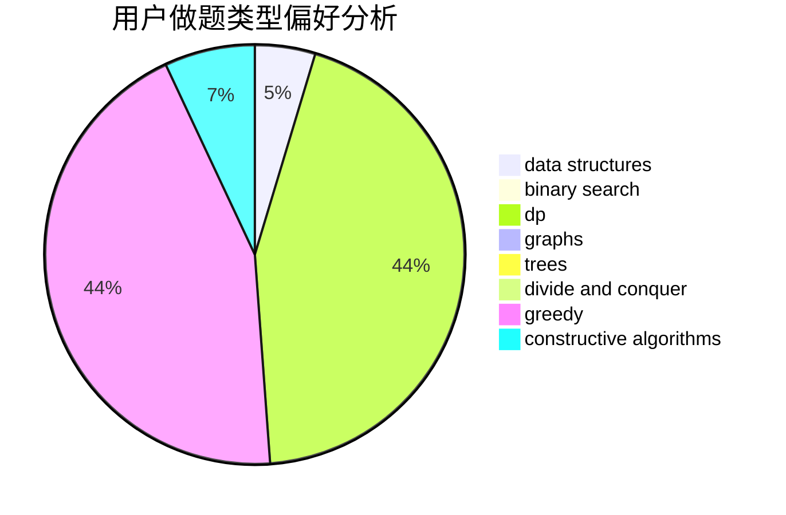
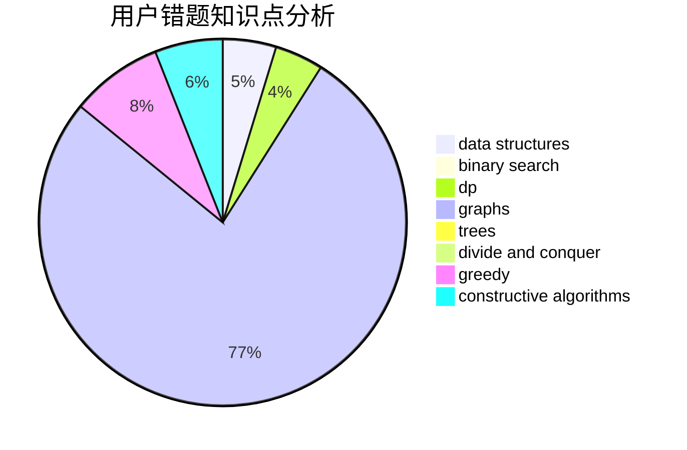

# JJLeo

<!-- tabs:start -->

#### **用户提交结果分析**

#### **用户做题类型偏好分析**

#### **用户错题知识点分析**

<!-- tabs:end -->
# 推荐题目
[1404E](https://codeforces.com/contest/1404/problem/E)		flows,
                        graph matchings,
                        graphs		  
[522D](https://codeforces.com/contest/522/problem/D)		*special problem,
                        data structures		  
[84C](https://codeforces.com/contest/84/problem/C)		binary search,
                        implementation		  
[616F](https://codeforces.com/contest/616/problem/F)		string suffix structures,
                        strings		  
[920G](https://codeforces.com/contest/920/problem/G)		binary search,
                        bitmasks,
                        brute force,
                        combinatorics,
                        math,
                        number theory		  
[1264A](https://codeforces.com/contest/1264/problem/A)		greedy,
                        implementation		  
[1074B](https://codeforces.com/contest/1074/problem/B)		dsu,graphs,sortings,trees		  
[295D](https://codeforces.com/contest/295/problem/D)		combinatorics,
                        dp		  
[804A](https://codeforces.com/contest/804/problem/A)		constructive algorithms,
                        greedy,
                        math		  
[1485E](https://codeforces.com/contest/1485/problem/E)		dfs and similar,
                        dp,
                        greedy,
                        trees		  
