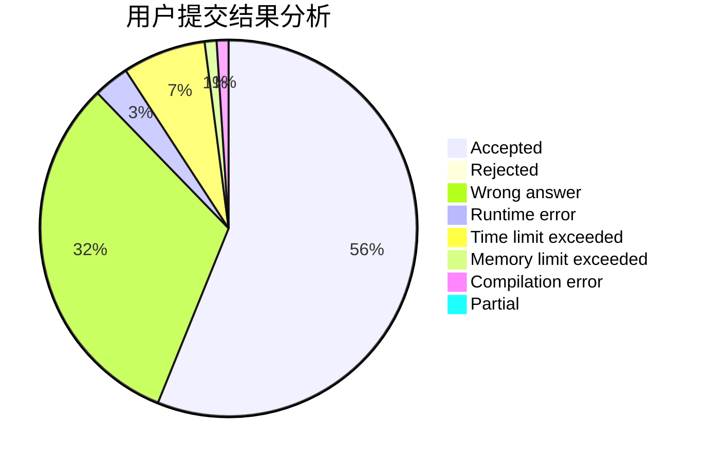
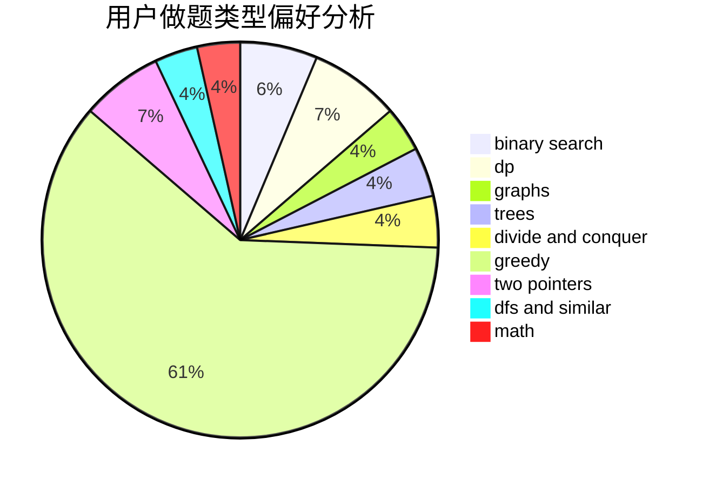

# JJLeo

<!-- tabs:start -->

#### **用户提交结果分析**

#### **用户做题类型偏好分析**

<!-- tabs:end -->
# 推荐题目
[1416A](https://codeforces.com/contest/1416/problem/A)
[548A](https://codeforces.com/contest/548/problem/A)
[868F](https://codeforces.com/contest/868/problem/F)
[634D](https://codeforces.com/contest/634/problem/D)
[940F](https://codeforces.com/contest/940/problem/F)
[1269E](https://codeforces.com/contest/1269/problem/E)
[1076A](https://codeforces.com/contest/1076/problem/A)
[312B](https://codeforces.com/contest/312/problem/B)
[81E](https://codeforces.com/contest/81/problem/E)
[1493A](https://codeforces.com/contest/1493/problem/A)
