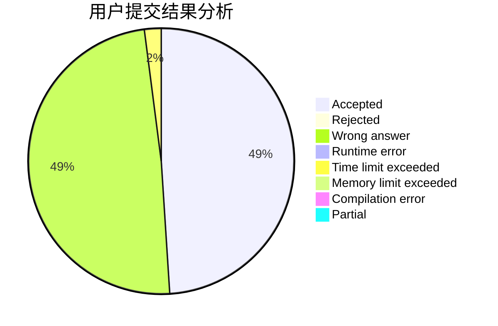
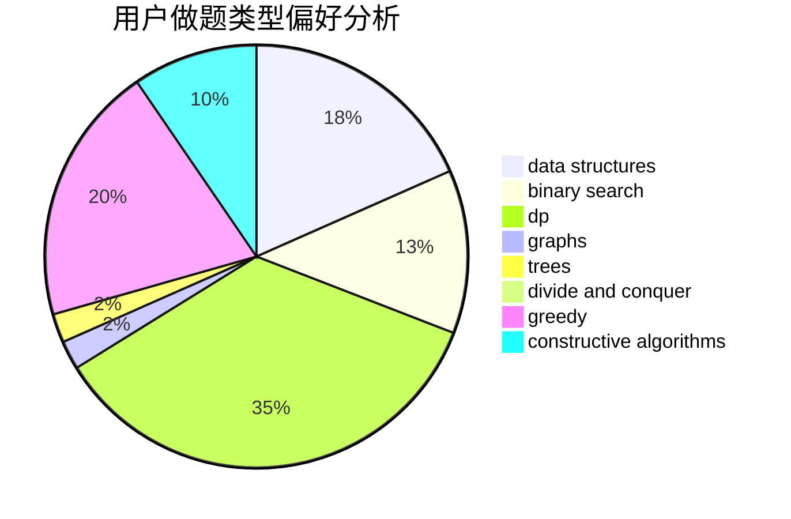

# JJLeo_

<!-- tabs:start -->

#### **用户提交结果分析**

#### **用户做题类型偏好分析**

#### **用户错题知识点分析**

<!-- tabs:end -->
# 推荐题目
[295A](https://codeforces.com/contest/295/problem/A)		data structures,
                        implementation		  
[1364D](https://codeforces.com/contest/1364/problem/D)		constructive algorithms,
                        dfs and similar,
                        graphs,
                        greedy,
                        implementation,
                        trees		  
[716B](https://codeforces.com/contest/716/problem/B)		greedy,
                        two pointers		  
[261D](https://codeforces.com/contest/261/problem/D)		dp		  
[734A](https://codeforces.com/contest/734/problem/A)		implementation,
                        strings		  
[1477F](https://codeforces.com/contest/1477/problem/F)		combinatorics,
                        fft,
                        math,
                        probabilities		  
[645G](https://codeforces.com/contest/645/problem/G)		binary search,
                        geometry		  
[534B](https://codeforces.com/contest/534/problem/B)		dp,
                        greedy,
                        math		  
[883G](https://codeforces.com/contest/883/problem/G)		dfs and similar,
                        graphs		  
[463A](https://codeforces.com/contest/463/problem/A)		brute force,
                        implementation		  
