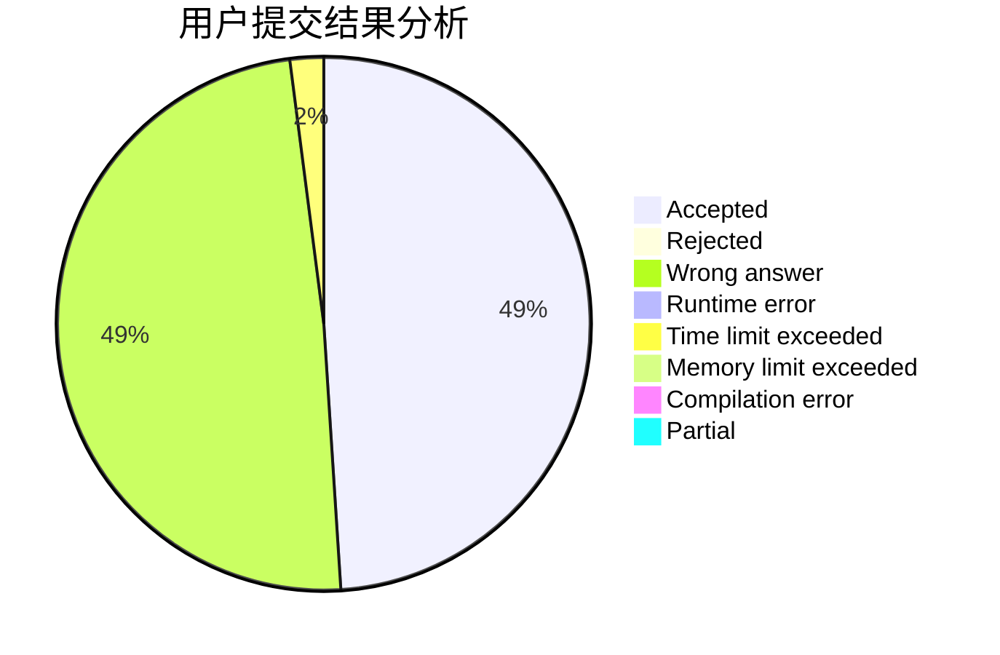
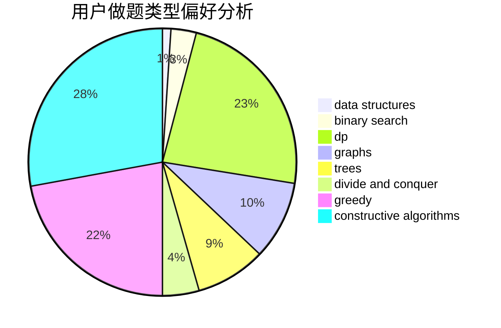
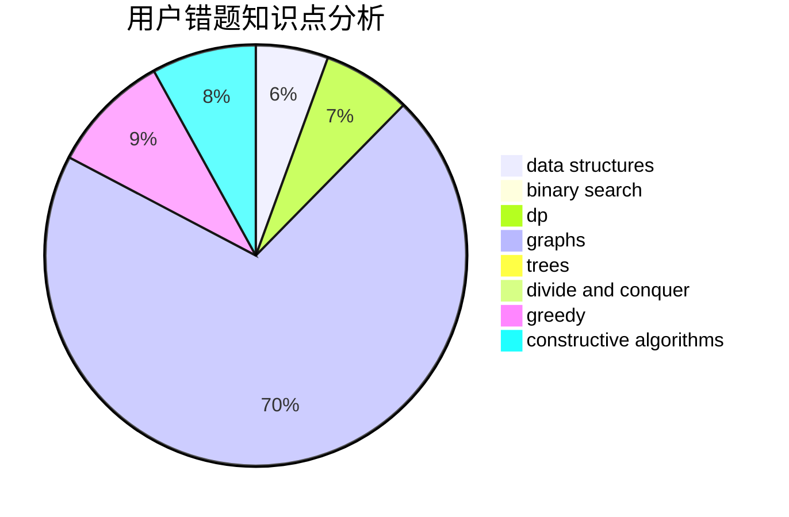

# JJLeo_

<!-- tabs:start -->

#### **用户提交结果分析**

#### **用户做题类型偏好分析**

#### **用户错题知识点分析**

<!-- tabs:end -->
# 推荐题目
[27B](https://codeforces.com/contest/27/problem/B)		bitmasks,
                        brute force,
                        dfs and similar,
                        greedy		  
[1357B1](https://codeforces.com/contest/1357B/problem/1)		nan		  
[699C](https://codeforces.com/contest/699/problem/C)		dsu,graphs,sortings,trees		  
[240F](https://codeforces.com/contest/240/problem/F)		data structures		  
[716A](https://codeforces.com/contest/716/problem/A)		implementation		  
[1469E](https://codeforces.com/contest/1469/problem/E)		bitmasks,
                        brute force,
                        hashing,
                        string suffix structures,
                        strings,
                        two pointers		  
[621E](https://codeforces.com/contest/621/problem/E)		dp,
                        matrices		  
[510D](https://codeforces.com/contest/510/problem/D)		bitmasks,
                        brute force,
                        dp,
                        math		  
[863E](https://codeforces.com/contest/863/problem/E)		data structures,
                        sortings		  
[442C](https://codeforces.com/contest/442/problem/C)		data structures,
                        greedy		  
