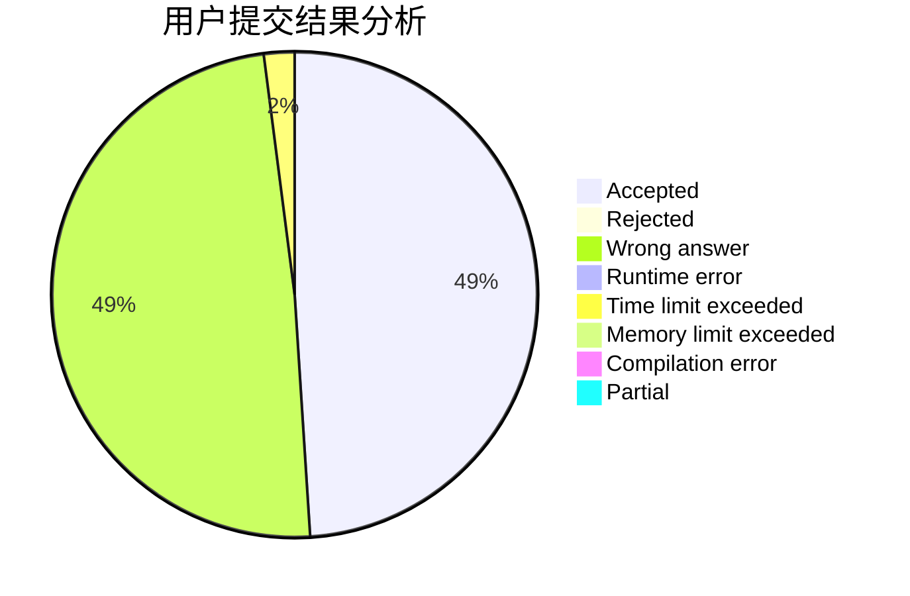
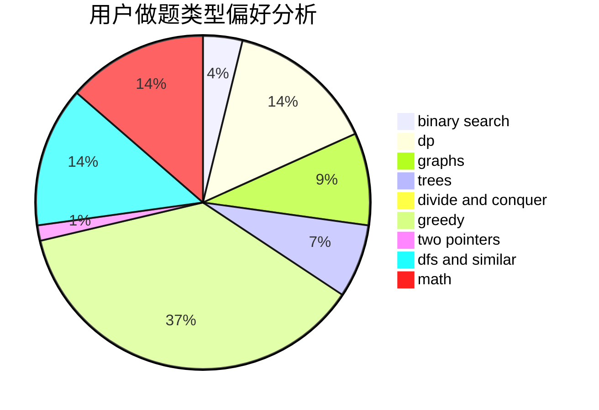

# JJLeo_

<!-- tabs:start -->

#### **用户提交结果分析**

#### **用户做题类型偏好分析**

<!-- tabs:end -->
# 推荐题目
[295A](https://codeforces.com/contest/295/problem/A)
[1364D](https://codeforces.com/contest/1364/problem/D)
[716B](https://codeforces.com/contest/716/problem/B)
[261D](https://codeforces.com/contest/261/problem/D)
[734A](https://codeforces.com/contest/734/problem/A)
[1477F](https://codeforces.com/contest/1477/problem/F)
[645G](https://codeforces.com/contest/645/problem/G)
[534B](https://codeforces.com/contest/534/problem/B)
[883G](https://codeforces.com/contest/883/problem/G)
[463A](https://codeforces.com/contest/463/problem/A)
