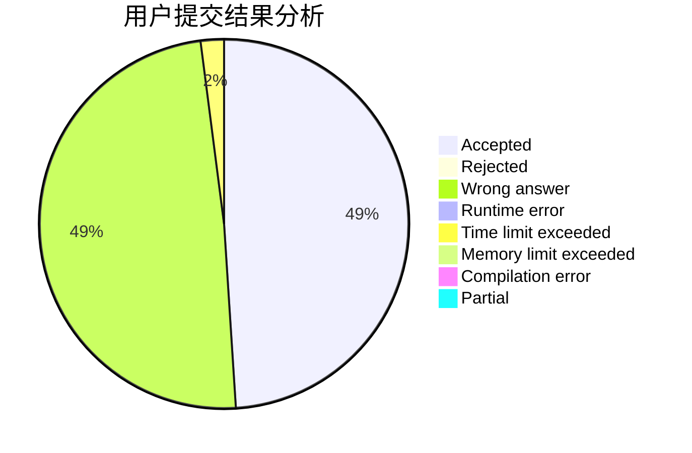
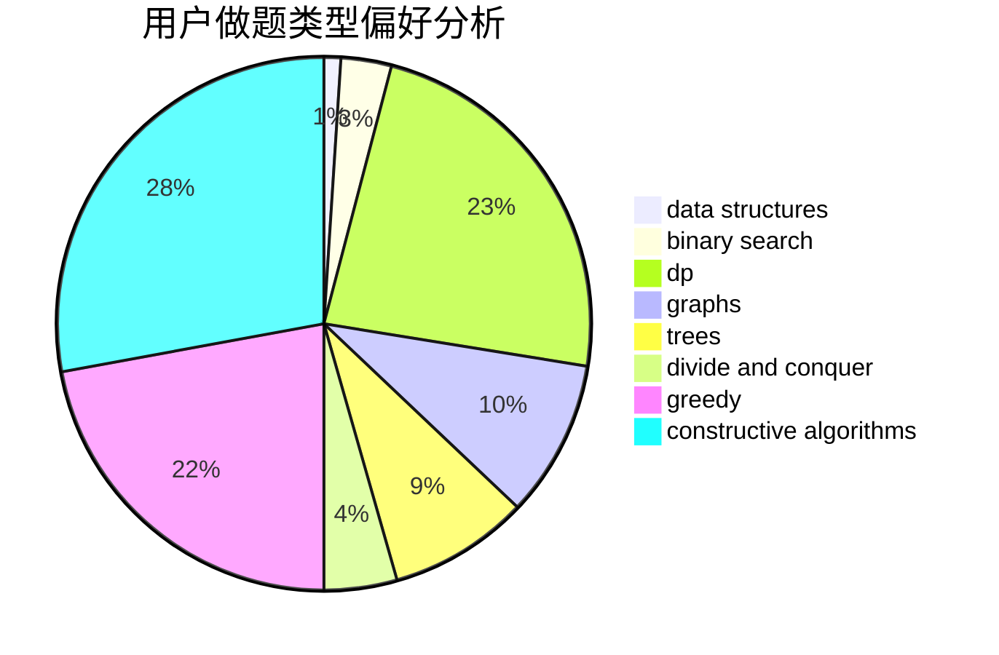
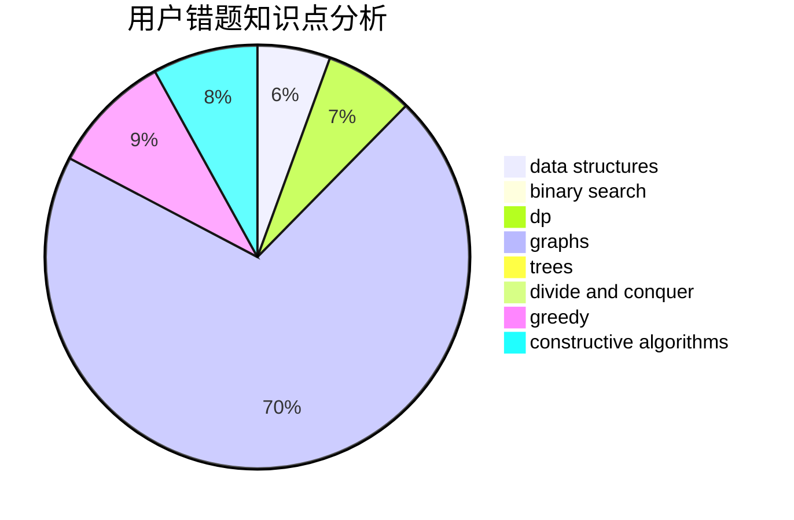

# JJLeo_
<!-- tabs:start -->
#### **用户提交结果分析**

#### **用户做题类型偏好分析**

#### **用户错题知识点分析**

<!-- tabs:end -->
# 推荐题目
[A Bit Similar](http://codeforces.com/problemset/problem/1469/E)		bitmasks,
                        brute force,
                        hashing,
                        string suffix structures,
                        strings,
                        two pointers		  
[Before an Exam](http://codeforces.com/problemset/problem/4/B)		constructive algorithms,
                        greedy		  
["Is the bit string balanced?" oracle](http://codeforces.com/problemset/problem/1357/B1)		nan		  
[Tournament](http://codeforces.com/problemset/problem/27/B)		bitmasks,
                        brute force,
                        dfs and similar,
                        greedy		  
[Animal Observation (hard version)](http://codeforces.com/problemset/problem/1304/F2)		data structures,
                        dp,
                        greedy		  
[Turn Off The TV](http://codeforces.com/problemset/problem/863/E)		data structures,
                        sortings		  
[Qualifying Contest](http://codeforces.com/problemset/problem/659/B)		constructive algorithms,
                        sortings		  
[Crazy Computer](http://codeforces.com/problemset/problem/716/A)		implementation		  
[Fox And Jumping](http://codeforces.com/problemset/problem/510/D)		bitmasks,
                        brute force,
                        dp,
                        math		  
[Ultimate Weirdness of an Array](http://codeforces.com/problemset/problem/671/C)		data structures,
                        number theory		  
<!-- tabs:start -->
#### **data structures**
[Animal Observation (hard version)](http://codeforces.com/problemset/problem/1304/F2)		data structures,
                        dp,
                        greedy		  
[Turn Off The TV](http://codeforces.com/problemset/problem/863/E)		data structures,
                        sortings		  
[Ultimate Weirdness of an Array](http://codeforces.com/problemset/problem/671/C)		data structures,
                        number theory		  
[Preparing for Merge Sort](http://codeforces.com/problemset/problem/847/B)		binary search,
                        data structures		  
[Chemistry Experiment](http://codeforces.com/problemset/problem/431/E)		binary search,
                        data structures,
                        ternary search		  
[TorCoder](http://codeforces.com/problemset/problem/240/F)		data structures		  
[Copy or Prefix Sum](http://codeforces.com/problemset/problem/1485/F)		combinatorics,
                        data structures,
                        dp,
                        sortings		  
[Artem and Array](http://codeforces.com/problemset/problem/442/C)		data structures,
                        greedy		  
[Maximum width](http://codeforces.com/problemset/problem/1492/C)		binary search,
                        data structures,
                        dp,
                        greedy,
                        two pointers		  
[Old Floppy Drive](http://codeforces.com/problemset/problem/1490/G)		binary search,
                        data structures,
                        math		  
#### **binary search**
[Preparing for Merge Sort](http://codeforces.com/problemset/problem/847/B)		binary search,
                        data structures		  
[Chemistry Experiment](http://codeforces.com/problemset/problem/431/E)		binary search,
                        data structures,
                        ternary search		  
[Good Numbers (hard version)](http://codeforces.com/problemset/problem/1249/C2)		binary search,
                        greedy,
                        math,
                        meet-in-the-middle		  
[Maximum width](http://codeforces.com/problemset/problem/1492/C)		binary search,
                        data structures,
                        dp,
                        greedy,
                        two pointers		  
[Pairs](http://codeforces.com/problemset/problem/1463/D)		binary search,
                        constructive algorithms,
                        greedy,
                        two pointers		  
[Old Floppy Drive](http://codeforces.com/problemset/problem/1490/G)		binary search,
                        data structures,
                        math		  
[Odd Mineral Resource](http://codeforces.com/problemset/problem/1479/D)		binary search,
                        bitmasks,
                        brute force,
                        data structures,
                        probabilities,
                        trees		  
[Complicated Computations](http://codeforces.com/problemset/problem/1436/E)		binary search,
                        data structures,
                        two pointers		  
[Divide and Summarize](http://codeforces.com/problemset/problem/1461/D)		binary search,
                        brute force,
                        data structures,
                        divide and conquer,
                        implementation,
                        sortings		  
[K-beautiful Strings](http://codeforces.com/problemset/problem/1493/C)		binary search,
                        brute force,
                        constructive algorithms,
                        greedy,
                        strings		  
#### **dp**
[Animal Observation (hard version)](http://codeforces.com/problemset/problem/1304/F2)		data structures,
                        dp,
                        greedy		  
[Fox And Jumping](http://codeforces.com/problemset/problem/510/D)		bitmasks,
                        brute force,
                        dp,
                        math		  
[Wet Shark and Blocks](http://codeforces.com/problemset/problem/621/E)		dp,
                        matrices		  
[Vacations](https://codeforces.com/contest/699/problem/C)		dp		  
[Sasha and a Bit of Relax](https://codeforces.com/contest/1113/problem/C)		dp,
                        implementation		  
[Pilgrims](http://codeforces.com/problemset/problem/348/E)		dfs and similar,
                        dp,
                        trees		  
[Mr. Kitayuta's Gift](http://codeforces.com/problemset/problem/506/E)		combinatorics,
                        dp,
                        matrices,
                        strings		  
[Copy or Prefix Sum](http://codeforces.com/problemset/problem/1485/F)		combinatorics,
                        data structures,
                        dp,
                        sortings		  
[Maximum width](http://codeforces.com/problemset/problem/1492/C)		binary search,
                        data structures,
                        dp,
                        greedy,
                        two pointers		  
[Bouncing Ball](https://codeforces.com/contest/1457/problem/C)		brute force,
                        dp,
                        implementation		  
#### **graph**
[Mastermind](http://codeforces.com/problemset/problem/1381/C)		constructive algorithms,
                        graph matchings,
                        greedy,
                        implementation,
                        sortings,
                        two pointers		  
[The Coronation](http://codeforces.com/problemset/problem/1250/E)		graphs,
                        implementation		  
[Water Level](http://codeforces.com/problemset/problem/1461/E)		brute force,
                        graphs,
                        greedy,
                        implementation,
                        math		  
[Minimum Ties](http://codeforces.com/problemset/problem/1487/C)		brute force,
                        constructive algorithms,
                        dfs and similar,
                        graphs,
                        greedy,
                        implementation,
                        math		  
[Chef Monocarp](http://codeforces.com/problemset/problem/1437/C)		dp,
                        flows,
                        graph matchings,
                        greedy,
                        math,
                        sortings		  
[Strange Housing](http://codeforces.com/problemset/problem/1470/D)		constructive algorithms,
                        dfs and similar,
                        graph matchings,
                        graphs,
                        greedy		  
[Longest Simple Cycle](http://codeforces.com/problemset/problem/1476/C)		dp,
                        graphs,
                        greedy		  
[Shortest and Longest LIS](http://codeforces.com/problemset/problem/1304/D)		constructive algorithms,
                        graphs,
                        greedy,
                        two pointers		  
[Ball in Berland](http://codeforces.com/problemset/problem/1475/C)		combinatorics,
                        graphs,
                        math		  
[Kyoya and Train](http://codeforces.com/problemset/problem/553/E)		dp,
                        fft,
                        graphs,
                        math,
                        probabilities		  
#### **trees**
[Pilgrims](http://codeforces.com/problemset/problem/348/E)		dfs and similar,
                        dp,
                        trees		  
[Odd Mineral Resource](http://codeforces.com/problemset/problem/1479/D)		binary search,
                        bitmasks,
                        brute force,
                        data structures,
                        probabilities,
                        trees		  
[Yet Another Card Deck](http://codeforces.com/problemset/problem/1511/C)		brute force,
                        data structures,
                        implementation,
                        trees		  
[Diameter Cuts](http://codeforces.com/problemset/problem/1499/F)		combinatorics,
                        dfs and similar,
                        dp,
                        trees		  
[Fib-tree](http://codeforces.com/problemset/problem/1491/E)		brute force,
                        dfs and similar,
                        divide and conquer,
                        number theory,
                        trees		  
[13th Labour of Heracles](http://codeforces.com/problemset/problem/1466/D)		data structures,
                        greedy,
                        sortings,
                        trees		  
[BFS Trees](http://codeforces.com/problemset/problem/1495/D)		combinatorics,
                        dfs and similar,
                        graphs,
                        math,
                        shortest paths,
                        trees		  
[Sum of Prefix Sums](http://codeforces.com/problemset/problem/1303/G)		data structures,
                        divide and conquer,
                        geometry,
                        trees		  
[Number of Simple Paths](http://codeforces.com/problemset/problem/1454/E)		combinatorics,
                        dfs and similar,
                        graphs,
                        trees		  
[Dogeforces](http://codeforces.com/problemset/problem/1494/D)		constructive algorithms,
                        data structures,
                        dfs and similar,
                        divide and conquer,
                        dsu,
                        greedy,
                        sortings,
                        trees		  
#### **divide and conquer**
[Divide and Summarize](http://codeforces.com/problemset/problem/1461/D)		binary search,
                        brute force,
                        data structures,
                        divide and conquer,
                        implementation,
                        sortings		  
[Song of the Sirens](http://codeforces.com/problemset/problem/1466/G)		combinatorics,
                        divide and conquer,
                        hashing,
                        math,
                        string suffix structures,
                        strings		  
[Permutation Transformation](http://codeforces.com/problemset/problem/1490/D)		dfs and similar,
                        divide and conquer,
                        implementation		  
[Skyline Photo](https://codeforces.com/contest/1483/problem/C)		data structures,
                        divide and conquer,
                        dp		  
[Fib-tree](http://codeforces.com/problemset/problem/1491/E)		brute force,
                        dfs and similar,
                        divide and conquer,
                        number theory,
                        trees		  
[Sum of Prefix Sums](http://codeforces.com/problemset/problem/1303/G)		data structures,
                        divide and conquer,
                        geometry,
                        trees		  
[Dogeforces](http://codeforces.com/problemset/problem/1494/D)		constructive algorithms,
                        data structures,
                        dfs and similar,
                        divide and conquer,
                        dsu,
                        greedy,
                        sortings,
                        trees		  
[Skyline Photo](http://codeforces.com/problemset/problem/1482/E)		data structures,
                        divide and conquer,
                        dp		  
[Logistical Questions](http://codeforces.com/problemset/problem/566/C)		dfs and similar,
                        divide and conquer,
                        trees		  
[Fruit Sequences](http://codeforces.com/problemset/problem/1428/F)		binary search,
                        data structures,
                        divide and conquer,
                        dp,
                        two pointers		  
#### **greedy**
[Before an Exam](http://codeforces.com/problemset/problem/4/B)		constructive algorithms,
                        greedy		  
[Tournament](http://codeforces.com/problemset/problem/27/B)		bitmasks,
                        brute force,
                        dfs and similar,
                        greedy		  
[Animal Observation (hard version)](http://codeforces.com/problemset/problem/1304/F2)		data structures,
                        dp,
                        greedy		  
[Good Numbers (hard version)](http://codeforces.com/problemset/problem/1249/C2)		binary search,
                        greedy,
                        math,
                        meet-in-the-middle		  
[Send Boxes to Alice (Easy Version)](https://codeforces.com/contest/1255/problem/E1)		constructive algorithms,
                        greedy,
                        math,
                        number theory,
                        ternary search,
                        two pointers		  
[Mastermind](http://codeforces.com/problemset/problem/1381/C)		constructive algorithms,
                        graph matchings,
                        greedy,
                        implementation,
                        sortings,
                        two pointers		  
[Artem and Array](http://codeforces.com/problemset/problem/442/C)		data structures,
                        greedy		  
[Water Level](http://codeforces.com/problemset/problem/1461/E)		brute force,
                        graphs,
                        greedy,
                        implementation,
                        math		  
[Maximum width](http://codeforces.com/problemset/problem/1492/C)		binary search,
                        data structures,
                        dp,
                        greedy,
                        two pointers		  
[Diamond Miner](https://codeforces.com/contest/1496/problem/C)		geometry,
                        greedy,
                        math,
                        sortings		  
#### **constructive algorithms**
[Before an Exam](http://codeforces.com/problemset/problem/4/B)		constructive algorithms,
                        greedy		  
[Qualifying Contest](http://codeforces.com/problemset/problem/659/B)		constructive algorithms,
                        sortings		  
[Beautiful Sets of Points](http://codeforces.com/problemset/problem/268/C)		constructive algorithms,
                        implementation		  
[Send Boxes to Alice (Easy Version)](https://codeforces.com/contest/1255/problem/E1)		constructive algorithms,
                        greedy,
                        math,
                        number theory,
                        ternary search,
                        two pointers		  
[All the Vowels Please](http://codeforces.com/problemset/problem/1166/B)		constructive algorithms,
                        math,
                        number theory		  
[Mastermind](http://codeforces.com/problemset/problem/1381/C)		constructive algorithms,
                        graph matchings,
                        greedy,
                        implementation,
                        sortings,
                        two pointers		  
[Anti-knapsack](http://codeforces.com/problemset/problem/1493/A)		constructive algorithms,
                        greedy		  
[Pairs](http://codeforces.com/problemset/problem/1463/D)		binary search,
                        constructive algorithms,
                        greedy,
                        two pointers		  
[XOR-gun](https://codeforces.com/contest/1456/problem/B)		bitmasks,
                        brute force,
                        constructive algorithms		  
[Genius's Gambit](http://codeforces.com/problemset/problem/1492/D)		bitmasks,
                        constructive algorithms,
                        greedy,
                        math		  
#### **sortings**
[Turn Off The TV](http://codeforces.com/problemset/problem/863/E)		data structures,
                        sortings		  
[Qualifying Contest](http://codeforces.com/problemset/problem/659/B)		constructive algorithms,
                        sortings		  
[Copy or Prefix Sum](http://codeforces.com/problemset/problem/1485/F)		combinatorics,
                        data structures,
                        dp,
                        sortings		  
[Mastermind](http://codeforces.com/problemset/problem/1381/C)		constructive algorithms,
                        graph matchings,
                        greedy,
                        implementation,
                        sortings,
                        two pointers		  
[Diamond Miner](https://codeforces.com/contest/1496/problem/C)		geometry,
                        greedy,
                        math,
                        sortings		  
[Diamond Miner](http://codeforces.com/problemset/problem/1495/A)		geometry,
                        greedy,
                        math,
                        sortings		  
[Meximization](http://codeforces.com/problemset/problem/1497/A)		brute force,
                        data structures,
                        greedy,
                        sortings		  
[Avoiding Zero](http://codeforces.com/problemset/problem/1427/A)		math,
                        sortings		  
[Divide and Summarize](http://codeforces.com/problemset/problem/1461/D)		binary search,
                        brute force,
                        data structures,
                        divide and conquer,
                        implementation,
                        sortings		  
[Chef Monocarp](http://codeforces.com/problemset/problem/1437/C)		dp,
                        flows,
                        graph matchings,
                        greedy,
                        math,
                        sortings		  
<!-- tabs:end -->
